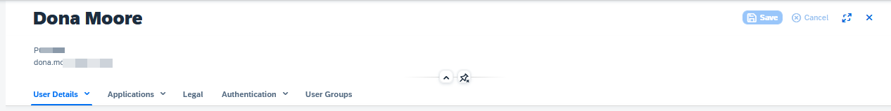

<!-- loiod50eec9598b7493bafe8b1ac3f5acd90 -->

# Unblock a User

Unblock a user that has been blocked due to inactivity.

## Context

## Procedure

1.  Access the tenant's administration console for Identity Authentication by using the console's URL.

    > ### Note:  
    > The URL has the following pattern:
    > 
    > `https://<tenant ID>.accounts.ondemand.com/admin`
    > 
    > *Tenant ID* is an automatically generated ID by the system. The first administrator created for the tenant receives an activation e-mail with a URL in it. This URL contains the *tenant ID*. For more information about your tenants, see [Viewing Assigned Tenants and Administrators](../viewing-assigned-tenants-and-administrators-f56e6f2.md).
    > 
    > If you have a configured custom domain, the URL has the following pattern: `<your custom domain>/admin`.

2.  Choose the *User Management* tile.

    The system displays the first 20 users in the tenant sorted by their user ID number.

3.  Find the user that you want to unblock.

    For more information about how to find a user in Identity Authentication, see [Search Users](search-users-06078a6.md).

4.  Select the user that you want to deactivate.

    This operation opens the *User Details* view.

    

5.  Under *Authentication* choose the *User Status* button to unblock the user.

