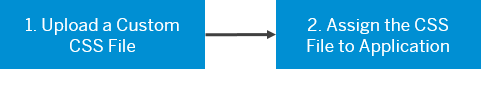
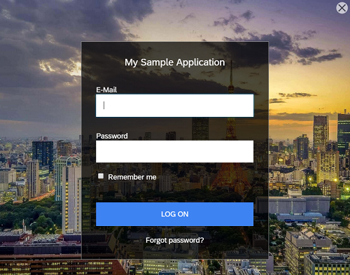

<!-- loiofaa2a33ff973409dafe136e4f748abda -->

# Use a Custom CSS

Upload a CSS file and assign that file to an application for advanced customization of the end-user screens and the profile page for the Quartz or Horizon Theme.

## Context

To use a custom CSS for the application end-user screens and profile page you must upload your custom CSS file in the administration console for SAP Cloud Identity Services and then assign that file to the application.

The [Example.zip](https://help.sap.com/doc/08293312afe748bc8850898c51b9ba8a/Cloud/en-US/Example.zip) contains a CSS file which you can use to test the Custom CSS option for the Quartz theme. After you follow the procedures for uploading and assigning the example file, the resulting logon page will be:

 <a name="loio899ba3bae3fe411aaf3402bc2dc05de9"/>

<!-- loio899ba3bae3fe411aaf3402bc2dc05de9 -->

## 1. Upload a Custom CSS File

Upload a Quartz or Horizon CSS file for custom end-user screens or the profile page.

<a name="loio899ba3bae3fe411aaf3402bc2dc05de9__steps_ebh_th5_lhb"/>

## Procedure

1.  Sign in to the administration console for SAP Cloud Identity Services.

2.  Choose the *Custom CSS* tile.

3.  Choose the CSS style that you want to edit.

    > ### Note:  
    > Type the name of the CSS style in the search field to filter the list items, or choose the CSS style from the list on the left.
    > 
    > If you do not have a created CSS style in your list, you can create one by choosing the *\+Add* button on the left-hand panel.

4.  Upload your CSS file for the respective theme \(Quartz or Horizon\).

5.  Save your changes.

    Once the style has been saved, the system displays the message ***<name of theme\> updated***.

    You can update your custom CSS style as many times as you need. Only the last updated version is used.

    You can delete a CSS style. Select the CSS styke and choose the *Delete* button to delete it.

    > ### Caution:  
    > You can delete a CSS style, only if it is not assigned to an application. If it is assigned, you must assign a new style, and then delete it.

    You can download the CSS file for further reference by choosing the *Download* button.

6.  To preview the implementation of the CSS on the Logon page, right click the preview link with title *CSS\_Test\_View* and open it in a new private or incognito tab.

 <a name="loioe9d7d8a6196b4e82af3365b7092bee27"/>

<!-- loioe9d7d8a6196b4e82af3365b7092bee27 -->

## 2. Assign the Custom CSS File to an Application

Assign the your CSS file to the application or profile page.

<a name="loioe9d7d8a6196b4e82af3365b7092bee27__context_qzk_w1b_mhb"/>

## Context

Once you have a CSS file uploaded for your theme you can assign it to an application.

<a name="loioe9d7d8a6196b4e82af3365b7092bee27__steps_rsj_db5_lhb"/>

## Procedure

1.  Sign in to the administration console for SAP Cloud Identity Services.

2.  Under *Applications and Resources*, choose the *Applications* tile.

3.  Choose the application that you want to edit.

    > ### Note:  
    > Type the name of the application in the search field to filter the list items, or choose the application from the list on the left.
    > 
    > If you don’t have a created application in your list, you can create one. For more information, see [Create a New Application](create-a-new-application-0d4b255.md).

4.  Choose the *Branding and Layout* tab.

5.  Under *BRANDING*, choose the *Branding Style* list item

6.  Select the theme:

    -   *Horizon Theme*
    -   *Quartz*

7.  Choose the *Custom Advanced* radio button.

8.  Select the style sheet that you want to apply.

9.  Save your selection.

    Once the application has been changed, the system displays the message ***Theme changed to <name of theme\>***.

    > ### Remember:  
    > The custom CSS file is combined with the default CSS file of Identity Authentication.
    > 
    > You can download the default CSS file for the Quartz theme at [Default.zip](https://help.sap.com/doc/73e3b389575a4499a837dcbf8cdbf558/Cloud/en-US/Default.zip).

