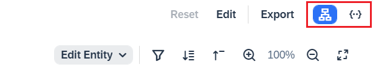
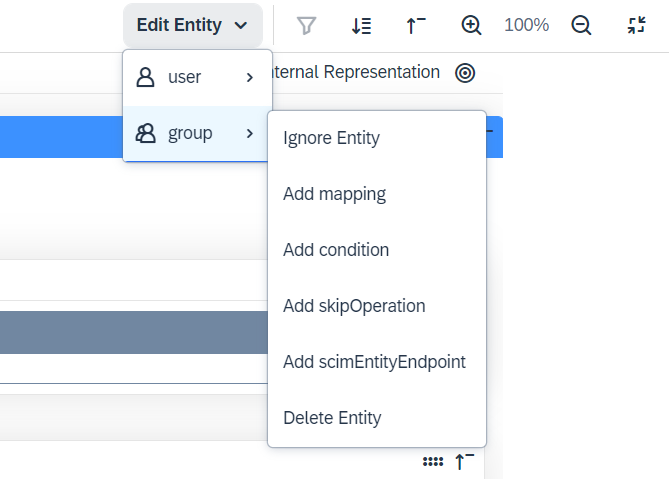
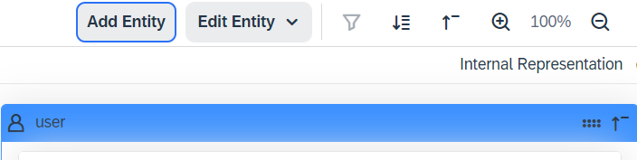
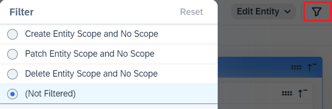
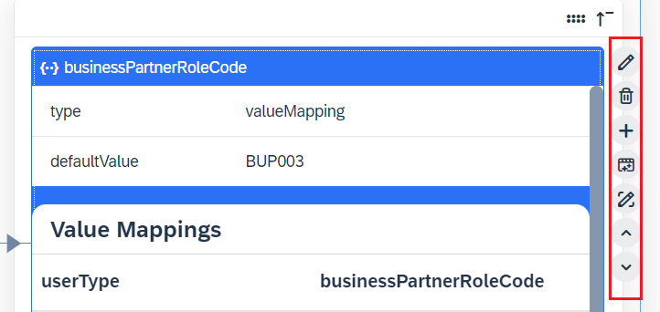

<!-- loioa985398fd04b49fe8b0905079a9faaf6 -->

# Working with Graphical Editor

You can create, update and delete entities and their attribute mappings with a handy and easy to use graphical editor. It provides typical operations for an editor, like adding new data, editing and deleting existing data and saving changes. And what's more, it brings improved user experience, requires less typing and more choosing from a list of prefilled values.

<a name="loioa985398fd04b49fe8b0905079a9faaf6__section_a1f_3rk_jvb"/>

## Basic Operations

> ### Note:  
> The graphical editor is available only for Identity Provisioning tenants running on SAP Cloud Identity infrastructure. It is the default editor.

<table>
<tr>
<th valign="top">

Description

</th>
<th valign="top">

Operation

</th>
</tr>
<tr>
<td valign="top">

**Switch Editor**

When selecting the *Transformations* tab, the graphical editor is displayed by default. It is represented by a tree icon \(in the red rectangle\). You can switch to the JSON text editor by choosing the code-bracket icon.

Switching between editors is allowed in view and edit mode.

</td>
<td valign="top">

</td>
</tr>
<tr>
<td valign="top">

*Edit Entity* \> *user/group* \> *Ignore Entity*

Use this option to ignore the provisioning of an entity. When selected, a check mark appears in front of the option and the entity is greyed out. To enable it again, deselect the option.

*Edit Entity* \> *user/group* \> *Add mapping*

Use this option to add attribute mapping for an entity. When selected, the *Add Mapping* dialog appears. For more information, see [Add or Edit Attribute Mappings](https://help.sap.com/docs/IDENTITY_PROVISIONING/f48e822d6d484fa5ade7dda78b64d9f5/a985398fd04b49fe8b0905079a9faaf6.html?state=DRAFT&version=Cloud_07#add-or-edit-attribute-mappings).

New mappings are added at the end of the list of mappings for the selected entity. As the order matters, you can move them up and down to define the proper place for processing them.

*Edit Entity* \> *user/group* \> *Add condition*

Use this option to add a condition for an entity. When selected, the *Add Condition* dialog appears. You need to provide a value. Conditions defined on an entity level are displayed right under the entity name in orange box.

*Edit Entity* \> *user/group* \> *Add skipOperation*

Use this option to add skipOperation for an entity. It is always defined on an entity level and in target system transformations only. When selected, the *Add skipOperation* dialog appears with a dropdown list of prefilled values.

*Edit Entity* \> *user/group* \> *Add scimEntityEndpoint*

Use this option to add the entity endpoint which is needed in proxy systems only.

*Edit Entity* \> *user/group* \> *Delete Entity*

Use this option to delete an entire entity. Confirmation is required. When an entity is deleted, you cannot restore it. You can only add a new one.

</td>
<td valign="top">

</td>
</tr>
<tr>
<td valign="top">

**Add Entity**

> ### Note:  
> The *Add Entity* button is displayed only if an entity has been deleted.

When selected, an *Add Entity* dialog appears. You are allowed to select only an entity of the type that has been deleted. The new entity appears in its dedicated colored box and has no content.

</td>
<td valign="top">

</td>
</tr>
<tr>
<td valign="top">

**Filter**

The *Filter* icon allows you to search for entity attributes by their scope: create, patch and delete. Filtering is enabled only in view mode, meaning you must not choose *Edit* on the *Transformations* tab.

When selected, the *Filter* dialog appears with the default value *\(Not Filtered\)*. Selecting a filter results in returning all entity attributes with the given scope plus all attributes without any scope.

> ### Remember:  
> Attribute mappings with no scope are always returned regardless of the selected filter.

Choosing *Reset* returns you to the default value *\(Not Filtered\)*.

</td>
<td valign="top">

</td>
</tr>
<tr>
<td valign="top">

Operations on an attribute mapping level:

-   *Pencil* icon - Edit an attribute mapping

-   *Trash* icon - Delete an attribute mapping

-   *Plus* sign icon - Adds an attribute mapping

-   *Function* icon - Add or edit a function

    Functions appear only for attributes on the right side of the editor.

-   *Pencil* icon - Edit value mappings

    This icon appears only for attributes with `type` set to `valueMapping`, for example: `businessPartnerRoleCode`, `timezone` and others.

-   *Up arrow* icon - Move an attribute mapping one level up.

-   *Down arrow* icon - Move an attribute mapping one level down.

</td>
<td valign="top">

</td>
</tr>
</table>

<a name="loioa985398fd04b49fe8b0905079a9faaf6__section_vmt_jrk_jvb"/>

## Add or Edit Attribute Mappings

When you select *Add mapping* for an entity or choose the *Plus* icon next to an attribute, the *Add Mapping* or *Edit Mapping* dialog appears, respectively. Use it to configure the following:

-   Add *Mapping Paths* - A mapping path is a name-value pair \(that is, source and target path expressions and their values\) based on a selected type of value.

    In the *Name* field, you can choose one of the predefined `sourcePath` and `targetPath` expressions, select your *Type* of value: *attribute*, *property* or *value* and finally, provide the value itself.

    Attribute is the default type value.

    If you want to configure a complex attribute, for example `name.familyName`, add the `name` attribute first and then choose the *Plus* sign icon to add the `familyName` subattribute second. You can add as many subattributes as you need.

-   Add *Mapping Configurations* - A mapping configuration is a name-value pair \(that is, a transformation expression and its value\).

    In the *Name* field, you can choose one of the predefined expressions: *condition*, *scope*, *constant*, *ignore*, *correlationAttribute* and others and provide a value. Some expressions have predefined values. For example, ignore, optional, scope, skipOperations.

-   View your configuration in the *Mapping Representation in JSON* view.

<a name="loioa985398fd04b49fe8b0905079a9faaf6__section_cqh_lrk_jvb"/>

## Add or Edit Functions

When you choose the *Function* icon on an attribute mapping level, the *Add Functions* dialog appears. If a function is already configured for a mapping, the *Edit Functions* dialog appears. Use it to configure the following:

-   Choose *Add* \> *Function* and select one from the list.

    Most functions have predefined parameters, listed in the *Name* field. For example, if you add the `replaceLastString` function, the `regex` and `replacement` parameters are prefilled. You only need to provide a value.

    If no parameters are listed in the *Name* field, choose *Add* next to the selected function to add a name-value pair.

    You can add as many functions as you need. The number of functions you've added is displayed under the title of the dialog.

-   Order the functions if needed. As the order of the functions matter, you can choose the arrows to move them up and down to define the proper place for processing them.

**Related Information**  

[**Blog Post**: Identity Provisioning Graphical Editor – the Game Changer for Transformation Configurations](https://blogs.sap.com/2023/03/17/identity-provisioning-graphical-editor-the-game-changer-for-transformation-configurations/)

