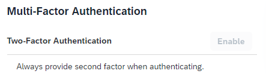

<!-- loio4063b261fa4b45249271e3e253ca1fbc -->

# Always Authenticate with Second Factor

This document provides information about how to enhance the security of your account by always providing second factor in addition to your primary credentials.

<a name="loio4063b261fa4b45249271e3e253ca1fbc__prereq_s5p_bzz_2tb"/>

## Prerequisites

You have a device activated for time-based one-time password \(TOTP\) or Web Two-Factor Authentication. For more information, see[Activate TOTP Two-Factor Authentication](activate-totp-two-factor-authentication-ab8a323.md) and [Add a Device for Web Two-Factor Authentication](add-a-device-for-web-two-factor-authentication-f7eb115.md).

<a name="loio4063b261fa4b45249271e3e253ca1fbc__context_gps_j5r_jpb"/>

## Context

You can choose to enhance your security with additional authentication, second factor \(passcode or security key\), although the application may not explicitly require it. This option is available only if the system administrator has allowed it for your profile.

> ### Note:  
> If the option is allowed by the administrator, but you don't have an activated device, you won't be able to enable it. When the option is disabled, but you dont't have on the profile page, under *Multi-Factor Authentication*, you see:
> 
> 
> 
> To use this option you must first activate a device for time-based one-time password \(TOTP\) or Web Two-Factor Authentication.

To enable the *Multi-Factor Authentication* option, proceed as follows:

## Procedure

1.  Access your profile page.

    > ### Note:  
    > You have received the link to your profile page in an email with information how to activate your account for user profile. If you can't find this email, and you don't know how to access your profile page, please contact your system administrator for assistance.

2.  Under *Multi-Factor Authentication*, enable *Two-Factor Authentication* to always provide second factor when authenticating.

3.  Verify your identity if you have already activated multi-factor authentication.

<a name="loio4063b261fa4b45249271e3e253ca1fbc__result_r4l_rxr_jpb"/>

## Results

When enabled, you see the following option on your profile page:

<a name="loio4063b261fa4b45249271e3e253ca1fbc__postreq_mnr_lxr_jpb"/>

## Next Steps

Activate multifactor authentication methods. For more information, see [Activate TOTP Two-Factor Authentication](activate-totp-two-factor-authentication-ab8a323.md) or [Add a Device for Web Two-Factor Authentication](add-a-device-for-web-two-factor-authentication-f7eb115.md).

**Related Information**  

[Activate TOTP Two-Factor Authentication](activate-totp-two-factor-authentication-ab8a323.md "To log on to applications that require time-based one-time password (TOTP) as two-factor authentication, first you have to activate a mobile device that will generate TOTP passcodes.")

[Add a Device for Web Two-Factor Authentication](add-a-device-for-web-two-factor-authentication-f7eb115.md "To log on to applications that require web two-factor authentication (FIDO2 standard), first you have to activate an authenticator device.")

[Deactivate TOTP Two-Factor Authentication](deactivate-totp-two-factor-authentication-d26427a.md "This document shows you how to deactivate the TOTP two-factor authentication that you use to access applications requiring passcodes for stronger authentication.")

[Remove Web Two-Factor Authentication](remove-web-two-factor-authentication-3f70669.md "This document shows you how to remove the web two-factor authentication (FIDO2 standard) that you use to access applications requiring it for stronger authentication.")

