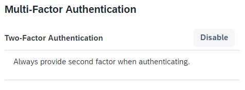

<!-- loio0d41cd49f6504f3eaf29b58d616b040f -->

# Multi-Factor Authentication

This document provides information about the second factor for authentication or how to log on if you are asked to provide a second factor to your primary credentials.

Based on the configurations for the application, you can be asked to provide a time-based, one time \(TOTP\) passcode, generated on a mobile device, a one-time \(OTP\) passcode sent to your email, a passcode sent via SMS, or a PIN security key. You can choose one of the enabled second factor authentication methods or press the button to enable a new method.

You can also choose to enhance your security with a second factor, although the application may not explicitly require it. This choice is available only if the system administrator has allowed it for your profile. If enabled, you see the following option on the profile page:

For more information about this option, see [Always Authenticate with Second Factor](always-authenticate-with-second-factor-4063b26.md).

<a name="loio0d41cd49f6504f3eaf29b58d616b040f__section_gmh_tls_rjb"/>

## Authenticate with TOTP Two-Factor Authentication

TOTP passcodes are time-based and are valid for one logon attempt only, thus providing additional security to the common static passwords. Passcodes are generated by an authenticator application. The authenticator is a mobile application that you install on your mobile devices. For more information about how to install and configure authenticators, see their documentation.

To log on when the application requires TOTP two-factor authentication, first you provide your primary credentials, choose the method or enable it, then provide the passcode generated on your mobile device.

If you don't have a device, activated for TOTP two-factor authentication, see [Activate TOTP Two-Factor Authentication](activate-totp-two-factor-authentication-ab8a323.md).

<a name="loio0d41cd49f6504f3eaf29b58d616b040f__section_a3p_tls_rjb"/>

## Authenticate with SMS Two-Factor Authentication

SMS passcodes are sent to a mobile device.

To log on when the application requires SMS two-factor authentication, first you provide your primary credentials, choose the method, or enable it, then you provide the passcode you received via SMS.

<a name="loio0d41cd49f6504f3eaf29b58d616b040f__section_cpy_5kk_hnb"/>

## Authenticate with Web Two-Factor Authentication

To log on when the application requires web authentication \(FIDO2 standard\), first you provide your primary credentials, choose the method, or enable it, then you provide the PIN code on your security key hardware USB authenticator. If you don't have a registered security key, you must register it first.

If you don't have a device activated for web authentication, see [Add a Device for Web Two-Factor Authentication](add-a-device-for-web-two-factor-authentication-f7eb115.md).

<a name="loio0d41cd49f6504f3eaf29b58d616b040f__section_bqm_2tn_mtb"/>

## Authenticate with Email Two-Factor Authentication

To log on when the application requires email-twofactor authentication, first you provide your primary credentials, choose the method, or enable it, then you provide the 8-digit code sent to your email. The code is valid for 10 minutes.

If the code has expired you can require a new one. You must wait for 3 minutes from the last request before you request a new code.

If you provide five wrong codes in row, the email two-factor authentication will be temporarily locked because of too many failed logon attempts. It will be automatically unlocked in 60 minutes. If the application allows other two-favtor authentication methods, you can use them.

If your email is not verified, the system won't send you a code, and you must contact the application's adminsitrator for assistance.

