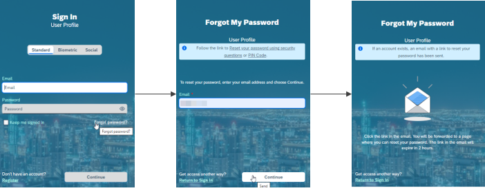

<!-- loioc821f3fdc558465db6950399672090e7 -->

# Reset Password

If you don't know your current password, you can reset your password.

## Context

> ### Remember:  
> The information in this document is valid only for applications whose configuration include the **Forgot Password** process via the logon page. If you don’t see the *Forgot Password* link on the logon page, contact the system administrator of your application.

If you don't know your current password, follow the *Forgot Password* link in the logon page of the application. You can choose to trigger the **Forgot Password** process, and to receive an email with instructions how to reset your password, or to answer security questions to reset your password.

> ### Tip:  
> If you don’t receive the reset password link, check your spam folder. If the email is not there, choose *Return to Sign In* and trigger the process again. If the problem continues, contact your administrator for further assistance.

> ### Note:  
> The security questions possibility is optional and must be offered by the application.

## Procedure

1.  Access the logon page of the application

2.  Follow the *Forgot Password* link.

3.  Provide your email address and press the *Send* button.

    An email with a link to a page where you can reset your password will be sent to you. The email might take a few minutes to reach your inbox.

4.  **Optional:** Follow the link to reset your password using Security Questions and provide the required information and answers.

    > ### Remember:  
    > To use this option, you must have configured the security questions section in your profile page. Note that the answers to the security questions are case sensitive. You must provide exactly the same answers that you have configured.

5.  **Optional:** Follow the link to reset your password using PIN code and provide the required information.

    > ### Remember:  
    > To use this option, you must have configured the PIN code section in your profile page.

## Example

> ### Note:  
> The example is just for illustration and may differ from your profile page.
> 
> 

