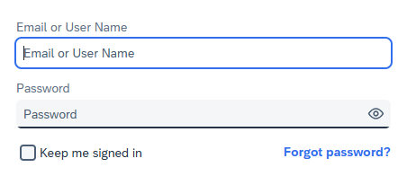

<!-- loioc821f3fdc558465db6950399672090e7 -->

# Reset Your Forgotten Password

You can reset your password if you have forgotten it.

<a name="loioc821f3fdc558465db6950399672090e7__prereq_npx_lzv_vfc"/>

## Prerequisites

-   You have forgotten your current password.

-   You see the *Forgot Password* link on the sign-in page of your application:

    

    > ### Note:  
    > The image is just for an illustration purpose and may differ from your sign-in page.

    Some applications don't offer the reset password option. If you can't see the *Forgot Password* link, contact the system administrator of your application with a request to reset your password.

## Context

> ### Tip:  
> If you know your password, but for security or any other reasons you want to change it, follow the procedure in [Change or Reset Password via Profile Page](change-or-reset-password-via-profile-page-3291dd3.md).

If you don't remember your current password, choose the *Forgot Password* link in the sign-in page of the application, and follow the onscreen instructions. Depending on the configurations made by your organization, you may have one, two, or all three options:

-   Receive an email with instructions how to reset your password.
-   Answer security questions. You must have already configured your answers in the profile page to be able to reset password via this option.
-   Provide a PIN code. You must have already set your PIN code in the profile page to be able to reset the password via this option.

Passwords can be reset and changed once in 24 hours.

To reset your password, follow the steps below:

## Procedure

1.  Access the sign-in page of the application.

2.  Choose the *Forgot Password* link.

3.  Choose one of the options available on your screen. Be aware that the options are visible only if the application supports them:

    -   **Optional:** *Email* - Provide the email address from your account and press *Continue*. An email with a link to a page where you can reset your password will be sent to you. The email might take a few minutes to reach your inbox.

        > ### Tip:  
        > If you don’t receive the email with the reset password link, check your spam folder. If the email isn't there, choose *Return to Sign In* and start the process again. If the problem persists, contact your administrator for further assistance.

    -   **Optional:** *Security Questions* - Provide the required information and answers, and press *Continue*.

        > ### Remember:  
        > To use this option, you must have configured the security questions section in your profile page. Note that the answers to the security questions are case sensitive. You must provide exactly the same answers that you have configured.

    -   **Optional:** *PIN Code* - Provide the required information and PIN code, and press *Continue*.

        > ### Remember:  
        > To use this option, you must have configured the PIN code section in your profile page.

