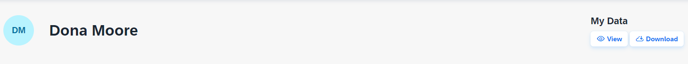

<!-- loiod4c3811a58c44982bce09e9fdcbb5c64 -->

# User Guide

This user guide describes the scenarios in the Identity Authentication from a user’s perspective. It’s aimed at consumers, partners, and employees.

For the scenarios, users can use services to maintain or update their user profiles and to log on to applications. User services are divided into profile and sign-on services. For configuration of certain profile services, users access the profile page.

> ### Note:  
> If you don't know the URL of your profile page, contact your system administrator.

Users can use the following sign-on services:

-   Basic authentication

    Users can log on to applications by providing basic credentials, such as user name and password.

-   Single Sign-On authentication

    Users can access cloud applications via SAML 2.0 or OpenID Connect based single sign-on \(SSO\).

-   Multi-factor authentication

    If the application requires second factor for authentication, users should provide an SMS code, or a passcode generated by a mobile device as an addition to the basic authentication. For more information, see [Multi-Factor Authentication](multi-factor-authentication-0d41cd4.md).

Users can use the following self-services:

**On the Logon Page**

-   Self-registration

    If this option is activated by an administrator, a user can register when he or she accesses the application’s logon page. When the user clicks on the *Register* button, a registration form appears, where he or she needs to provide some personal data. The user also has to accept the organization’s terms of use and privacy policy.

    By clicking the *Register* button, the users acknowledge that he or she has read the organization’s privacy policy document.

    Once the user has submitted the form, he or she receives an email explaining how to activate the account. Successful activation of the user account completes the registration, thus allowing the user to log on to the application.

    > ### Note:  
    > If the user hasn’t received the activation email, he or she can do the following:
    > 
    > -   Check the *Deleted*, *Junk*, or other folders in his or her mail box.
    > -   Follow the *Forgot Password* link in the logon page of the application. If the registration is successful, this will trigger the *Forgot Password* process, and the user will receive an email with instructions how to reset the password.
    > -   Choose the *Register Now* link, and fill in the registration form again.
    > -   Contact the system administrator of the application.

-   Forgot password

    A user can change his or her password when he or she accesses the application’s logon page. When the user clicks on the *Forgot password?* link, the user triggers the forgot password process.

-   Social sign-on

    If this feature is enabled by an administrator, users can link their Identity Authentication accounts with social network accounts. That way they can authenticate through a social provider by choosing the social network button on the logon page. They can also unlink their accounts on the profile page.

    > ### Note:  
    > The content in this section is not relevant for China \(Shanghai\) region.

**On the Profile Page**

-   Changing profile data

    Users can change their profile information on the profile page. This includes Personal Information, Company Information, and Contact Preferences.

    > ### Note:  
    > The `Login Name` field can't be edited on the profile page. This field can be edited by the tenant administrator via the administration console for SAP Cloud Identity Services.
    > 
    > The `Valid From` and `Valid To` fields are empty if no validity dates are set for the user. The dates are not editable via the profile page.

-   Viewing profile data
    -   Users can open a printable overview of all the data on file for them by visiting their account information in the upper right corner of the screen and choosing the *User Data* section from the menu.

        

        > ### Note:  
        > The data includes the **Terms of Use** and **Privacy Policy** documents singed by the user. The documents can be seen by clicking on their names. They open in a new tab.

    -   Users can download an overview of all the data for them on a JSON file by clicking the download button in the *User Data* section.

-   Verifying user phone

    > ### Remember:  
    > The phone verification possibility on the Profile Page is optional and must be enabled by a system administrator.

    If the phone verification is enabled by a system administrator, and the phone number is verified users can change it on the profile by choosing *Edit* in the *Personal Information* section. They will receive a verification code on the phone which must be provided so that the change is completed. If the code fails to arrive, users have up to five attempts to request a new code via SMS. They can also trigger one phone call per session. If the phone number is not verified, users can change it without a verification code.

    > ### Restriction:  
    > A phone number can be verified by only one user. If another user has already verified the phone number that is provided, the user is prompted to choose a different one or contact an administrator.

-   Changing user passwords

    Users can change their passwords on the profile page.

    By clicking the change password button in the *Password* section, users trigger the change password process. That way, they are asked to provide the current and the new passwords. Users must also comply with the password requirements.

    > ### Note:  
    > Users must familiarize themselves with the password policy for logging on to the respective application. If no password policy is set for the application, users are able to modify their passwords with any characters of their choosing.

-   Viewing sessions and tokens information

    Users can view their sessions and tokens on the profile page and delete those that they don't want or they don't trust. There is information about the:

    -   browser
    -   operating system
    -   IP address
    -   credentials or token type
    -   expiration period

-   Unlinking social sign-on

    Users can unlink their accounts on the profile page.

    > ### Note:  
    > The content in this section is not relevant for China \(Shanghai\) region.

**Related Information**  

[Scenarios](../scenarios-fb9898d.md "Identity Authentication supports scenarios for consumers (business-to-consumer scenarios), for partners (business-to-business scenarios), and for employees (business-to-employee scenarios).")

[Multi-Factor Authentication](multi-factor-authentication-0d41cd4.md "This document provides information about the second factor for authentication or how to sign in if you are asked to provide a second factor to your primary credentials.")

[Social Authentication](social-authentication-108607a.md "")

[Use the Remember Me Option](use-the-remember-me-option-bc7c6c6.md "With the Remember me functionality enabled, you can log on to an application without the need to provide your credentials every time you access it.")

