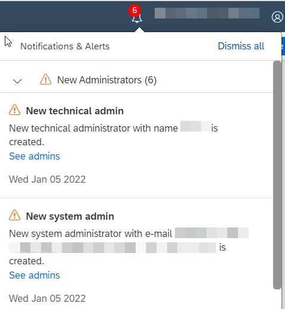
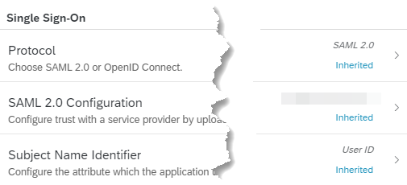

<!-- loio8f61880dc1c145e3ad7097e461479186 -->

# Application Types

Application types in the administration console for SAP Cloud Identity Services.

<a name="loio8f61880dc1c145e3ad7097e461479186__section_nh2_zhh_w5b"/>

## SAP Applications

The SAP applications are created and managed by SAP, and they can't be deleted. Part of their configurations are read-only. SAP applications are: bundled, subscriptions and system applications.

Identity Authentication identifies the type of the application by the URI or SAML 2.0 endpoints.

> ### Note:  
> Applications using custom domains can't be marked correctly, so if you have such applications, report an incident on [SAP Support Portal Home](https://support.sap.com/en/index.html) with a component `BC-IAM-IDS`.

### Bundled Applications

Bundled applications are managed and configured by SAP and can't be deleted. Part of their SAML 2.0 configurations are read-only. For more information, see [Configure an Application's Type](Operation-Guide/configure-an-application-s-type-6fee9c3.md).

### Subscribed Applications

A special kind of applications are the so-called subscribed applications.

Most subscribed applications use the trust configuration of the SAP BTP subaccount where they're subscribed. For some applications, when you subscribe to them, the system automatically sets up an application in Identity Authentication for you. These applications appear as child applications of the application in SAP Cloud Identity Services that represents the SAP BTP subaccount.

You can't create or delete a subscribed application. For these applications, you can only see and configure a certain subset of their settings. The change in the following configurations is restricted, since they are managed by the application provider:

-   Protocol
-   OpenID Connect Configuration

    > ### Note:  
    > It's possible to add custom URIs, but those defined by the application provider remain.

-   Attributes - Self-defined Attributes

    The attributes supported by subscribed applications are predefined and listed under the *Primary Attribute* section, with default mappings for source *Identity Directory*. You can see which attributes are supported, and add or remove mappings for the other sources - *Corporate Identity Provider* and *Expression*.

    > ### Tip:  
    > For some subscribed applications, you might need to add custom attribute mappings \(under the *Self-Defined Attributes* section\).

-   Client Authentication

    > ### Note:  
    > Fully managed by the application provider.

-   APIs

    > ### Note:  
    > You have no access to the APIs provided by Identity Authentication.

### System Applications

The tenant of Identity Authentication has two additional system applications. They are predefined with the creation of the tenant. These applications are: `Administration Console`, and `User Profile`, previously called `SAP Cloud Identity`.

> ### Note:  
> In some tenants, the `User Profile` application still bears its previous name, `SAP Cloud Identity`.

> ### Tip:  
> If `Administration Console` or `User Profile` are not in the list of the system applications you may request them. To do this, report an incident on [SAP Support Portal Home](https://support.sap.com/en/index.html) under the component `BC-IAM-IDS`.

> ### Caution:  
> Please be careful when you make configuration changes to the system applications. Certain configuration options for the system applications are read-only.
> 
> System applications can't be parents to other applications, and can't have child applications.

The `Administration Console` application contains the configurations of the administration console for SAP Cloud Identity Services, and information about expiring certificates, system notifications and new administrators. The information is visible at the top-right corner of the administration console:

You can access the tenant's administration console for SAP Cloud Identity Services by using the console's URL.

> ### Note:  
> The URL has the following pattern:
> 
> `https://<tenant ID>.accounts.ondemand.com/admin` or `https://<tenant ID>.accounts.cloud.sap/admin`
> 
> *Tenant ID* is an automatically generated ID by the system. The first administrator created for the tenant receives an activation email with a URL in it. This URL contains the *tenant ID*. For more information about your tenants, see [View Assigned Tenants and Administrators](view-assigned-tenants-and-administrators-f56e6f2.md).
> 
> If you have a configured custom domain, the URL has the `<your custom domain>/admin` pattern.
> 
> If you have updated the ***Name*** in the *SAML 2.0 Configuration* or the ***URL*** in the *OpenID Connect Configuration* in *Tenant Settings* make sure to access the tenant with the updated domain in the ***Name*** or ***URL***. For more information, see [Tenant SAML 2.0 Configurations](Operation-Guide/tenant-saml-2-0-configurations-e81a19b.md) and [Tenant OpenID Connect \(OIDC\) Configurations](Operation-Guide/tenant-openid-connect-oidc-configurations-3d6abcc.md).

As a tenant administrator you can change the default configurations:

-   to configure stronger protection for the administration console for SAP Cloud Identity Services via the *Risk-Based Authentication* option.
-   to configure stronger password requirements for the tenant administrators of the administration console for SAP Cloud Identity Services.
-   to choose authenticating identity provider and define rules for authenticating identity provider.
-   to customize the look and feel of the sign-in page of the administration console for SAP Cloud Identity Services.

> ### Tip:  
> To change the appearance of the administration console, at the top-right corner choose the *circle with your initials* \> *Settings* \> *Appearance* and select the theme you want. You can chose from:
> 
> -   *SAP Morning Horizon \(default\)*
> -   *SAP Evening Horizon*
> -   *SAP Quartz Light*
> -   *SAP Horizon High Contrast White*
> -   *SAP Horizon High Contrast Black*

The `User Profile` application contains the configurations of the Profile Page.

As a tenant administrator you can change the default configurations:

-   to configure stronger protection via the *Risk-Based Authentication* option.
-   to choose authenticating identity provider and define rules for authenticating identity provider.
-   to define custom email template sets for users created via the *Add User* option in the administration console for SAP Cloud Identity Services, or via the SCIM REST API.
-   to customize the look and feel of the sign-in page of the Profile Page.

> ### Note:  
> The URL of the profile page has the following pattern:
> 
> `https://<tenant ID>.accounts.ondemand.com` or `https://<tenant ID>.accounts.cloud.sap`
> 
> *Tenant ID* is an automatically generated ID by the system.
> 
> If you have a configured custom domain, the URL is `<your custom domain`.

> ### Tip:  
> For a quick access to your own profile page, at the top-right corner of the administration console, choose the *circle with your initials* \> *Settings* \> *User Account* \> *Manage Profile*. Your profile page opens in a new tab.

<a name="loio8f61880dc1c145e3ad7097e461479186__section_mxs_f4h_w5b"/>

## Customer Applications

Applications that are created by the SAP customers are recognized as charged, or third-party applications. If no URI or SAML 2.0 endpoints are specified in the configuration of the application, Identity Authentication recognizes the application as a charged one.

Charged applications are created by customers for third-party \(non-SAP\) solutions. Customers are in charge of the configuration and are charged for integrating applications with Identity Authentication.

All the configurations of the applications are done by you as a customer.

<a name="loio8f61880dc1c145e3ad7097e461479186__section_hcz_cyx_pxb"/>

## Parent, Child Applications

SAP and non-SAP created applications can also be parent or child. An application can be defined as parent or child at its creation, or later when editing the application.

When you create or edit an application, you can select a parent for that application. Thus, the application that is created or edited becomes child, and the selected application becomes parent. When creating a new application, the parent application option in the administration console is optional.

Changing child application's configuration doesn't affect the configuration of the parent.

Applications that have a parent application configured can't be selected as parent application.

An application that is chosen as a parent application to another can't have a parent application assigned for it.

Newly created applications with an assigned parent application inherits all the configurations from the parent with the except for the `Client ID` and `Secrets`.

The inherited configurations are marked as such.

Existing applications that have a parent application assigned to them will inherit only the configurations that have not been changed, including the configurations that are made at the creation of the application. The configurations that are changed, and the configurations made at the creation of the application are not inherited. See the list below for the configurations made at the creation of the application:

-   Protocol
-   Subject Name Identifier

    > ### Note:  
    > When a subscribed application becomes a child application, the configuration of the `Subject Name Identifier` of that child application can be different from the parent application or from the application it is subscribed to. You can make the configuration of the `Subject Name Identifier` the same as the parent application by choosing the *Inherit from Parent* button on the top right-hand corner of the screen. You can also make the configuration of the `Subject Name Identifier` the same as the application it is subscribed to by choosing the *Reset* button on the top right-hand corner of the screen. Depending on your configuration, either the *Inherit from Parent* or the *Reset* button is active, or both buttons are active.

-   Default Name ID Format
-   Attributes

    > ### Note:  
    > Attributes from different sources are inherited separately. For more information about the different user attribute sources, see [User Attributes](Operation-Guide/user-attributes-ed2797d.md).

-   Dependencies
-   Risk-Based Authentication
-   Conditional Authentication
-   Email Verification
-   Password Policy
-   Terms Of Use
-   Privacy Policy
-   User Application Access
-   User Attributes for Access
-   Token Url Separator
-   Reload Parent Page

> ### Tip:  
> A child application can override all the configurations inherited from the parent application. If you change a configuration in the child that is inherited from the parent, and after that you decide to return to the inherited one, go to the respective configuration and choose the *Inherit from Parent* button on the top right-hand corner of the screen.

> ### Caution:  
> If you change a configuration in the child that is inherited from the parent, also change the name of the child, so that it differs from the name of the parent. Saving the configuration without changing the child application's name may result in failing authentication requests.

