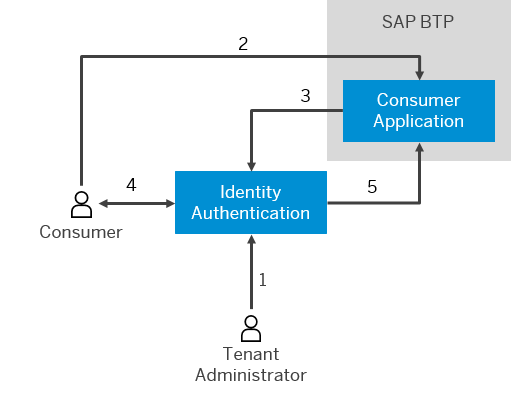

<!-- loiofd11ee278b6d4554951d70f856e4df1b -->

# Business-to-Consumer

The business-to-consumer scenario is related to any actions performed by the consumer, such as registration to applications and consumer retailing. In this scenario, administrators facilitate the consumer processes, but they do not act on the consumer's behalf.

This scenario includes the following features:

-   Authentication with user name and password
-   A secure single sign-on to cloud applications
-   Social sign-on to cloud applications

    > ### Note:  
    > The content in this section is not relevant for China \(Shanghai\) region.

-   Self-registration of consumers
-   Invitation of consumers
-   Branding elements on all the forms for logon, registration, password update, and account activation
-   Customized privacy policy and terms of use
-   Consumer security policy
-   User import and export

> ### Example:  
> Michael Adams is an administrator at retail company A. He would like to configure his system such that users can register on their own and then purchase from the company’s site. Michael also wants to allow users to access his *Company A Purchasing* application by self-registration. To do this, Michael logs on to the administration console for SAP Cloud Identity Services, navigates to *Applications* \> *Company A Purchasing*, and chooses *Authentication and Access* \> *User Application Access*. He selects the *Public* radio button to allow user self-registration for his *Company A Purchasing* application.Michael also allows users to authenticate through a social provider by providing the keys and secrets for the social providers after he chooses the *Social Identity Providers* tile. He then enables social sign-on by choosing the *Applications* tile and navigating to *Company A Purchasing* \> *Authentication and Access*. Furthermore, Michael configures custom terms of use and privacy policy for the *Company A Purchasing* application. To do this, he chooses the *Terms of Use Documents* and *Privacy Policy Documents* tiles and adds the new plain text files in English language versions. He then returns to *Applications* \> *Company A Purchasing* view and sets the new terms of use and privacy policy documents for the application under the *Authentication and Access* tab.
> 
> Michael also decides to use a custom branding style for the buttons on his logon and registration forms. To do this, he opens the *Branding Style* page under the *Branding and Layout* tab in the *Application* view and selects the branding styles.
> 
> Donna Moore is a customer who wants to purchase goods from company A for the first time. When she accesses company A’s application, she is redirected to the company’s logon page. Because she is not registered yet, she has to choose the *Register Now* link to start the registration process. A registration form then appears, prompting Donna to enter her names, email, and address and to accept the organization's terms of use and privacy policy. When she submits the form, she receives an email with instructions on how to activate her registration. Once she activates her registration, she is able to log on to the retailing application with her user credentials.
> 
> 
> 
> 1.  Configures user access to the application.
> 2.  Registers or provides credentials.
> 3.  Delegates self-registration or authentication.
> 4.  Activates account.
> 5.  Confirms authentication.

**Related Information**  

[Administration](Operation-Guide/administration-6a8e67c.md "The SAP Cloud Identity Services administration and configuration tasks are intended for administrators. They include configuring tenant settings, applications, authorization policies and provisioning, as well as managing users and groups, to ensure proper operations.")

[Development](Development/development-55ab9b8.md "The developer guide is aimed mainly at organization developers who can implement configurations in addition to the ones in the administration console of Identity Authentication.")

[Configure User Access to the Application](Operation-Guide/configure-user-access-to-the-application-8b147c4.md "You can configure public access to the application allowing self-registration, or you can restrict the access to existing users or users registered by an application.")

[Configuring Privacy Policies](Operation-Guide/configuring-privacy-policies-ed48466.md "You can configure a custom privacy policy document by creating a new document, adding and editing its language versions, and defining the document for an application.")

[Configuring Terms of Use](Operation-Guide/configuring-terms-of-use-61d3a86.md "You can configure a custom terms of use document by creating a new document, adding and editing its language versions, and defining the document for an application.")

[Choose and Configure a Branding Style for an Application](Operation-Guide/choose-and-configure-a-branding-style-for-an-application-32f8d33.md "For the configuration of the branding style, you can choose a style for the end-user screens, such as sign-in, registration, upgrade. You can also customize the buttons on these screens.")

