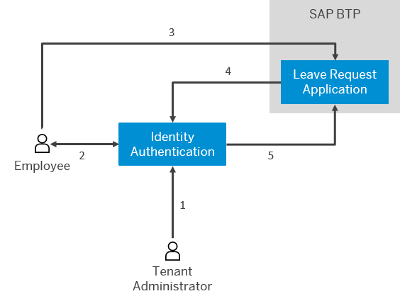

<!-- loio3aecb4caf38f4729b28959e3c2e789bd -->

# Business-to-Employee Scenario

The business-to-employee scenario is related to services for employees of an organization. Employees can access various applications with one logon. Furthermore, administrators can upload employees data by using the user import functionality.

The scenario includes the following features:

-   Authentication with user name and password
-   A secure SSO to cloud applications
-   Branding elements on all the forms for logon and password update
-   Customized privacy policy and terms of use documents
-   Employee security policy
-   User import and export
-   Database restricted for employees only

> ### Example:  
> Julie Armstrong is an administrator at company B. She wants to configure a leave request application to be used by the employees of the company. For this purpose, she imports the employees by opening the *Import Users* page in the administration console for SAP Cloud Identity Services and selecting a CSV file containing the employees. Once she has imported all the new users into the system, she sends them an email with instructions how to activate their accounts. She also configures the trust on SAP BTP.
> 
> Julie wants only the employees to access the application. She selects the *Internal* radio button after she chooses *Authentication and Access* \> *User Application Access* for the leave request application in the administration console.
> 
> As an employee of company B, Michael accesses an SAP BTP application to make a leave request. When he opens the application, he has to choose the *Forgot Password* link to activate his account. After activation, Michael provides a user name and password to log on to the leave request application with. He is redirected to Identity Authentication for authentication. Identity Authentication verifies his credentials and sends a response back to the SAP BTP application. As a result, Michael logs on and enters his leave request.
> 
> 
> 
> 1.  Imports users.
> 2.  Activates account.
> 3.  Provides credentials.
> 4.  Delegates authentication.
> 5.  Confirms authentication.

**Related Information**  

[Business-to-Consumer Scenario](business-to-consumer-scenario-fd11ee2.md "The business-to-consumer scenario is related to any actions performed by the consumer, such as registration to applications and consumer retailing. In this scenario, administrators facilitate the consumer processes, but they do not act on the consumer's behalf.")

[Business-to-Business Scenario](business-to-business-scenario-3908c37.md "The business-to-business scenario is related to services for business partners. Unlike the business-to-consumer scenario, consumer self-registration is not allowed, and the administrator of the company is usually the one that triggers the user registration process.")

[Centralized Provisioning with Identity Directory](centralized-provisioning-with-identity-directory-9d0235c.md "Identity Directory is the persistency layer of SAP Cloud Identity Services, providing a central place for storing and managing users and groups. You can use it in centralized provisioning scenarios for managing user access to SAP cloud applications from a single, central location.")

[Central Store-Based Provisioning](central-store-based-provisioning-33eae39.md "Central store-based provisioning enables the automatic provisioning of application-specific groups from the Identity Directory to the target systems whenever changes occur. These changes include user assignments or modifications of group attributes.")

[Import or Update Users for a Specific Application](Operation-Guide/import-or-update-users-for-a-specific-application-33838e0.md "As a tenant administrator, you can import new users or update existing ones for a specific application with a CSV file. You can also send activation emails to the users that have not received activation emails for that application so far.")

[Configure User Access to the Application](Operation-Guide/configure-user-access-to-the-application-8b147c4.md "You can configure public access to the application allowing self-registration, or you can restrict the access to existing users or users registered by an application.")

[Tenant SAML 2.0 Configurations](Operation-Guide/tenant-saml-2-0-configurations-e81a19b.md "You as a tenant administrator can view and download the tenant SAML 2.0 metadata. You can also change the name format and update your certificate used by the identity provider to digitally sign the messages for the applications.")

