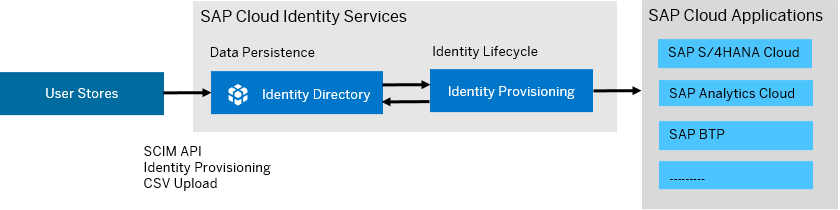

<!-- loio9d0235cc85dc46baa941f0a963cb1e95 -->

# Centralized Provisioning with Identity Directory

Identity Directory is the persistency layer of SAP Cloud Identity Services, providing a central place for storing and managing users and groups. You can use it in centralized provisioning scenarios for managing user access to SAP cloud applications from a single, central location.

In a typical scenario, illustrated in the diagram below, the Identity Provisioning service reads identities from the customer's user store, like Microsoft Entra ID, and replicates them to the directory. From there, they are provisioned further to various SAP cloud systems like SAP S/4HANA Cloud, SAP Analytics Cloud and more.

For every newly created user, the directory generates a Global User ID, which serves as unique identifier across the entire landscape. This unique correlation attribute is then distributed by Identity Provisioning to the SAP cloud applications that need it for their integration with the SAP Task Center, for example. The unique identifier can also be generated externally and persisted in the identity directory during the initial replication from the customer’s user store. For more information, see [Global User ID in Integration Scenarios](https://help.sap.com/docs/cloud-identity/system-integration-guide/global-user-id-in-integration-scenarios).



You can access the Identity Directory in the following ways:

-   Use the Identity Provisioning service to create, update and delete users and groups by running provisioning jobs. The service provides a connector, known as Local Identity Directory, which can be set up as the source, target or proxy system for provisioning scenarios. There is no need to configure connectivity and authentication properties when connecting the Identity Directory and Identity Provisioning. Both services share the same SAP Cloud Identity Services tenant that you are currently logged in.

    For more information, see [Local Identity Directory](local-identity-directory-59557ae.md).

    > ### Note:  
    > The Local Identity Directory connector is available for bundle and standalone tenants running on SAP Cloud Identity Services infrastructure.

-   Use the SCIM 2.0 API to programmatically access and manage identities in the directory. The API allows you to view predefined schemas and to define custom schemas with your own attributes. For more information, see [Identity Directory API](https://api.sap.com/api/IdDS_SCIM/resource/Users).

-   Use the SAP Cloud Identity Services administration console to access and manage identities in the directory via the user interface. For more information, see [Managing Users](Operation-Guide/managing-users-228428f.md) and [Managing Groups](Operation-Guide/managing-groups-ddd067c.md).


<a name="loio9d0235cc85dc46baa941f0a963cb1e95__section_flf_hst_lbc"/>

## Source-Target System Provisioning

Configure Local Identity Directory, both as a target and as a source system.

In this scenario, the Local Identity Directory is initially set up as a target system for user and group provisioning. Typically, identities are initially provisioned from the customer's user store to the directory, thus establishing the user store as the leading source system for identity management. Following this, users and groups from other source systems are provisioned to the directory. Finally, the identities in the directory are replicated to the target systems.

The following configuration example uses a number of systems, including: Microsoft Entra ID, Local Identity Directory, and SAP S/4HANA Cloud.

1.  Sign in to SAP Cloud Identity Services administration console and navigate to *Identity Provisioning*.

2.  Add [Microsoft Entra ID](microsoft-entra-id-f75f99c.md) as a source system.

3.  Add [Local Identity Directory](local-identity-directory-59557ae.md) as a target system.

4.  **Optional**: Configure properties that are relevant for the Local Identity Directory target system, for example `idds.support.bulk.operation` and `idds.bulk.operations.max.count`. For more information, see [List of Properties](list-of-properties-d6f3577.md).

5.  **Optional**: Review and adapt the default write transformations as necessary.

    > ### Code Syntax:  
    > ```
    > {
    >   "user": {
    >     "condition": "($.emails EMPTY false) && ($.userName EMPTY false) && isValidEmail($.emails[0].value)",
    >     "mappings": [
    >       {
    >         "sourceVariable": "entityIdTargetSystem",
    >         "targetPath": "$.id"
    >       },
    >       {
    >         "constant": ["urn:ietf:params:scim:schemas:core:2.0:User","urn:ietf:params:scim:schemas:extension:enterprise:2.0:User","urn:ietf:params:scim:schemas:extension:sap:2.0:User","urn:sap:cloud:scim:schemas:extension:custom:2.0:User"],
    >         "targetPath": "$.schemas"
    >       },
    >       {
    >         "sourcePath": "$.userName",
    >         "targetPath": "$.userName"
    >       },
    >       {
    >         "constant": "userName",
    >         "targetVariable": "entityCorrelationAttributeName"
    >       },
    >       {
    >         "sourcePath": "$.userName",
    >         "targetVariable": "entityCorrelationAttributeValue"
    >       },
    >       {
    >         "sourcePath": "$.emails",
    >         "preserveArrayWithSingleElement": true,
    >         "targetPath": "$['urn:ietf:params:scim:schemas:extension:sap:2.0:User']['emails']",
    >         "scope": "createEntity",
    >         "functions": [
    >            {
    >                  "function": "putIfAbsent",
    >                  "key": "verified",
    >                  "defaultValue": true
    >            }
    >          ]
    >       },
    >       {
    >         "targetPath": "$['urn:ietf:params:scim:schemas:extension:sap:2.0:User']['emails'][*]['type']",
    >         "type": "remove"
    >       },
    >       {
    >         "sourcePath": "$.emails[*].value",
    >         "preserveArrayWithSingleElement": true,
    >         "targetPath": "$.emails[?(@.value)]"
    >       },
    >       {
    >         "sourcePath": "$.name.givenName",
    >         "targetPath": "$.name.givenName",
    >         "optional": true
    >       },
    >       {
    >         "sourcePath": "$.name.middleName",
    >         "targetPath": "$.name.middleName",
    >         "optional": true
    >       },
    >       {
    >         "sourcePath": "$.name.familyName",
    >         "targetPath": "$.name.familyName",
    >         "optional": true
    >       },
    >       {
    >         "sourcePath": "$.name.honorificPrefix",
    >         "targetPath": "$.name.honorificPrefix",
    >         "optional": true
    >       },
    >       {
    >         "sourcePath": "$.addresses",
    >         "targetPath": "$.addresses",
    >         "preserveArrayWithSingleElement": true,
    >         "defaultValue": [],
    >         "optional": true,
    >         "functions": [
    >           {
    >             "function": "putIfAbsent",
    >             "key": "type",
    >             "defaultValue": "work"
    >           },
    >           {
    >             "condition": "(@.type NIN ['work', 'home'])",
    >             "function": "putIfPresent",
    >             "key": "type",
    >             "defaultValue": "work"
    >           }
    >         ]
    >       },
    >       {
    >         "sourcePath": "$.phoneNumbers",
    >         "targetPath": "$.phoneNumbers",
    >         "preserveArrayWithSingleElement": true,
    >         "optional": true
    >       },
    >       {
    >         "sourcePath": "$.displayName",
    >         "targetPath": "$.displayName",
    >         "optional": true
    >       },
    >       {
    >         "sourcePath": "$.userType",
    >         "targetPath": "$.userType",
    >         "optional": true
    >       },
    >       {
    >         "sourcePath": "$.locale",
    >         "targetPath": "$.locale",
    >         "optional": true
    >       },
    >       {
    >         "sourcePath": "$.timezone",
    >         "targetPath": "$.timezone",
    >         "optional": true
    >       },
    >       {
    >         "sourcePath": "$.active",
    >         "targetPath": "$.active",
    >         "defaultValue": true,
    >         "optional": true
    >       },
    >       {
    >         "sourcePath": "$['urn:ietf:params:scim:schemas:extension:sap:2.0:User']['validFrom']",
    >         "targetPath": "$['urn:ietf:params:scim:schemas:extension:sap:2.0:User']['validFrom']",
    >         "optional": true
    >       },
    >       {
    >         "sourcePath": "$['urn:ietf:params:scim:schemas:extension:sap:2.0:User']['validTo']",
    >         "targetPath": "$['urn:ietf:params:scim:schemas:extension:sap:2.0:User']['validTo']",
    >         "optional": true
    >       },
    >       {
    >         "sourcePath": "$['urn:ietf:params:scim:schemas:extension:enterprise:2.0:User']['employeeNumber']",
    >         "targetPath": "$['urn:ietf:params:scim:schemas:extension:enterprise:2.0:User']['employeeNumber']",
    >         "optional" : true
    >       },
    >       {
    >         "sourcePath": "$['urn:ietf:params:scim:schemas:extension:enterprise:2.0:User']['costCenter']",
    >         "targetPath": "$['urn:ietf:params:scim:schemas:extension:enterprise:2.0:User']['costCenter']",
    >         "optional" : true
    >       },
    >       {
    >         "sourcePath": "$['urn:ietf:params:scim:schemas:extension:enterprise:2.0:User']['organization']",
    >         "targetPath": "$['urn:ietf:params:scim:schemas:extension:enterprise:2.0:User']['organization']",
    >         "optional" : true
    >       },
    >       {
    >         "sourcePath": "$['urn:ietf:params:scim:schemas:extension:enterprise:2.0:User']['division']",
    >         "targetPath": "$['urn:ietf:params:scim:schemas:extension:enterprise:2.0:User']['division']",
    >         "optional" : true
    >       },
    >       {
    >         "sourcePath": "$['urn:ietf:params:scim:schemas:extension:enterprise:2.0:User']['department']",
    >         "targetPath": "$['urn:ietf:params:scim:schemas:extension:enterprise:2.0:User']['department']",
    >         "optional" : true
    >       },
    >       {
    >         "sourcePath": "$['urn:ietf:params:scim:schemas:extension:enterprise:2.0:User']['manager']['value']",
    >         "targetPath": "$['urn:ietf:params:scim:schemas:extension:enterprise:2.0:User']['manager']['value']",
    >         "optional" : true,
    >         "functions": [
    >             {
    >               "function": "resolveEntityIds"
    >             }
    >           ]
    >       },
    >       {
    >         "sourcePath": "$['urn:ietf:params:scim:schemas:extension:enterprise:2.0:User']['manager']['displayName']",
    >         "targetPath": "$['urn:ietf:params:scim:schemas:extension:enterprise:2.0:User']['manager']['displayName']",
    >         "optional" : true
    >       },
    >       {
    >         "constant": false,
    >         "targetPath": "$['urn:ietf:params:scim:schemas:extension:sap:2.0:User']['sendMail']",
    >         "scope": "createEntity"
    >       },
    >       {
    >         "constant": true,
    >         "targetPath": "$['urn:ietf:params:scim:schemas:extension:sap:2.0:User']['mailVerified']",
    >         "scope": "createEntity"
    >       },
    >       {
    >         "constant": "disabled",
    >         "targetPath": "$['urn:ietf:params:scim:schemas:extension:sap:2.0:User']['passwordDetails']['status']",
    >         "scope": "createEntity"
    >       },
    >       {
    >         "sourcePath": "$['urn:sap:cloud:scim:schemas:extension:custom:2.0:User']['attributes']",
    >         "preserveArrayWithSingleElement": true,
    >         "optional": true,
    >         "targetPath": "$['urn:sap:cloud:scim:schemas:extension:custom:2.0:User']['attributes']"
    >       },
    >       {
    >         "constant": "<your-initial-password>",
    >         "targetPath": "$.password",
    >         "scope": "createEntity",
    >         "ignore": "true"
    >       },
    >       {
    >         "constant": "<your-source-system-type-code>",
    >         "targetPath": "$['urn:ietf:params:scim:schemas:extension:sap:2.0:User']['sourceSystem']",
    >         "scope": "createEntity",
    >         "ignore": true
    >       },
    >       {
    >         "constant": "<your-source-system-id>",
    >         "targetPath": "$['urn:ietf:params:scim:schemas:extension:sap:2.0:User']['sourceSystemId']",
    >         "scope": "createEntity",
    >         "ignore": true
    >       }
    >     ]
    >   },
    >   "group": {
    >     "mappings": [
    >       {
    >         "sourceVariable": "entityIdTargetSystem",
    >         "targetPath": "$.id"
    >       },
    >       {
    >         "constant": ["urn:ietf:params:scim:schemas:core:2.0:Group","urn:sap:cloud:scim:schemas:extension:custom:2.0:Group","urn:ietf:params:scim:schemas:extension:sap:2.0:Group"],
    >         "targetPath": "$.schemas"
    >       },
    >       {
    >         "sourcePath": "$.displayName",
    >         "targetPath": "$.displayName"
    >       },
    >       {
    >         "sourcePath": "$.members[*].value",
    >         "preserveArrayWithSingleElement": true,
    >         "optional": true,
    >         "targetPath": "$.members[?(@.value)]",
    >         "functions": [
    >             {
    >               "entityType": "user",
    >               "type": "resolveEntityIds"
    >             }
    >           ]
    >       },
    >       {
    >         "sourcePath": "$.members[*].value",
    >         "preserveArrayWithSingleElement": true,
    >         "optional": true,
    >         "targetPath": "$.members[?(@.value)]",
    >         "functions": [
    >             {
    >               "entityType": "group",
    >               "type": "resolveEntityIds"
    >             }
    >           ]
    >       },
    >       {
    >         "sourcePath": "$.displayName",
    >         "targetPath": "$['urn:sap:cloud:scim:schemas:extension:custom:2.0:Group']['name']",
    >         "scope": "createEntity"
    >       },
    >       {
    >         "sourcePath": "$['urn:sap:cloud:scim:schemas:extension:custom:2.0:Group']['name']",
    >         "optional": true,
    >         "targetPath": "$['urn:sap:cloud:scim:schemas:extension:custom:2.0:Group']['name']",
    >         "scope": "createEntity"
    >       },
    >       {
    >         "sourcePath": "$['urn:sap:cloud:scim:schemas:extension:custom:2.0:Group']['description']",
    >         "optional": true,
    >         "targetPath": "$['urn:sap:cloud:scim:schemas:extension:custom:2.0:Group']['description']"
    >       },
    >       {
    >         "condition": "$['urn:ietf:params:scim:schemas:extension:sap:2.0:Group']['applicationId'] EMPTY false",
    >         "sourcePath": "$['urn:ietf:params:scim:schemas:extension:sap:2.0:Group']['applicationId']",
    >         "targetPath": "$['urn:ietf:params:scim:schemas:extension:sap:2.0:Group']['applicationId']"
    >       },
    >       {
    >         "condition": "$['urn:ietf:params:scim:schemas:extension:sap:2.0:Group']['applicationId'] EMPTY false",
    >         "sourcePath": "$['urn:ietf:params:scim:schemas:extension:sap:2.0:Group']['type']",
    >         "optional": true,
    >         "targetPath": "$['urn:ietf:params:scim:schemas:extension:sap:2.0:Group']['type']"
    >       },
    >       {
    >         "condition": "$['urn:ietf:params:scim:schemas:extension:sap:2.0:Group']['applicationId'] EMPTY false",
    >         "sourcePath": "$['urn:ietf:params:scim:schemas:extension:sap:2.0:Group']['supportedOperations']",
    >         "optional": true,
    >         "targetPath": "$['urn:ietf:params:scim:schemas:extension:sap:2.0:Group']['supportedOperations']"
    >       }
    >     ]
    >   }
    > }
    > ```

6.  Schedule or [run manually a provisioning job](Operation-Guide/start-and-stop-provisioning-jobs-531a261.md) from the *Microsoft Entra ID* source system.

7.  View the [provisioning job logs](Monitoring-and-Reporting/monitor-provisioning-job-logs-e5b5176.md) and subscribe to receive [job notifications](Monitoring-and-Reporting/manage-job-notifications-d055bc2.md). We recommend that you do this for each source system where a provisioning job is initiated.

8.  Add [Local Identity Directory](local-identity-directory-59557ae.md) as a source system.

    It already contains all the users and groups provisioned from *Microsoft Entra ID*.

9.  **Optional**: Configure properties that are relevant for the Local Identity Directory source system, for example `idds.user.filter` and `idds.group.filter`. For more information, see [List of Properties](list-of-properties-d6f3577.md).

10. **Optional**: Review and adapt the default read transformations as necessary.

    > ### Code Syntax:  
    > ```
    > {
    >     "user": {
    >         "mappings": [
    >             {
    >                 "sourcePath": "$.id",
    >                 "targetVariable": "entityIdSourceSystem",
    >                 "targetPath": "$['urn:sap:cloud:scim:schemas:extension:custom:2.0:User']['userId']"
    >             },
    >             {
    >                 "sourcePath": "$['urn:ietf:params:scim:schemas:extension:sap:2.0:User']['userUuid']",
    >                 "targetPath": "$['urn:ietf:params:scim:schemas:extension:sap:2.0:User']['userUuid']"
    >             },
    >             {
    >                 "sourcePath": "$.schemas",
    >                 "preserveArrayWithSingleElement": true,
    >                 "targetPath": "$.schemas"
    >             },
    >             {
    >                 "sourcePath": "$.userName",
    >                 "targetPath": "$.userName",
    >                 "optional": true,
    >                 "correlationAttribute": true
    >             },
    >             {
    >                 "sourcePath": "$.name.givenName",
    >                 "targetPath": "$.name.givenName",
    >                 "optional": true
    >             },
    >             {
    >                 "sourcePath": "$.name.middleName",
    >                 "targetPath": "$.name.middleName",
    >                 "optional": true
    >             },
    >             {
    >                 "sourcePath": "$.name.familyName",
    >                 "targetPath": "$.name.familyName",
    >                 "optional": true
    >             },
    >             {
    >                 "sourcePath": "$.name.honorificPrefix",
    >                 "targetPath": "$.name.honorificPrefix",
    >                 "optional": true
    >             },
    >             {
    >                 "sourcePath": "$.emails[*].value",
    >                 "preserveArrayWithSingleElement": true,
    >                 "targetPath": "$.emails[?(@.value)]"
    >             },
    >             {
    >                 "sourcePath": "$.emails[?(@.primary== true)].value",
    >                 "correlationAttribute": true
    >             },
    >             {
    >                 "sourcePath": "$.active",
    >                 "targetPath": "$.active"
    >             },
    >             {
    >                 "sourcePath": "$.userType",
    >                 "targetPath": "$.userType",
    >                 "optional": true
    >             },
    >             {
    >                 "sourcePath": "$.addresses",
    >                 "targetPath": "$.addresses",
    >                 "preserveArrayWithSingleElement": true,
    >                 "optional": true
    >             },
    >             {
    >                 "sourcePath": "$.locale",
    >                 "targetPath": "$.locale",
    >                 "optional": true
    >             },
    >             {
    >                 "sourcePath": "$.phoneNumbers",
    >                 "targetPath": "$.phoneNumbers",
    >                 "preserveArrayWithSingleElement": true,
    >                 "optional": true
    >             },
    >             {
    >                 "sourcePath": "$.timezone",
    >                 "targetPath": "$.timezone",
    >                 "optional": true
    >             },
    >             {
    >                 "sourcePath": "$.displayName",
    >                 "targetPath": "$.displayName",
    >                 "optional": true
    >             },
    >             {
    >                 "sourcePath": "$.groups",
    >                 "targetPath": "$.groups",
    >                 "preserveArrayWithSingleElement": true,
    >                 "optional": true
    >             },
    >             {
    >                 "type": "remove",
    >                 "targetPath": "$.groups[*].display"
    >             },
    >             {
    >                 "condition": "$.displayName EMPTY true",
    >                 "type": "remove",
    >                 "targetPath": "$.displayName"
    >             },
    >             {
    >                 "sourcePath": "$['urn:ietf:params:scim:schemas:extension:sap:2.0:User']['validFrom']",
    >                 "targetPath": "$['urn:ietf:params:scim:schemas:extension:sap:2.0:User']['validFrom']",
    >                 "optional": true
    >             },
    >             {
    >                 "sourcePath": "$['urn:ietf:params:scim:schemas:extension:sap:2.0:User']['validTo']",
    >                 "targetPath": "$['urn:ietf:params:scim:schemas:extension:sap:2.0:User']['validTo']",
    >                 "optional": true
    >             },
    >             {
    >                 "sourcePath": "$['urn:ietf:params:scim:schemas:extension:sap:2.0:User']['sourceSystem']",
    >                 "targetPath": "$['urn:ietf:params:scim:schemas:extension:sap:2.0:User']['sourceSystem']",
    >                 "optional": true
    >             },
    >             {
    >                 "sourcePath": "$['urn:ietf:params:scim:schemas:extension:sap:2.0:User']['sourceSystemId']",
    >                 "targetPath": "$['urn:ietf:params:scim:schemas:extension:sap:2.0:User']['sourceSystemId']",
    >                 "optional": true
    >             },
    >             {
    >                 "sourcePath": "$['urn:ietf:params:scim:schemas:extension:enterprise:2.0:User']['employeeNumber']",
    >                 "targetPath": "$['urn:ietf:params:scim:schemas:extension:enterprise:2.0:User']['employeeNumber']",
    >                 "optional": true
    >             },
    >             {
    >                 "sourcePath": "$['urn:ietf:params:scim:schemas:extension:enterprise:2.0:User']['costCenter']",
    >                 "targetPath": "$['urn:ietf:params:scim:schemas:extension:enterprise:2.0:User']['costCenter']",
    >                 "optional": true
    >             },
    >             {
    >                 "sourcePath": "$['urn:ietf:params:scim:schemas:extension:enterprise:2.0:User']['organization']",
    >                 "targetPath": "$['urn:ietf:params:scim:schemas:extension:enterprise:2.0:User']['organization']",
    >                 "optional": true
    >             },
    >             {
    >                 "sourcePath": "$['urn:ietf:params:scim:schemas:extension:enterprise:2.0:User']['division']",
    >                 "targetPath": "$['urn:ietf:params:scim:schemas:extension:enterprise:2.0:User']['division']",
    >                 "optional": true
    >             },
    >             {
    >                 "sourcePath": "$['urn:ietf:params:scim:schemas:extension:enterprise:2.0:User']['department']",
    >                 "targetPath": "$['urn:ietf:params:scim:schemas:extension:enterprise:2.0:User']['department']",
    >                 "optional": true
    >             },
    >             {
    >                 "sourcePath": "$['urn:ietf:params:scim:schemas:extension:enterprise:2.0:User']['manager']['value']",
    >                 "targetPath": "$['urn:ietf:params:scim:schemas:extension:enterprise:2.0:User']['manager']['value']",
    >                 "optional": true
    >             },
    >             {
    >                 "sourcePath": "$['urn:ietf:params:scim:schemas:extension:enterprise:2.0:User']['manager']['displayName']",
    >                 "targetPath": "$['urn:ietf:params:scim:schemas:extension:enterprise:2.0:User']['manager']['displayName']",
    >                 "optional": true
    >             },
    >             {
    >                 "sourcePath": "$['urn:sap:cloud:scim:schemas:extension:custom:2.0:User']",
    >                 "targetPath": "$['urn:sap:cloud:scim:schemas:extension:custom:2.0:User']",
    >                 "optional": true
    >             },
    >             {
    >                 "sourcePath": "$.company",
    >                 "targetPath": "$['urn:ietf:params:scim:schemas:extension:enterprise:2.0:User']['organization']",
    >                 "optional": true
    >             }
    >         ]
    >     },
    >     "group": {
    >         "mappings": [
    >             {
    >                 "sourcePath": "$.id",
    >                 "targetVariable": "entityIdSourceSystem"
    >             },
    >             {
    >                 "sourcePath": "$['urn:sap:cloud:scim:schemas:extension:custom:2.0:Group']['name']",
    >                 "targetPath": "$['urn:sap:cloud:scim:schemas:extension:custom:2.0:Group']['name']"
    >             },
    >             {
    >                 "sourcePath": "$.displayName",
    >                 "targetPath": "$.displayName"
    >             },
    >             {
    >                 "sourcePath": "$.members",
    >                 "targetPath": "$.members",
    >                 "preserveArrayWithSingleElement": true,
    >                 "optional": true
    >             },
    >             {
    >                 "sourcePath": "$['urn:ietf:params:scim:schemas:extension:sap:2.0:Group']['type']",
    >                 "targetPath": "$['urn:ietf:params:scim:schemas:extension:sap:2.0:Group']['type']",
    >                 "optional": true
    >             },
    >             {
    >                 "sourcePath": "$['urn:ietf:params:scim:schemas:extension:sap:2.0:Group']['supportedOperations']",
    >                 "targetPath": "$['urn:ietf:params:scim:schemas:extension:sap:2.0:Group']['supportedOperations']",
    >                 "optional": true
    >             }
    >         ]
    >     }
    > }
    > ```

11. Add [SAP S/4HANA Cloud](sap-s-4hana-cloud-d3f93a7.md) as a target system.

12. Start another provisioning job, this time from the *Local Identity Directory* source system.


### Results

The Microsoft Entra ID users and groups are provisioned to the identity directory. It now becomes the central point of truth for identity information. Once in the directory, the users and groups are replicated to the SAP S/4HANA Cloud target.


<a name="loio9d0235cc85dc46baa941f0a963cb1e95__section_yf5_fd3_mbc"/>

## Merging Data from Multiple Sources

The personal and technical information of the user varies across different systems. To manage a unified and up-to-date user data, you can provision the identities from multiple sources and merge them into one target identity directory.

You have the flexibility to choose your own approach when merging data from various sources. This could include defining the unique attribute or a combination of them when resolving conflicts, deciding on how to add and update user and group attributes. All of these require changes in the default write transformations of the identity directory.

> ### Caution:  
> When reading user data from multiple sources, we strongly recommend that you perform **consecutive** provisioning jobs. Simultaneous jobs may lead to inconsistent or overwritten user data in the target system.

> ### Note:  
> To execute PATCH instead of PUT requests when updating an entry, set the `scim.support.patch.operation` = *true* on the *Properties* tab of the Local Identity Directory target system.


### Merge User Data by Email

By default, Identity Provisioning determines the user uniqueness based on the `userName` attribute. This means that if a user with a particular `userName` already exists in the identity directory, the service will match any new user, provisioned from other source systems with the same `userName`, to this existing user and update it accordingly.

To merge the user data by email instead of userName, you need to set the `scim.user.unique.attribute` to `emails[0].value` and replace the default mapping for `userName` with the one for `emails` as shown below.


<table>
<tr>
<td valign="top">

> ### Code Syntax:  
> ```
> {
>    "constant":"userName",
>    "targetVariable":"entityCorrelationAttributeName"
> },
> {
>    "sourcePath":"$.userName",
>    "targetVariable":"entityCorrelationAttributeValue"
> }
> ```


</td>
<td valign="top">

> ### Code Syntax:  
> ```
> {
>    "constant":"emails.value",
>    "targetVariable":"entityCorrelationAttributeName"
> },
> {
>    "sourcePath":"$.emails[0].value",
>    "targetVariable":"entityCorrelationAttributeValue"
> }
> ```


</td>
</tr>
</table>


### Add and Update Attributes with Patch

Following the provisioning of your identities from the leading source system \(Microsfot Entra ID\), you may want to replicate additional user attributes from the second source system \(SAP SuccessFactors\) which were not initially provisioned from the first one.

One way to achieve this is to use `"scope":"patchEntity"` expression in the attribute mappings and define add or replace operation there. For example, suppose that users from Microsoft Entra ID are provisioned with their displayName attribute value but lack a value for the userType attribute. In order to both add userType and update displayName, you must provide the following mappings under the user entity in the target transformation:

> ### Code Syntax:  
> ```
> {
>    "targetPath":"$.schemas[0]",
>    "constant":"urn:ietf:params:scim:api:messages:2.0:PatchOp",
>    "scope":"patchEntity"
> },
> {
>    "targetPath":"$.Operations[0].op",
>    "condition":"$.userType EMPTY false",
>    "constant":"add",
>    "scope":"patchEntity"
> },
> {
>    "targetPath":"$.Operations[0].path",
>    "condition":"$.userType EMPTY false",
>    "constant":"userType",
>    "scope":"patchEntity"
> },
> {
>    "sourcePath":"$.userType",
>    "targetPath":"$.Operations[0].value",
>    "condition":"$.userType EMPTY false",
>    "scope":"patchEntity"
> },
> {
>    "targetPath":"$.Operations[1].op",
>    "condition":"$.displayName EMPTY false",
>    "constant":"add",
>    "scope":"patchEntity"
> },
> {
>    "targetPath":"$.Operations[1].path",
>    "condition":"$.displayName EMPTY false",
>    "constant":"displayName",
>    "scope":"patchEntity"
> },
> {
>    "sourcePath":"$.displayName",
>    "targetPath":"$.Operations[1].value",
>    "condition":"$.displayName EMPTY false",
>    "scope":"patchEntity"
> }
> ```

> ### Note:  
> The add operation is used to add a new attribute value to an existing resource. When add is performed on a single-value attribute that already has a value, like the displayName, the existing value is replaced with the new one. In this case, add is equivalent to replace. For more information about add and replace operations when modifying resources with PATCH, see the SCIM specification RFC [7644](https://datatracker.ietf.org/doc/html/rfc7644#section-3.5.2.1).

Another way to control which attributes are updated and when is using the `"scope":"createEntity"`. This transformation expression is defined on an attribute mapping in the target system. When this is in place, the attribute is only processed during user creation. Any other attributes could potentially be changed if a new value is subsequently provisioned.

For example, consider a scenario where you want the user's email to be provisioned from the leading source system when the user is created in the identity directory. Further provisioning from systems like SAP SuccessFactors, SAP SuccessFactors Learning, among others, will not change the email value if the scope is defined as follows:

> ### Code Syntax:  
> ```
> {
>    "sourcePath":"$.emails[*].value",
>    "preserveArrayWithSingleElement":true,
>    "targetPath":"$.emails[?(@.value)]",
>    "scope":"createEntity"
> },
> 
> ```


### Add Custom Attributes

You can provision attributes specific to a given source system as custom attributes in the target identity directory. For example, if you want to provision the `perPersonUuid` user attribute from SAP SuccessFactors to the identity directory, you need to provide the following mappings:

> ### Code Syntax:  
> ```
> {
>    "sourcePath":"$['urn:ietf:params:scim:schemas:extension:successfactors:2.0:User']['perPersonUuid']",
>    "targetPath":"$['urn:sap:cloud:scim:schemas:extension:custom:2.0:User']['attributes'][0]['value']",
>    "optional":true
> },
> {
>    "targetPath":"$['urn:sap:cloud:scim:schemas:extension:custom:2.0:User']['attributes'][0]['name']",
>    "condition":"$['urn:ietf:params:scim:schemas:extension:successfactors:2.0:User']['perPersonUuid'] EMPTY false",
>    "constant":"customAttribute1"
> }
> ```


<a name="loio9d0235cc85dc46baa941f0a963cb1e95__section_lpb_gxy_lbc"/>

## Proxy System Provisioning

Configure *Local Identity Directory* as a proxy system in the Identity Provisioning.

You can use the identity directory as a SCIM 2.0 based proxy connector. Before exposing it to an external system, you should first populate it with users and groups. To learn how to read and then provision them to the identity directory, see the *Source-Target System Provisioning* section above.

> ### Note:  
> The Identity Provisioning implementation of the Proxy System SCIM API \(based on the [SCIM Query](https://datatracker.ietf.org/doc/html/rfc7644#section-3.4.2)\) supports single entity and delta read filtering for users and groups. For more information, see [Query Parameters for Proxy System SCIM API](https://help.sap.com/docs/cloud-identity-services/cloud-identity-services/proxy-systems?version=Cloud#query-parameters-for-proxy-system-scim-api) → *Filters*.

1.  Sign in to SAP Cloud Identity Services administration console and create a technical user with the necessary authorizations. It will later be used by the external consumer to connect to Identity Provisioning.

    If you already have a technical user, skip this step.

    -   For **Certificate-based authentication**, follow the procedure in [Manage Certificates for Inbound Connection](Operation-Guide/manage-certificates-for-inbound-connection-952e7c7.md) → *SAP Cloud Identity Infrastructure*.

        For **Basic authentication**, navigate to *Users & Authorizations* \> *Administrators* and add an admin user of type **System**. Configure a client ID and secret for this user and enable the *Access Proxy System API* permission.


2.  Navigate to *Identity Provisioning* \> *Proxy Systems*.

3.  Add [Local Identity Directory](local-identity-directory-0624f7d.md) as a proxy system.

4.  **Optional**: Configure properties applicable for the Local Identity Directory proxy system, such as `idds.user.filter` and `idds.group.filter`. For more information, see [List of Properties](list-of-properties-d6f3577.md).

5.  **Optional**: Adapt the default proxy read and proxy write transformations:


    <table>
    <tr>
    <th valign="top">

    Read Transformation
    
    </th>
    <th valign="top">

    Write Transformation
    
    </th>
    </tr>
    <tr>
    <td valign="top">
    
    > ### Code Syntax:  
    > ```
    > {
    >   "user": {
    >     "scimEntityEndpoint": "Users",
    >     "mappings": [
    >       {
    >         "sourcePath": "$.id",
    >         "targetVariable": "entityIdSourceSystem",
    >         "targetPath": "$.id"
    >       },
    >       {
    >         "sourceVariable": "entityBaseLocation",
    >         "targetVariable": "entityLocationSourceSystem",
    >         "targetPath": "$.meta.location",
    >         "functions": [
    >           {
    >             "type": "concatString",
    >             "suffix": "${entityIdSourceSystem}"
    >           }
    >         ]
    >       },
    >       {
    >         "sourcePath": "$['urn:ietf:params:scim:schemas:extension:sap:2.0:User']['userUuid']",
    >         "targetPath": "$['urn:ietf:params:scim:schemas:extension:sap:2.0:User']['userUuid']"
    >       },
    >       {
    >         "sourcePath": "$.schemas",
    >         "preserveArrayWithSingleElement": true,
    >         "targetPath": "$.schemas"
    >       },
    >       {
    >         "sourcePath": "$.userName",
    >         "targetPath": "$.userName",
    >         "optional": true,
    >         "correlationAttribute": true
    >       },
    >       {
    >         "sourcePath": "$.emails[*].value",
    >         "preserveArrayWithSingleElement": true,
    >         "targetPath": "$.emails[?(@.value)]"
    >       },
    >       {
    >         "sourcePath": "$.emails[0].value",
    >         "targetPath": "$.emails[0].value"
    >       },
    >       {
    >         "sourcePath": "$.emails[?(@.primary== true)].value",
    >         "correlationAttribute": true
    >       },
    >       {
    >         "sourcePath": "$.active",
    >         "targetPath": "$.active"
    >       },
    >       {
    >         "sourcePath": "$.userType",
    >         "targetPath": "$.userType",
    >         "optional": true
    >       },
    >       {
    >         "sourcePath": "$.name.givenName",
    >         "targetPath": "$.name.givenName",
    >         "optional": true
    >       },
    >       {
    >         "sourcePath": "$.name.middleName",
    >         "targetPath": "$.name.middleName",
    >         "optional": true
    >       },
    >       {
    >         "sourcePath": "$.name.familyName",
    >         "targetPath": "$.name.familyName",
    >         "optional": true
    >       },
    >       {
    >         "sourcePath": "$.name.honorificPrefix",
    >         "targetPath": "$.name.honorificPrefix",
    >         "optional": true
    >       },
    >       {
    >         "sourcePath": "$.addresses",
    >         "targetPath": "$.addresses",
    >         "preserveArrayWithSingleElement": true,
    >         "optional": true
    >       },
    >       {
    >         "sourcePath": "$.locale",
    >         "targetPath": "$.locale",
    >         "optional": true
    >       },
    >       {
    >         "sourcePath": "$.phoneNumbers",
    >         "targetPath": "$.phoneNumbers",
    >         "preserveArrayWithSingleElement": true,
    >         "optional": true
    >       },
    >       {
    >         "sourcePath": "$.timezone",
    >         "targetPath": "$.timezone",
    >         "optional": true
    >       },
    >       {
    >         "sourcePath": "$.displayName",
    >         "targetPath": "$.displayName",
    >         "optional": true
    >       },
    >       {
    >         "sourcePath": "$.sourceSystem",
    >         "targetPath": "$.sourceSystem",
    >         "ignore": true
    >       },
    >       {
    >         "sourcePath": "$.groups",
    >         "targetPath": "$.groups",
    >         "preserveArrayWithSingleElement": true,
    >         "optional": true
    >       },
    >       {
    >         "type": "remove",
    >         "targetPath": "$.groups[*].display"
    >       },
    >       {
    >         "condition": "$.displayName EMPTY true",
    >         "type": "remove",
    >         "targetPath": "$.displayName"
    >       },
    >       {
    >         "sourcePath": "$['urn:ietf:params:scim:schemas:extension:enterprise:2.0:User']['employeeNumber']",
    >         "targetPath": "$['urn:ietf:params:scim:schemas:extension:enterprise:2.0:User']['employeeNumber']",
    >         "optional": true
    >       },
    >       {
    >         "sourcePath": "$['urn:ietf:params:scim:schemas:extension:enterprise:2.0:User']['costCenter']",
    >         "targetPath": "$['urn:ietf:params:scim:schemas:extension:enterprise:2.0:User']['costCenter']",
    >         "optional": true
    >       },
    >       {
    >         "sourcePath": "$['urn:ietf:params:scim:schemas:extension:enterprise:2.0:User']['organization']",
    >         "targetPath": "$['urn:ietf:params:scim:schemas:extension:enterprise:2.0:User']['organization']",
    >         "optional": true
    >       },
    >       {
    >         "sourcePath": "$['urn:ietf:params:scim:schemas:extension:enterprise:2.0:User']['division']",
    >         "targetPath": "$['urn:ietf:params:scim:schemas:extension:enterprise:2.0:User']['division']",
    >         "optional": true
    >       },
    >       {
    >         "sourcePath": "$['urn:ietf:params:scim:schemas:extension:enterprise:2.0:User']['department']",
    >         "targetPath": "$['urn:ietf:params:scim:schemas:extension:enterprise:2.0:User']['department']",
    >         "optional": true
    >       },
    >       {
    >         "sourcePath": "$['urn:ietf:params:scim:schemas:extension:enterprise:2.0:User']['manager']['value']",
    >         "targetPath": "$['urn:ietf:params:scim:schemas:extension:enterprise:2.0:User']['manager']['value']",
    >         "optional": true
    >       },
    >       {
    >         "sourcePath": "$['urn:ietf:params:scim:schemas:extension:enterprise:2.0:User']['manager']['displayName']",
    >         "targetPath": "$['urn:ietf:params:scim:schemas:extension:enterprise:2.0:User']['manager']['displayName']",
    >         "optional": true
    >       },
    >       {
    >         "sourcePath": "$['urn:sap:cloud:scim:schemas:extension:custom:2.0:User']",
    >         "targetPath": "$['urn:sap:cloud:scim:schemas:extension:custom:2.0:User']",
    >         "optional": true
    >       },
    >       {
    >         "sourcePath": "$.company",
    >         "targetPath": "$['urn:ietf:params:scim:schemas:extension:enterprise:2.0:User']['organization']",
    >         "optional": true
    >       }
    >     ]
    >   },
    >   "group": {
    >     "scimEntityEndpoint": "Groups",
    >     "mappings": [
    >       {
    >         "sourcePath": "$.id",
    >         "targetPath": "$.id",
    >         "targetVariable": "entityIdSourceSystem"
    >       },
    >       {
    >         "sourceVariable": "entityBaseLocation",
    >         "targetVariable": "entityLocationSourceSystem",
    >         "targetPath": "$.meta.location",
    >         "functions": [
    >           {
    >             "type": "concatString",
    >             "suffix": "${entityIdSourceSystem}"
    >           }
    >         ]
    >       },
    >       {
    >          "sourcePath": "$['urn:sap:cloud:scim:schemas:extension:custom:2.0:Group']['name']",
    >          "targetPath": "$['urn:sap:cloud:scim:schemas:extension:custom:2.0:Group']['name']"
    >       },
    >       {
    >          "sourcePath": "$.displayName",
    >          "targetPath": "$.displayName"
    >       },
    >       {
    >          "sourcePath": "$.members",
    >          "targetPath": "$.members",
    >          "preserveArrayWithSingleElement": true,
    >          "optional": true
    >       },
    >       {
    >         "sourcePath": "$.schemas",
    >         "preserveArrayWithSingleElement": true,
    >         "targetPath": "$.schemas"
    >       },
    >       {
    >         "sourcePath": "$['urn:ietf:params:scim:schemas:extension:sap:2.0:Group']['type']",
    >         "targetPath": "$['urn:ietf:params:scim:schemas:extension:sap:2.0:Group']['type']",
    >         "optional": true
    >       },
    >       {
    >         "sourcePath": "$['urn:ietf:params:scim:schemas:extension:sap:2.0:Group']['supportedOperations']",
    >         "targetPath": "$['urn:ietf:params:scim:schemas:extension:sap:2.0:Group']['supportedOperations']",
    >         "optional": true
    >       }
    >     ]
    >   }
    > }
    > ```


    
    </td>
    <td valign="top">
    
    > ### Code Syntax:  
    > ```
    > {
    >   "user": {
    >     "scimEntityEndpoint": "Users",
    >     "mappings": [
    >       {
    >         "sourceVariable": "entityIdTargetSystem",
    >         "targetPath": "$.id"
    >       },
    >       {
    >         "constant": ["urn:ietf:params:scim:schemas:core:2.0:User","urn:ietf:params:scim:schemas:extension:enterprise:2.0:User","urn:ietf:params:scim:schemas:extension:sap:2.0:User"],
    >         "targetPath": "$.schemas"
    >       },
    >       {
    >         "sourcePath": "$.userName",
    >         "targetPath": "$.userName",
    >         "optional": true
    >       },
    >       {
    >         "sourcePath": "$.emails[*].value",
    >         "preserveArrayWithSingleElement": true,
    >         "targetPath": "$.emails[?(@.value)]"
    >       },
    >       {
    >         "sourcePath": "$.userType",
    >         "targetPath": "$.userType",
    >         "optional": true
    >       },
    >       {
    >         "sourcePath": "$.name.givenName",
    >         "targetPath": "$.name.givenName",
    >         "optional": true
    >       },
    >       {
    >         "sourcePath": "$.name.middleName",
    >         "targetPath": "$.name.middleName",
    >         "optional": true
    >       },
    >       {
    >         "sourcePath": "$.name.familyName",
    >         "targetPath": "$.name.familyName",
    >         "optional": true
    >       },
    >       {
    >         "sourcePath": "$.name.honorificPrefix",
    >         "targetPath": "$.name.honorificPrefix",
    >         "optional": true
    >       },
    >       {
    >         "sourcePath": "$.addresses",
    >         "targetPath": "$.addresses",
    >         "preserveArrayWithSingleElement": true,
    >         "defaultValue": [],
    >         "optional": true,
    >         "functions": [
    >           {
    >             "function": "putIfAbsent",
    >             "key": "type",
    >             "defaultValue": "work"
    >           },
    >           {
    >             "condition": "(@.type NIN ['work', 'home'])",
    >             "function": "putIfPresent",
    >             "key": "type",
    >             "defaultValue": "work"
    >           }
    >         ]
    >       },
    >       {
    >         "sourcePath": "$.locale",
    >         "targetPath": "$.locale",
    >         "optional": true
    >       },
    >       {
    >         "sourcePath": "$.phoneNumbers",
    >         "targetPath": "$.phoneNumbers",
    >         "preserveArrayWithSingleElement": true,
    >         "optional": true
    >       },
    >       {
    >         "sourcePath": "$.displayName",
    >         "targetPath": "$.displayName",
    >         "optional": true
    >       },
    >       {
    >         "sourcePath": "$['urn:ietf:params:scim:schemas:extension:sap:2.0:User']['validFrom']",
    >         "targetPath": "$['urn:ietf:params:scim:schemas:extension:sap:2.0:User']['validFrom']",
    >         "optional": true
    >       },
    >       {
    >         "sourcePath": "$['urn:ietf:params:scim:schemas:extension:sap:2.0:User']['validTo']",
    >         "targetPath": "$['urn:ietf:params:scim:schemas:extension:sap:2.0:User']['validTo']",
    >         "optional": true
    >       },
    >       {
    >         "sourcePath": "$['urn:ietf:params:scim:schemas:extension:enterprise:2.0:User']['employeeNumber']",
    >         "targetPath": "$['urn:ietf:params:scim:schemas:extension:enterprise:2.0:User']['employeeNumber']",
    >         "optional": true
    >       },
    >       {
    >         "sourcePath": "$['urn:ietf:params:scim:schemas:extension:enterprise:2.0:User']['costCenter']",
    >         "targetPath": "$['urn:ietf:params:scim:schemas:extension:enterprise:2.0:User']['costCenter']",
    >         "optional": true
    >       },
    >       {
    >         "sourcePath": "$['urn:ietf:params:scim:schemas:extension:enterprise:2.0:User']['organization']",
    >         "targetPath": "$['urn:ietf:params:scim:schemas:extension:enterprise:2.0:User']['organization']",
    >         "optional": true
    >       },
    >       {
    >         "sourcePath": "$['urn:ietf:params:scim:schemas:extension:enterprise:2.0:User']['division']",
    >         "targetPath": "$['urn:ietf:params:scim:schemas:extension:enterprise:2.0:User']['division']",
    >         "optional": true
    >       },
    >       {
    >         "sourcePath": "$['urn:ietf:params:scim:schemas:extension:enterprise:2.0:User']['department']",
    >         "targetPath": "$['urn:ietf:params:scim:schemas:extension:enterprise:2.0:User']['department']",
    >         "optional": true
    >       },
    >       {
    >         "sourcePath": "$['urn:ietf:params:scim:schemas:extension:enterprise:2.0:User']['manager']['value']",
    >         "targetPath": "$['urn:ietf:params:scim:schemas:extension:enterprise:2.0:User']['manager']['value']",
    >         "optional": true
    >       },
    >       {
    >         "sourcePath": "$['urn:ietf:params:scim:schemas:extension:enterprise:2.0:User']['manager']['displayName']",
    >         "targetPath": "$['urn:ietf:params:scim:schemas:extension:enterprise:2.0:User']['manager']['displayName']",
    >         "optional": true
    >       },
    >       {
    >         "sourcePath": "$.active",
    >         "targetPath": "$.active",
    >         "defaultValue": true,
    >         "optional": true
    >       },
    >       {
    >         "constant": false,
    >         "targetPath": "$['urn:ietf:params:scim:schemas:extension:sap:2.0:User']['sendMail']",
    >         "scope": "createEntity"
    >       },
    >       {
    >         "sourcePath": "$.emails",
    >         "preserveArrayWithSingleElement": true,
    >         "targetPath": "$['urn:ietf:params:scim:schemas:extension:sap:2.0:User']['emails']",
    >         "scope": "createEntity",
    >         "functions": [
    >           {
    >             "function": "putIfAbsent",
    >             "key": "verified",
    >             "defaultValue": true
    >           }
    >         ]
    >       },
    >       {
    >         "targetPath": "$['urn:ietf:params:scim:schemas:extension:sap:2.0:User']['emails'][*]['type']",
    >         "type": "remove"
    >       },
    >       {
    >         "constant": "disabled",
    >         "targetPath": "$['urn:ietf:params:scim:schemas:extension:sap:2.0:User']['passwordDetails']['status']",
    >         "scope": "createEntity"
    >       },
    >       {
    >         "constant": 39,
    >         "targetPath": "$['urn:ietf:params:scim:schemas:extension:sap:2.0:User']['sourceSystem']",
    >         "scope": "createEntity"
    >       },
    >       {
    >         "constant": "employee",
    >         "targetPath": "$.userType"
    >       },
    >       {
    >         "sourcePath": "$.timezone",
    >         "targetPath": "$.timezone",
    >         "optional": true
    >       },
    >       {
    >         "constant": "userName",
    >         "targetVariable": "entityCorrelationAttributeName"
    >       },
    >       {
    >         "sourcePath": "$.userName",
    >         "targetVariable": "entityCorrelationAttributeValue"
    >       },
    >       {
    >         "sourcePath": "$.Operations",
    >         "targetPath": "$.Operations",
    >         "preserveArrayWithSingleElement": true,
    >         "scope": "patchEntity"
    >       },
    >       {
    >         "sourcePath": "$.schemas",
    >         "targetPath": "$.schemas",
    >         "preserveArrayWithSingleElement": true,
    >         "scope": "patchEntity"
    >       }
    >     ]
    >   },
    >   "group": {
    >     "scimEntityEndpoint": "Groups",
    >     "mappings": [
    >       {
    >         "sourceVariable": "entityIdTargetSystem",
    >         "targetPath": "$.id"
    >       },
    >       {
    >         "sourcePath": "$.Operations",
    >         "targetPath": "$.Operations",
    >         "preserveArrayWithSingleElement": true,
    >         "scope": "patchEntity"
    >       },
    >       {
    >         "sourcePath": "$.schemas",
    >         "targetPath": "$.schemas",
    >         "preserveArrayWithSingleElement": true,
    >         "scope": "patchEntity"
    >       },
    >       {
    >         "constant": ["urn:ietf:params:scim:schemas:core:2.0:Group","urn:sap:cloud:scim:schemas:extension:custom:2.0:Group","urn:ietf:params:scim:schemas:extension:sap:2.0:Group"],
    >         "targetPath": "$.schemas"
    >       },
    >       {
    >         "sourcePath": "$.displayName",
    >         "targetPath": "$.displayName"
    >       },
    >       {
    >         "sourcePath": "$.members",
    >         "targetPath": "$.members",
    >         "preserveArrayWithSingleElement": true,
    >         "optional": true
    >       },
    >       {
    >         "sourcePath": "$.displayName",
    >         "targetPath": "$['urn:sap:cloud:scim:schemas:extension:custom:2.0:Group']['name']",
    >         "scope": "createEntity",
    >         "functions": [
    >           {
    >             "type": "replaceAllString",
    >             "regex": "[\\s\\p{Punct}]",
    >             "replacement": "_"
    >           }
    >         ]
    >       },
    >       {
    >         "sourcePath": "$['urn:sap:cloud:scim:schemas:extension:custom:2.0:Group']['name']",
    >         "optional": true,
    >         "targetPath": "$['urn:sap:cloud:scim:schemas:extension:custom:2.0:Group']['name']",
    >         "scope": "createEntity"
    >       },
    >       {
    >         "sourcePath": "$['urn:sap:cloud:scim:schemas:extension:custom:2.0:Group']['description']",
    >         "optional": true,
    >         "targetPath": "$['urn:sap:cloud:scim:schemas:extension:custom:2.0:Group']['description']"
    >       },
    >       {
    >         "condition": "$['urn:ietf:params:scim:schemas:extension:sap:2.0:Group']['applicationId'] EMPTY false",
    >         "sourcePath": "$['urn:ietf:params:scim:schemas:extension:sap:2.0:Group']['applicationId']",
    >         "targetPath": "$['urn:ietf:params:scim:schemas:extension:sap:2.0:Group']['applicationId']"
    >       },
    >       {
    >         "condition": "$['urn:ietf:params:scim:schemas:extension:sap:2.0:Group']['applicationId'] EMPTY false",
    >         "sourcePath": "$['urn:ietf:params:scim:schemas:extension:sap:2.0:Group']['type']",
    >         "optional": true,
    >         "targetPath": "$['urn:ietf:params:scim:schemas:extension:sap:2.0:Group']['type']"
    >       },
    >       {
    >         "condition": "$['urn:ietf:params:scim:schemas:extension:sap:2.0:Group']['applicationId'] EMPTY false",
    >         "sourcePath": "$['urn:ietf:params:scim:schemas:extension:sap:2.0:Group']['supportedOperations']",
    >         "optional": true,
    >         "targetPath": "$['urn:ietf:params:scim:schemas:extension:sap:2.0:Group']['supportedOperations']"
    >       }
    >     ]
    >   }
    > }
    > ```


    
    </td>
    </tr>
    </table>
    
6.  Connect the external consumer to Identity Provisioning with the technical user you have created in *Step 1*.

    If the external consumer system is **SAP Identity Management**, you can export the newly created proxy system as a SCIM repository from Identity Provisioning and import it in SAP Identity Management. This will create a SCIM repository in SAP Identity Management where most of the repository constants will be automatically filled in. You need to provide the technical user credentials that you have set up in *Step 1* and the SCIM assignment method as described below:

    -   For AUTH\_USER and AUTH\_PASSWORD, enter the user ID and password of the technical user for which you have set permission *Access Proxy System API*.

    -   For the SCIM\_ASSIGNMENT\_METHOD constant, make sure the value is **PUT**.


    > ### Note:  
    > For external consumer systems, other than SAP Identity Management, you should also use the **PUT** method for modifying entities.


### Results

When a proxy system is connected to an external backend system \(in the case of SAP Identity Management this means the exported CSV file is imported into the Identity Management Admin UI and a repository is configured\), you can start managing the users and groups into this external system. Usually, the first operation is the initial load of the existing entities into your external system. When this load has finished, changes in the external system, such as creating new users or updating existing ones, can trigger CRUD requests back to the proxy system.

