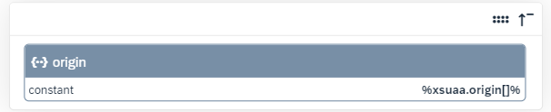
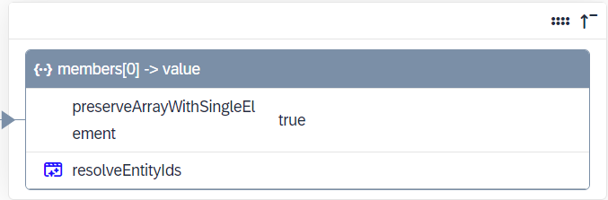
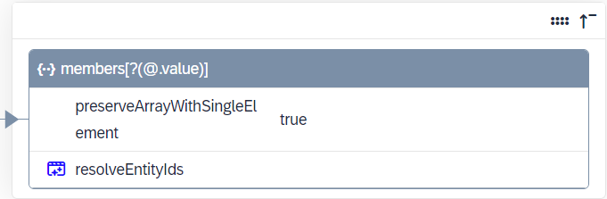

<!-- loioaeaab631ec4c49b7b3a25ae7b32a6e80 -->

# Configure Single and Multiple Origins

Configure and provision users with single or multiple origins in SAP BTP XS Advanced UAA \(Cloud Foundry\) target system.


<a name="loioaeaab631ec4c49b7b3a25ae7b32a6e80__section_znm_bvy_rxb"/>

## Context

An origin tells you which is the identity provider of a user in SAP BTP XS Advanced UAA \(Cloud Foundry\). It is defined in the trust configuration in the SAP BTP cockpit under *Security* \> *Trust Configuration* \> *Origin Key*.

The origin itself is not a concept of Identity Provisioning. The role of the service is to ensure that you can read and provision users with their identity providers. Once you find the identity provider in the Origin Key, you need to set it in the `xsuaa.origin` property. You can configure it in source, target and proxy SAP BTP XS Advanced UAA \(Cloud Foundry\) systems. Both single and multiple values are supported. The value is a string that usually specifies the name of the identity provider or its location.

For example: `xsuaa.origin=`*ldap* and `xsuaa.origin=`*ldap;myaccount-xsuaa.accounts.ondemand.com*, where the ";" \(semicolon\) is the only supported delimiter.


### Provisioning Users with Single Origin

You want to provision a user from a given source system to SAP BTP XS Advanced UAA \(Cloud Foundry\) target system where a single origin is configured.

1.  On the *Properties* tab of the target system, enter the value for the `xsuaa.origin` property, for example: *idp1*.

2.  \(Optional\) Ensure the property resolving the uniqueness of the attributes is configured. By default, it is set to: `xsuaa.user.unique.attribute=`*userName*.

3.  Run a provisioning job from the source system.


As a result, users are created with a single origin in the target system.


### Provisioning Users with Multiple Origins

You want to provision a user from a given source system to SAP BTP XS Advanced UAA \(Cloud Foundry\) target system where multiple origins are configured.

1.  On the *Properties* tab of the target system, enter multiple values for the `xsuaa.origin` property, for example: *idp1;idp2*.

2.  Ensure the property resolving the uniqueness of the attributes is configured and contains the *origin* value. For example, set it to: `xsuaa.user.unique.attribute=`*userName,origin*.

3.  On the *Transformations* tab, update the SAP BTP XS Advanced UAA \(Cloud Foundry\) target system transformation by adding "\[\]" \(square brackets\) to ensure that the following constant supports multiple values:


    <table>
    <tr>
    <th valign="top">

    JSON Text Editor
    
    </th>
    <th valign="top">

    Graphical Editor
    
    </th>
    </tr>
    <tr>
    <td valign="top">
    
    > ### Code Syntax:  
    > ```
    > {
    >    "constant":"%xsuaa.origin%[]",
    >    "targetPath":"$.origin"
    > },
    > ```


    
    </td>
    <td valign="top">
    
    
    
    </td>
    </tr>
    </table>
    
    > ### Note:  
    > In case you use the `resolveEntityIds` function in your SAP BTP XS Advanced UAA \(Cloud Foundry\) target system transformation to resolve the value of one group member in the `sourcePath` to exactly one group member in the `targetPath`, this won't work with multiple origin values. You need to change the `targetPath` in the transformation so that the value of one group member is resolved to multiple group members. See the example below.


    <table>
    <tr>
    <th valign="top">

    JSON Text Editor
    
    </th>
    <th valign="top">

    Graphical Editor
    
    </th>
    </tr>
    <tr>
    <td valign="top">
    
    Current mapping:

    > ### Code Syntax:  
    > ```
    > {
    >    "sourcePath":"$.members[0].value",
    >    "preserveArrayWithSingleElement":true,
    >    "optional":true,
    >    "targetPath":"$.members[0].value",
    >    "functions":[
    >       {
    >          "function":"resolveEntityIds"
    >       }
    >    ]
    > },
    > ```


    
    </td>
    <td valign="top">
    
    Current mapping:

    
    
    </td>
    </tr>
    <tr>
    <td valign="top">
    
    Expected mapping:

    > ### Code Syntax:  
    > ```
    > {
    >    "sourcePath":"$.members[0].value",
    >    "preserveArrayWithSingleElement":true,
    >    "optional":true,
    >    "targetPath":"$.members[?(@.value)]",
    >    "functions":[
    >       {
    >          "function":"resolveEntityIds"
    >       }
    >    ]
    > },
    > ```


    
    </td>
    <td valign="top">
    
    Expected mapping:

    
    
    </td>
    </tr>
    </table>
    
4.  Run a provisioning job.


As a result, two entries for one and the same user are created. Both entries contain the same user attributes \(for example, username and email address\) and differ only in their origins. The job logs show that one user is read and two users are created.

If the provisioned user is assigned to a group, this group will have two user entries assigned as group members which differ only in their origins.


### 

> ### Note:  
> Multiple origins are not supported in provisioning scenarios between SAP BTP XS Advanced UAA \(Cloud Foundry\) source system and SAP BTP XS Advanced UAA \(Cloud Foundry\) target system.


<a name="loioaeaab631ec4c49b7b3a25ae7b32a6e80__section_fqq_wy1_sxb"/>

## Change From Single to Multiple Origins

You have provisioned users to SAP BTP XS Advanced UAA \(Cloud Foundry\) with a single origin and now you want to provision them with multiple ones.

Follow the steps in the *Provisioning Users with Multiple Origins* above. Before you run the provisioning job, you must reset the target system. For more information, see [Reset Identity Provisioning System](Operation-Guide/reset-identity-provisioning-system-0bc1e53.md)

