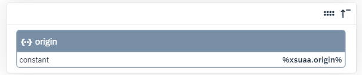
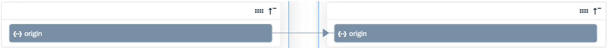

<!-- loioe5c5900a098a4881879c61812389cc56 -->

# Configure Single and Multiple Origins

Configure and provision users with single or multiple origins in SAP BTP XS Advanced UAA \(Cloud Foundry\) proxy system.


<a name="loioe5c5900a098a4881879c61812389cc56__section_pc4_gpx_wxb"/>

## Overview

An origin tells you which is the identity provider of a user in SAP BTP XS Advanced UAA \(Cloud Foundry\). It is defined in the trust configuration in the SAP BTP cockpit under *Security* \> *Trust Configuration* \> *Origin Key*.

The origin itself is not a concept of Identity Provisioning. The role of the service is to ensure that you can read and provision users with their identity providers. Once you find the identity provider in the Origin Key, you need to set it in the `xsuaa.origin` property. You can configure it in source, target and proxy SAP BTP XS Advanced UAA \(Cloud Foundry\) systems. Both single and multiple values are supported. The value is a string that usually specifies the name of the identity provider or its location.

For example: `xsuaa.origin=`*ldap* and `xsuaa.origin=`*ldap;myaccount-xsuaa.accounts.ondemand.com*, where the ";" \(semicolon\) is the only supported delimiter.


### Provisioning Users with Single Origin

You want to configure SAP BTP XS Advanced UAA \(Cloud Foundry\) as a proxy system for provisioning users with a single origin to and from an external identity management system.

1.  On the *Properties* tab of the proxy system, set the `xsuaa.origin.filter.enabled` property to *true*.

    This is a prerequisite for enabling the `xsuaa.origin` property in proxy systems.

2.  Enter the value for the `xsuaa.origin` property, for example: *idp1*.

    The value of this property acts like a filter.


Expect the following results:

-   When executing a GET request, only users with the origin specified in the `xsuaa.origin` property are returned.

-   When executing a POST request to create a user, you make one request to the proxy system. The payload contains the *idp1* origin.

-   When executing a PUT request to update a user, you make one request to the proxy system. The payload contains the *idp1* origin.


### Provisioning Users with Multiple Origins

You want to configure SAP BTP XS Advanced UAA \(Cloud Foundry\) as a proxy system for provisioning users with multiple origins to and from an external identity management system.

1.  On the *Properties* tab of the proxy system, set the `xsuaa.origin.filter.enabled` property to *true*.

    This is a prerequisite for enabling the `xsuaa.origin` property in proxy systems.

2.  Enter multiple values for the `xsuaa.origin` property, for example: *idp1;idp2*.

    The value of this property acts like a filter.

3.  On the *Transformations* tab, update the SAP BTP XS Advanced UAA \(Cloud Foundry\) proxy write transformation. Replace the constant and its value with the sourcePath expression pointing to a multivalue origin attribute:


    <table>
    <tr>
    <th valign="top">

    JSON Text Editor
    
    </th>
    <th valign="top">

    Graphical Editor
    
    </th>
    </tr>
    <tr>
    <td valign="top">
    
    Default mapping:

    > ### Code Syntax:  
    > ```
    > {
    >    "constant":"%xsuaa.origin%",
    >    "targetPath":"$.origin"
    > },
    > 
    > ```


    
    </td>
    <td valign="top">
    
    Default mapping:

    
    
    </td>
    </tr>
    <tr>
    <td valign="top">
    
    Expected mapping:

    > ### Code Syntax:  
    > ```
    > {
    >    "sourcePath":"$.origin",
    >    "targetPath":"$.origin"
    > },
    > 
    > ```


    
    </td>
    <td valign="top">
    
    Expected mapping:

    
    
    </td>
    </tr>
    </table>
    
4.  -   When executing a GET request, only users with the origins specified in the `xsuaa.origin` property are returned.

-   When executing a POST request to create a user with two origins \(*idp1;idp2*\), you should make two separate requests to the proxy system with two separate payloads - the first one containing the *idp1* origin and the second one containing *idp2* origin.

    As a result, two entries for one and the same user are created. Both entries contain the same user attributes \(for example, username and email address\) and differ only in their origins.

-   When executing a PUT request to update a user with two origins \(*idp1;idp2*\), you should make two separate requests to the proxy system with two separate payloads - the first one containing the *idp1* origin and the second one containing *idp2* origin.

    As a result, two entries for one and the same user are updated.


### 

> ### Note:  
> Multiple origins are not supported in provisioning scenarios between SAP BTP XS Advanced UAA \(Cloud Foundry\) source system and SAP BTP XS Advanced UAA \(Cloud Foundry\) target system.

