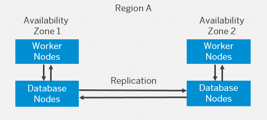
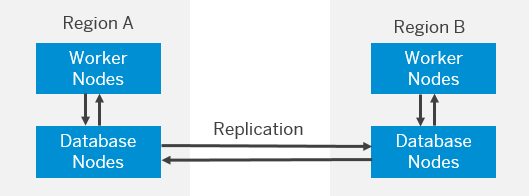

<!-- loio2c1a05526b1f4f288e15ad420c4202ff -->

# Disaster Recovery/High Availability

Disaster recovery \(DR\) and high availability \(HA\) are based on the capabilities of the underlying infrastructure.

Identity Authentication is a multi-tenant system where tenants share the hardware and software and use dedicated \(and isolated\) database instances for persistence.

<a name="loio2c1a05526b1f4f288e15ad420c4202ff__section_twq_csh_lkb"/>

## High Availability - Single Region Setup

All deployments that have one data center support replication of the data between two zones within the same region.

<a name="loio2c1a05526b1f4f288e15ad420c4202ff__section_p3w_csh_lkb"/>

## High Availability/Disaster Recovery - Multi-Region Setup

Country/regions with two data centers operate in high availability \(HA\) and disaster recovery \(DR\) mode among the respective data centers. Tenants located in these country/regions are distributed among the data centers there.

Identity Authentication uses Akamai GTM to route the traffic to failover data center in case of any issues in the primary data center. This covers the HA and DR setup.

<a name="loio2c1a05526b1f4f288e15ad420c4202ff__section_lbc_cbw_w4b"/>

## Backup and Recovery

A full backup is performed everyday at 01:00 UTC. The backup is kept for 90 days.

If a restore is required due to an issue on infrastructure level, then SAP DevOps team takes care of the recovery procedure.

If a restore is required due to an issue on application level, report an incident on [SAP Support Portal Home](https://support.sap.com/en/index.html) with a component `BC-IAM-IDS`.

**Related Information**  

[Product Details](product-details-4d404b1.md)

[Tenant Model and Licensing](tenant-model-and-licensing-93160eb.md "This document provides information about the tenant model, tenant licensing, and obtaining a tenant of Identity Authentication.")

[Web-Based Logon Interface](web-based-logon-interface-8e40afc.md "Service providers that delegate authentication to Identity Authentication can use two types of visualization of the web-based user interfaces for the logon pages of their applications.")

[Regional Availability](regional-availability-be600ca.md "Tenants are deployed on the productive domain accounts.ondemand.com.")

[Browser Support](browser-support-0741076.md "Information on the supported browser version for the administration console, and the end user screens of Identity Authentication.")

[Supported Languages](supported-languages-0ea634d.md "Information on the supported languages for the administration console, and the end user screens of Identity Authentication.")

[Regional Availability](regional-availability-be600ca.md "Tenants are deployed on the productive domain accounts.ondemand.com.")

[Cloud Service Status](https://www.sap.com/about/trust-center/cloud-service-status.html)

