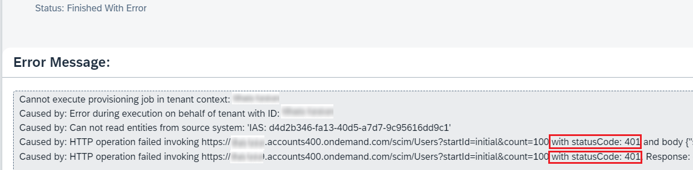
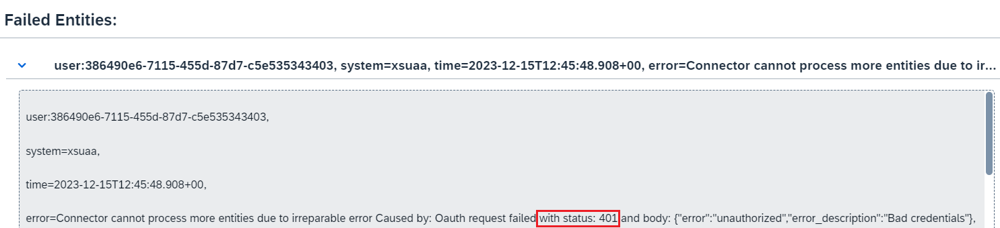
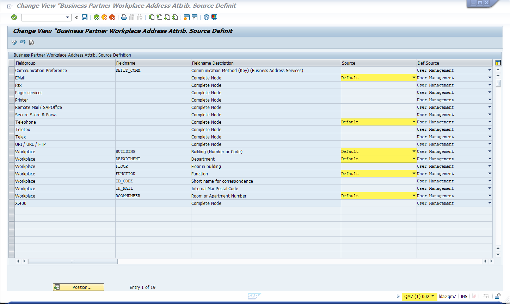

<!-- loioad525a4ae37c4efab2710f7664fec548 -->

# Error Messages

<a name="loioad525a4ae37c4efab2710f7664fec548__section_wwz_qrh_mbc"/>

## \[Job Logs\] Error statusCode: 401

**Problem**

1.  You added a source and a target system in the *Identity Provisioning* admin consoleadministration console for SAP Cloud Identity Services.

2.  You started a provisioning job \(**Read** or **Resync**\).

3.  In the *Job Logs* section, you see that the job has finished with error.

4.  You find an error with status code **401** - either in the main *Error Message* filed, or in the details of a particular failed entity.

The error looks similar to the following ones:

-   In the main *Error Message* field, you find: *"HTTP operation failed invoking <system\_URL\> with statusCode: 401"*

-   In the logs of a failed entity, you find:*"OAuth request failed with status: 401 and body: \{"error":"unauthorized","error":"description":"Bad credentials"\}"*

> ### Example:  
> 1 

> ### Example:  
> 2

**Reason**

This error mostly appears when the credentials of the relevant system are wrong. However, the reason can also be incorrect names or values of the following properties:

-   `Authentication` \(*BasicAuthentication*, *NoAuthentication*, *ClientCertificateAuthentication*\)

-   `ProxyType` \(*Internet*, *OnPremise*\)

-   `Type` \(*HTTP*, *LDAP*, *RFC*\)

-   `URL`

> ### Note:  
> These properties and values are case-sensitive.

Bear in mind the place you've found the error! That means:

-   If the **401** error appears in the main *Error Message* field - the wrong credentials or incorrect property values are in the source system.

-   If the **401** error appears in the details of a failed entity - the wrong credentials or incorrect property values are in the target system.

**Solution**

Go to the *Properties* tab of the relevant source or target system and correct the credentials \(`User` and `Password`\), or the other affected properties.

<a name="loioad525a4ae37c4efab2710f7664fec548__section_wnh_nh3_mbc"/>

## Error statusCode: 432

**Problem**

1.  You use SAP SuccessFactors as a source system, and Identity Authentication as a target one.

2.  You run a provisioning job between the two systems.

3.  In the administration console for SAP Cloud Identity Services you see that all users have been successfully created or updated.

4.  Nevertheless, in the *Job Logs* statistics, the job has finished with error due to some failed users. You can find the following error message for the relevant users:

*statusCode: 432, Response: User is provisioned to Identity Authentication but its UUID is not successfully updated back on SAP SuccessFactors.*

**Reason**

Effective February 16, 2021, Identity Provisioning supports the SAP SuccessFactors attribute `sapGlobalUserId`. That means, your provisioning logic will be as follows:

1.  You start a new Read or Resync job.

2.  The Identity Provisioning service reads the users from SAP SuccessFactors and writes/updates them in Identity Authentication.

3.  The Identity Authentication generates a `UUID` for each newly created user.

4.  During the runtime of the same job, the service will also send a request back to SAP SuccessFactors, which aims to update all users whose `sapGlobalUserId` attribute is either *null* or already exists.

    -   When the value is *null* - Identity Provisioning reads the `sapGlobalUserId` attribute of every user in SAP SuccessFactors, and if for some user this attribute is missing, the service will update it with the value of the `userUUID` attribute in Identity Authentication.

    -   When the value already exists - Identity Provisioning updates the existing `sapGlobalUserId` attribute value of a given user with the new value. Typically, this could happen if a user is provisioned from SAP SuccessFactors toIdentity Authentication and later on deleted from the target system. After running a Resync Job, the deleted user is created again in Identity Authentication. A new `userUUID` is generated for this user and Identity Provisioning updates the old value in SAP SuccessFactors.

So, if for some reason the update request to the source system fails, you will get this general *432* error code.

**Reason**

For your SAP SuccessFactors system, send the following REST API request:

`https://<system_host>.successfactors.eu/odata/v2/Users/('user_D')?$expand=personKeyNav/userAccountNav&$select=personKeyNav/userAccountNav/sapGlobalUserId,personKeyNav/userAccountNav/accountUuid, personKeyNav/userAccountNav/username, &$format=json` 

In addition to username, this request returns also the following specific attributes: `accountUuid` and `sapGlobalUserId`

-   `accountUuid` – this attribute is used by Identity Provisioning to update the `userUuid` attribute of a user in the SAP SuccessFactors system. The value of `accountUuid` must not be *null* or invalid! Thus, make sure all users have a valid `accountUuid` value.

-   `sapGlobalUserId` – this attribute stores the value of `userUuid`.Identity Provisioning will try to provision the `userUuid` if the value of `sapGlobalUserId` is *null* \(missing\) or if it already exists. Thus, the update of `userUuid` will be completed successfully when the `sapGlobalUserId` attribute has/gets a value, or when the old value is updated with a new one.

<a name="loioad525a4ae37c4efab2710f7664fec548__section_oxd_1j3_mbc"/>

## User 'v4admin' Causes Job Error

**Problem**

1.  You've addedSAP SuccessFactors as a source system and Identity Authentication as a target one.

2.  You've started a **Read** Job, which finishes with error.

3.  In the *Job Logs* section, you see that the error mentions user "*v4admin*" and contains the following error message:

*Property lastModifiedDateTime is not available for \{"lastName":"System","empId":null,"lastModifiedDateTime":null,...,"userId:"v4admin"...\}*

**Reason**

1.  Open the SAP SuccessFactors source system and choose *Properties*.

2.  Modify the `sf.user.filter` property, extending its current value by adding the following string at the end: `and userId ne 'v4admin'`

3.  Save your changes.

4.  Run a new Read Job.

5.  The provisioning job should now finish successfully.

> ### Example:  
> If the previous value of your `sf.user.filter` property is, for example: *location eq 'US'*, then you should change it to: `location eq 'US' and userId ne 'v4admin'`.

<a name="loioad525a4ae37c4efab2710f7664fec548__section_jr4_5j3_mbc"/>

## Invalid Property Names: User/usersSysIdOfSecondaryAssignmentsItemNav

**Problem**

A provisioning job that reads users fromSAP SuccessFactors fails with the following error:

*Response: \{"error" : \{"code" : "COE\_PROPERTY\_NOT\_FOUND", "message" : \{"lang" : "en-US", "value" : "**\[COE0021\]Invalid property names: User/usersSysIdOfSecondaryAssignmentsItemNav**. Please check the property name in Admin Center \> OData API Data Dictionary or entity metadata. Ensure there were no data model changes that removed this field, and please execute a refresh metadata to ensure the cache is not corrupted."\}\}\}*

**Reason**

The attribute `usersSysIdOfSecondaryAssignmentsItemNav` is present when options *Concurrent Employment* and *Global Assignment* are enabled in the SAP SuccessFactors system. The default Identity Provisioning configuration considers that those options are enabled.

If they are not enabled, the above mentioned error appears. To solve this problem, follow the steps below.

**Solution**

1.  Open the *Identity Provisioning* admin consoleadministration console for SAP Cloud Identity Services and navigate to the SAP SuccessFactors source system.

2.  Go to the *Properties* tab and set the following attributes:

    -   `sf.user.attributes` = *userId,username,status,email,lastName,firstName,lastModifiedDateTime,personKeyNav*

    -   `sf.user.attributes.expand` = *personKeyNav,personKeyNav/userAccountNav*

    -   `sf.user.filter` = *status in 'active','active\_external','active\_external\_suite'*

3.  Go to the *Transformations* tab and remove the following condition from the transformation \(everywhere you find it\):

    `"condition": "!($.usersSysIdOfSecondaryAssignmentsItemNav.results.length() > 0)",`

4.  Run a new provisioning job.

<a name="loioad525a4ae37c4efab2710f7664fec548__section_vl2_bl3_mbc"/>

## Provisioning to S4 failed: \[Employee ONPREMXXXXX: Insertion or modification with errors

**Problem**

1.  You configure anSAP S/4HANA on-premise system \(in SAP ABAP\).

2.  You add a target system for it in the *Identity Provisioning* admin consoleadministration console for SAP Cloud Identity Services.

3.  You add a source system and connect it to the target S/4HANA On-Premise target system.

4.  Run a provisioning \(Read\) job.

5.  The job fails with an error of type: *Provisioning to S4 failed for the following reason\(s\): \[Employee ONPREMXXXXX: Insertion or modification with errors.\]*

****

<table>
<tr>
<th valign="top">

The error message contains one of the following reasons \(or similar\):

</th>
</tr>
<tr>
<td valign="top">

\[BP 0000019334: Change of field EMAIL not permitted using data source BP\], \[ONPREM16772: Error while inserting / updating workplace address.\],

</td>
</tr>
<tr>
<td valign="top">

\[BP 0000019334: Change of field WORKPLACE - BUILDING not permitted using data source BP\], \[ONPREM16772: Error while inserting / updating workplace address.\],

</td>
</tr>
<tr>
<td valign="top">

\[BP 0000019334: Change of field WORKPLACE - FUNCTION not permitted using data source BP\], \[ONPREM16772: Error while inserting / updating workplace address.\],

</td>
</tr>
<tr>
<td valign="top">

\[BP 0000019334: Change of field WORKPLACE - DEPARTMENT not permitted using data source BP\], \[ONPREM16772: Error while inserting / updating workplace address.\],

</td>
</tr>
<tr>
<td valign="top">

\[BP 0000019334: Change of field WORKPLACE - ROOMNUMBER not permitted using data source BP\], \[ONPREM16772: Error while inserting / updating workplace address.\],

</td>
</tr>
</table>

**Problem**

1.  Now go to your S/4HANA on-premise system and open transaction */nSPRO*.

2.  Then navigate to *Cross-Application Components* \> *SAP Business Partner* \> *Addition Customizing for SAP Business Partners* \> *Workplace Address Attribute Source Definition*.

3.  \(Optional\) You can reach to the same place via transaction */nSM30*, and then for Table/View enter: `TBZ_V_EEWA_SRC`

4.  Your table looks similar to this:

    

**Reason**

Your user attributes are of type *Default*. But they should be of type *Business Partner*.

**Solution**

1.  You have opened the table view in *"Workplace Address Attribute Source Definition"* of your S/4HANA on-premise system.

2.  Now go to column *Source*, and by the drop-down menu, change *Default* to *Business Partner*.

<a name="loioad525a4ae37c4efab2710f7664fec548__section_lgh_wp3_mbc"/>

## Provisioning Job Fails with Exception

**Problem**

1.  You added one source and multiple target systems in the *Identity Provisioning* admin consoleadministration console for SAP Cloud Identity Services.

2.  You started a provisioning job.

3.  The job fails with one of the following exceptions:

    -   *Caused by: Timeout exception has occurred while processing entity for <URL of the source system\>*

    -   *Caused by: Timeout exception occurred*

**Reason**

Those exceptions occur when provisioning to one of the multiple target systems fails, for example, due to connectivity issues.

**Solution**

Start the provisioning job again.

<a name="loioad525a4ae37c4efab2710f7664fec548__section_krl_4bh_ccc"/>

## Provisioning Job Fails with Error Unsuccessful Provisioning of the Entity

**Problem**

1.  You added a source and a target system in your *Identity Provisioning* admin consoleadministration console for SAP Cloud Identity Services.

2.  You started a provisioning job \(**Read** or **Resync**\).

3.  In the*Job Logs* section, you see that the job has finished with error.

    In the details of the failed entity, you find the error *"Unsuccessful provisioning of the entity"*.

**Solution**

Your problem requires deeper analysis by SAP. Please create an incident for component BC-IAM-IPS.

In the incident, specify also:

-   The IDs of your global account and subaccount, or your bundle tenant.

-   To which region your account/tenant belongs. You can find it in this list:[\(Discovery Center\) Identity Provisioning](https://discovery-center.cloud.sap/index.html#/serviceCatalog/identity-provisioning) -\> *Service Plan*

-   The Job log with information about the failed entity

Before you create a support case, read:

[2654164 - What to consider before opening a Support Ticket for SAP Business Technology Platform](https://launchpad.support.sap.com/#/notes/2654164)

For contract-related questions, read:

[1660069 - How to contact SAP Contracts Department for questions or issues](https://launchpad.support.sap.com/#/notes/1660069)

## Display All Failed or Skipped Entities

Your provisioning job fails or results in skipped entities. Users and groups are not provisioned to the target system. In the *Job Execution Details* screen, you see a maximum number of ten failed entities \(although they might be more\) and the content of each failed or skipped entity is hidden, that is:*content=<hidden content\>*.

To further investigate the issue, you must enable tracing and logging.

1.  Select the *Properties* tab of your source system and set the `ips.trace.failed.entity.content`,`ips.trace.skipped.entity` and `ips.trace.skipped.entity.content` properties to *true*.

2.  Run again the provisioning job.

3.  Navigate to *Provisioning Logs* \> *Job Logs* and select the job that finished with error.

4.  Choose the *Download* icon and select the respective log: *Download All Error Logs for This Job* or *Download All Skipped Entity Logs for This Job*.

Now, when you open the log file, you see all failed and skipped entities and their content \(attributes\). For example, if the failed entity is a group, you see its *displayName* and *members*.

For more information, see:

[Monitor Provisioning Job Logs](Monitoring-and-Reporting/monitor-provisioning-job-logs-e5b5176.md)

[Manage Provisioning Job Logs](Monitoring-and-Reporting/manage-provisioning-job-logs-041b5ff.md)

[List of Properties](list-of-properties-d6f3577.md)

**Related Information**  

[Administration issues](administration-issues-90ce2d5.md "")

[Job and Transformation Issues](job-and-transformation-issues-dbe3c08.md "")

[Additional Information](additional-information-7463572.md "")

[Handling Specific Attributes](handling-specific-attributes-e957782.md "")

