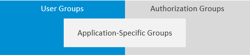

<!-- loiod93be69816ac4d0c9b972895f2b6a46f -->

# Groups

SAP Cloud Identity Services offers groups to organize users based on common characteristics, authorization, or application. Use them to efficiently manage user access and permissions within your organization's SAP Cloud Identity Services environment.

There are two kinds of groups in SAP Cloud Identity Services - *user groups* and *authorization groups*, and one special group - *application-specific groups*.

The following sections explain the different groups.

<a name="loiod93be69816ac4d0c9b972895f2b6a46f__section_zjk_h5z_lbc"/>

## User Groups

The user groups serve to create sets of users who have something in common. An example for a user group is a group of users who work in the same department, or users who have similar tasks in a company.

The type of these groups in the administration console for SAP Cloud Identity Services is *User Group*.

For more information, see [Managing Groups](Operation-Guide/managing-groups-ddd067c.md).

<a name="loiod93be69816ac4d0c9b972895f2b6a46f__section_ug2_35z_lbc"/>

## Authorization Groups

The authorization groups are related to authorization of users, groups or applications.

The groups that result from the creation of authorization represent the authorization policies that are available in the administration console for SAP Cloud Identity Services. When you create a new authorization, a group with the same name is also created and appears in the list of the groups. Initially, only the authorization groups related to the base authorization policies are visible.

> ### Restriction:  
> You can't modify or delete an authorization group that is related to an authorization policy via the administration console.

The type of these groups in the administration console is *Authorization*

For more information, see [Managing Groups](Operation-Guide/managing-groups-ddd067c.md), [Configure Authorizations Based on Policies](Operation-Guide/configure-authorizations-based-on-policies-08fea39.md) and [Configuring Authorization Policies](Operation-Guide/configuring-authorization-policies-982ac5f.md).

<a name="loiod93be69816ac4d0c9b972895f2b6a46f__section_zwy_35z_lbc"/>

## Application-Specific Groups

The application-specific groups are a special kind of groups which are bound to an application and can be created in the Identity Directory of SAP Cloud Identity Services by running provisioning jobs, or via the administration console. For more information, see [Start and Stop Provisioning Jobs](Operation-Guide/start-and-stop-provisioning-jobs-531a261.md) and [Create a Group](Operation-Guide/create-a-group-b1b638d.md).

The extension schema of the Identity Directory API *urn:ietf:params:scim:schemas:extension:sap:2.0:Group* defines the following three attributes:

-   *applicationId* - supported only for the Local Identity Directory default write and proxy write transformations as mandatory attribute. The value of this attribute is provided from the source system by setting the property ips.application.id. For more information, see [List of Properties](list-of-properties-d6f3577.md) →`ips.application.id`.

-   *type* - supported by theLocal Identity Directory source, target, and proxy provisioning systems as optional attribute. If no value is specified in the write or proxy write default transformations, the default value*'userGroup'* is set.

-   *supportedOperations* - supported byLocal Identity Directory source, target, and proxy provisioning systems as optional attribute. If no value is specified in the write or proxy write default transformations, the default value *'readWrite'* is set. The attribute defines the supported update options for the application-specific group.

The application-specific groups appear with their name in the *Application Name* column in the administration console for SAP Cloud Identity Services under the *Groups* tile. The *Application Name* column for the groups that aren't application-specific is empty.

> ### Restriction:  
> You must be assigned to a policy that allows reading applications, or to the *Manage Applications* role to view *Application Name* column. For more information, see [Configure User Authorizations](Operation-Guide/configure-user-authorizations-424b64c.md).

The application-specific groups can be of the following types:

**Application-Specific Groups Types**

<table>
<tr>
<th valign="top">

Group Type Technical Name

</th>
<th valign="top">

Group Type in Administration Console

</th>
<th valign="top">

Description

</th>
</tr>
<tr>
<td valign="top">

`userGroup`

</td>
<td valign="top">

*User Group*

</td>
<td valign="top">

A group of users who have something in common.

</td>
</tr>
<tr>
<td valign="top">

`authorization`

</td>
<td valign="top">

*Authorization*

</td>
<td valign="top">

A group related to authorization of users, groups or applications.

</td>
</tr>
<tr>
<td valign="top">

`deepLinkActivationPermission`

</td>
<td valign="top">

*Deep Link Activation*

</td>
<td valign="top">

A group of applications that support deep linking.

</td>
</tr>
</table>

The application-specific groups support the following operations:

**Application-Specific Groups Supported Operations**

<table>
<tr>
<th valign="top">

Supported Operation Technical Name

</th>
<th valign="top">

Supported Operation in Administration Console

</th>
<th valign="top">

You can

</th>
</tr>
<tr>
<td valign="top">

`readOnly`

</td>
<td valign="top">

*Read*

</td>
<td valign="top">

-   View the group details and group members.

</td>
</tr>
<tr>
<td valign="top">

`readWrite`

</td>
<td valign="top">

*Read & Write*

</td>
<td valign="top">

-   View the group details and group members.
-   Modify and delete the group.
-   Add new group members
-   Remove the group members.

</td>
</tr>
<tr>
<td valign="top">

`userOnlyMembership`

</td>
<td valign="top">

*User Membership Only*

</td>
<td valign="top">

-   View the group details and group members.
-   Add new group members.
-   Remove the group members.
-   You **can't** modify or delete the group.

</td>
</tr>
<tr>
<td valign="top">

`membership`

</td>
<td valign="top">

*Membership*

</td>
<td valign="top">

-   View the group details and group members.
-   Add new entities, users, and groups, as group members.
-   Remove entities, users, and groups, from the group members.
-   You can't modify or delete the group.

</td>
</tr>
</table>

**Related Information**  

[Tenants](tenants-93160eb.md "A tenant refers to your (customer-specific) instance of SAP Cloud Identity Services. It's delivered to you as part of a bundle with an SAP cloud solution or as part of a self-service request in SAP BTP cockpit.")

[Bundles](bundles-25b65a4.md "A bundle is a group of preconfigured products and services which are sold together.")

[Applications](applications-404a11c.md "An application is associated with a consumer of Identity Authentication as an identity provider. This consumer could be for example an SAP cloud solution, a third-party application, SAP BTP subaccount, or the SAP Cloud Identity Services administration console.")

[Provisioning Systems](provisioning-systems-15da6af.md "Identity Provisioning provides connectors to various business applications for provisioning and deprovisioning of users and groups. These business applications are set up as provisioning systems in the administration console of SAP Cloud Identity Services.")

[Properties](properties-e92c1aa.md "Properties hold the configuration of a provisioning system.")

[Transformations](transformations-81f5204.md "Transformations help you transform user and group attributes from the data model of the source system to the data model of the target system.")

[Users](users-70e95d1.md "Users in SAP Cloud Identity Services fall into two categories: administrators and end users.")

[Cookies](cookies-e60fd04.md "")

[List and Edit Groups](Operation-Guide/list-and-edit-groups-5e8a55c.md "As a tenant administrator, you can list and edit information about the groups in a tenant in the administration console for SAP Cloud Identity Services.")

[List and Search Users in Groups](Operation-Guide/list-and-search-users-in-groups-4ac340a.md "As a tenant administrator, you can list and view information about the users in a group in a tenant in the administration console for SAP Cloud Identity Services.")

[Add Users to a Group](Operation-Guide/add-users-to-a-group-d2e1a01.md "As a tenant administrator, you can add one or more users created for a specific tenant to a group via the administration console for SAP Cloud Identity Services.")

[Remove Users from a Group](Operation-Guide/remove-users-from-a-group-301fdb7.md "As a tenant administrator, you can remove one, more than one, or all users added to a group via the administration console for SAP Cloud Identity Services.")

[Assign Groups to a User](Operation-Guide/assign-groups-to-a-user-bfdeb9c.md "As a tenant administrator, you can assign one or more groups created for a specific tenant to a user via the administration console for SAP Cloud Identity Services.")

[Unassign Groups from a User](Operation-Guide/unassign-groups-from-a-user-4353735.md "As a tenant administrator, you can unassign one or more groups that are assigned to a user via the administration console for SAP Cloud Identity Services.")

[**Blog Post**: Taking Groups to the Next Level with Application-Specific Groups](https://community.sap.com/t5/technology-blogs-by-sap/taking-groups-to-the-next-level-with-application-specific-groups/ba-p/13956003?emcs_t=S2h8ZW1haWx8a3Vkb3N8TTVPMFJaSVA1WDJDQ1R8MTM5NTYwMDN8S1VET1N8aEs)

