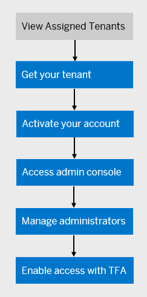

<!-- loio31af7da133874e199a7df1d42905241b -->

# Initial Setup

The initial setup of SAP Cloud Identity Services involves the following steps:

<a name="loio31af7da133874e199a7df1d42905241b__section_atx_zjr_gxb"/>

## Quickstart

### View Assigned Tenants and Admins

Before getting a tenant, check if there is an existing one assigned to your customer ID.

-   If there is an existing tenant and you are among its administrators, skip this step and [access the administration console](access-admin-console-2609e81.md). Your existing tenant will be reused.

-   If there is no existing tenant, follow the steps below.

See [View Assigned Tenants and Administrators](view-assigned-tenants-and-administrators-f56e6f2.md)

### Get Your Tenant

As a customer, you are entitled to one productive and one test SAP Cloud Identity Services tenant. You are also allowed to request an additional tenant. Trial tenants are open to everyone.

See [Get Your Tenant](get-your-tenant-460766b.md)

### Activate Your Account

Once you get your tenant, you receive an email with instructions to activate your account for the administration console of SAP Cloud Identity Services. This tool is the central point for configuring identity authentication and provisioning scenarios.

See [Activate Your Account](activate-your-account-cc03ecc.md)

### Access Admin Console

Once you activate your account and sign in successfully, you open the SAP Cloud Identity Services administration console. You are the initial administrator user listed under *Users & Authorizations* \> *Administrators*.

See [Access Admin Console](access-admin-console-2609e81.md)

### Manage Administrators

As the initial administrator user of SAP Cloud Identity Services, you can view and manage your predefined authorizations, add new administrators, as well as define authorization policies to further control their data access.

See [Manage Administrators](manage-administrators-3bddea4.md)

### Enable Two-Factor Authentication

We recommend that you protect the access to the SAP Cloud Identity Services administration console with two-factor authentication \(TFA\). Compared to single-factor authentication, two-factor authentication provides enhanced security.

See [Enable Two-Factor Authentication](enable-two-factor-authentication-7003302.md)

