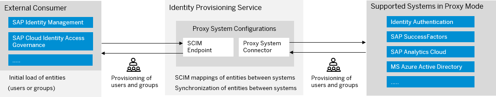

<!-- loiob10d68a92d3a43f49e202ca0d6862493 -->

# Proxy Systems

A proxy system is a special connector type you can use for *hybrid* scenarios.

It exposes any Identity Provisioning supported backend system as a SCIM 2.0 service provider, which can be consumed by any [SCIM 2.0](https://tools.ietf.org/html/rfc7644) compatible client application, without making a direct connection between them.

After the proxy connector is configured, a consumer application can start sending CRUD requests to the Identity Provisioning proxy connector \(which will play the role of a target system\). The proxy connector will then read the entities \(playing the role of a source system\) and provision them to the back-end of the SCIM 2.0 system.




<a name="loiob10d68a92d3a43f49e202ca0d6862493__section_wyj_nsw_cfb"/>

## How Proxy Systems Work

Identity Provisioning exposes a SCIM 2.0 based system \(connector\) as a proxy. Then, an external consumer system regards this proxy connector as its back-end system. To start using a proxy system in your Identity Provisioning tenant, whether it's a bundle or standalone, and depending on the infrastructure or environment it runs on, the following steps need to be performed.


### Infrastructure of SAP Cloud Identity Services

Your tenant type meets one of the following requirements:

-   Your bundle tenant is created after March 15, 2022.

-   Your Identity Provisioning is purchased as a standalone product between September 1, 2020 and October 20, 2020.


1.  Sign in to the SAP Cloud Identity Services administration console and navigate to *Users & Authorizations* \> *Administrators*.

2.  Choose your technical user \(administrator user of type **System**\). If you don't have a technical user yet, create one. For more information, see [Add System as Administrator](https://help.sap.com/viewer/6d6d63354d1242d185ab4830fc04feb1/Cloud/en-US/bbbdbdd3899942ce874f3aae9ba9e21d.html#loiocefb742a36754b18bbe5c3503ac6d87c)

3.  Configure the technical user authentication.

    -   **Certificate**

        Choose *Certificate* \> *Configure certificate* and *Upload* your certificate.

        Client certificates are used by HTTP REST clients as a means for SSL certificate authentication.

    -   **Secrets**

        Choose *Secrets* \> *Add* and provide the required information. After saving it, a Client ID and Client Secret are generated for the technical user. Make sure you copy and save the client secret.


4.  Enable the *Access Proxy System API* permission for the technical user.

5.  Then navigate to *Identity Provisioning* \> *Proxy Systems*, and create a proxy system.

6.  \(Optional\) Export this system as a *.csv* file. This will help an administrator of the external consumer application to import the proxy configuration as a SCIM repository in SAP Identity Management, for example.

    > ### Note:  
    > The entities exposed by the back-end system will be mapped to SCIM 2.0 entities, if possible. If not possible, the SCIM standard provides a mechanism to define a new resource type with the appropriate schema. You can use the custom resource type to map the back-end entities.

7.  Finally, the external application can start sending REST web service requests to the proxy system in order to read identities from the back end of the SCIM 2.0 system. For the authentication, you need to use the *user ID* and *password* of the Identity Authentication technical user for which you have set permission *Access Proxy System API*.


### SAP BTP, Neo environment

Your tenant type meets one of the following requirements:

-   Your bundle tenant is created before March 15, 2022.

-   Your Identity Provisioning is purchased as a standalone product before September 1, 2020.


1.  Create a technical user that will be used to connect to the Identity Provisioning proxy system and assign the necessary authorizations to your technical user.

    -   For **Certificate-based authentication**, follow the procedure in [Manage Certificates for Inbound Connection](Operation-Guide/manage-certificates-for-inbound-connection-952e7c7.md) → *SAP BTP, Neo Environment*
    -   For **OAuth authentication**, proceed as follows:

        Step **a.** and **b.** are relevant for Identity Provisioning bundle tenants. For standalone tenants, proceed from step **c.**

        1.  Open the Identity Provisioning admin console and choose section *Security* \> *Authorizations*.

        2.  Select your admin user and set role *Manage OAuth Clients* to it. You can grant additional administrators with this role.

        3.  Go to the SAP BTP cockpit → *Neo* → *Overview* and open your subaccount.

            > ### Note:  
            > You can see the Global account, which SAP provides for your bundle in the corresponding Identity Provisioning region. Then, in the global account, you can see your subaccount, where the Identity Provisioning is enabled as a service for the bundle. The display name of the subaccount starts with **SAP\_BUNDLE**.

        4.  Register a new OAuth client for the subscription to the *ipsproxy* application.

        5.  Assign role IPS\_PROXY\_USER to the *oauth\_client\_*<client\_ID\>**.


2.  Then open again the Identity Provisioning admin console, and create a proxy system.

3.  \(Optional\) Export this system as a *.csv* file. This will help an administrator of the external consumer application to import the proxy configuration as a SCIM repository in SAP Identity Management, for example.

    > ### Note:  
    > The entities exposed by the back-end system will be mapped to SCIM 2.0 entities, if possible. If not possible, the SCIM standard provides a mechanism to define a new resource type with the appropriate schema. You can use the custom resource type to map the back-end entities.

4.  Finally, the external application can start sending REST web service requests to the proxy system in order to read identities from the back end of the SCIM 2.0 system. For the authentication, you need to use the *client ID* and *secret* of the registered OAuth client for which you have assigned the IPS\_PROXY\_USER role.


<a name="loiob10d68a92d3a43f49e202ca0d6862493__section_pvr_vp5_5lb"/>

## How Proxy Transformations Work

The proxy *Read Transformation* is used when the external client application \(for example, SAP Identity Management\) makes initial load. That is, executing GET requests to the resource endpoints \(**/Users** or **/Groups**\) to retrieve the corresponding entities of the particular type. The external client application can also execute GET requests to a single resource endpoint \(querying a single resource is supported\). In this case, the proxy system acts as a *source* one.

The proxy *Write Transformation* is used when the external application manages the entities in the proxy system – creates new entities, updates existing ones, or deletes existing ones. In this case, the proxy system acts as a *target* one.

However, after a *Create* or *Update* operation is performed on the proxy system, the *Read Transformation* is applied to the result, so that the created or updated entity is sent back to the external application. This behavior demonstrates that the proxy *Read Transformation* is used for *write* cases, as well.

> ### Example:  
> **Conditions in Proxy Scenarios**
> 
> Using conditions is supported for both - proxy *Read Transformation* and proxy *Write Transformation*. However, when conditions are applied to users or groups in proxy *Read Transformation*, the number of returned resources may be “0” or less than the actual number of read entities. This is because some of the entities are filtered out as they don’t match the applied condition.
> 
> In the example below, the returned resources are "0" because all 5 users \(items\) returned per page are filtered out as they don't match a condition.
> 
> ```
> SCIM proxy client request: GET /Users?startIndex=6&count=5
> SCIM proxy application response:
> {
>   "startIndex": 6,
>   "itemsPerPage": 5,
>   "totalResults": 11,
>   "Resources": [],
>   "schemas": ["urn:ietf:params:scim:api:messages:2.0:ListResponse"]
> }
> 
> ```


<a name="loiob10d68a92d3a43f49e202ca0d6862493__section_tv2_5ld_wfb"/>

## How to call a proxy system

As proxy operations cannot be maintained by the Identity Provisioning UI, you need to manage resources \(users and groups\) by sending SCIM 2.0 API requests to certain endpoints. Below are listed all endpoints and operations available in the Identity Provisioning service. Each provisioning system, however, supports only a specific set of operations.

**Tip**: The ID of each proxy system \(`system_ID` in the table below\) is a dash-separated string. You can see it at the end of the system URL in the Identity Provisioning UI.

> ### Caution:  
> Effective *September 2020*, Shanghai \(China\) tenants that reside on SAP BTP, Neo environment should be accessed on the following domain: **dispatcher.cn1.platform.sapcloud.cn**
> 
> So make sure you use the correct domain when you construct your REST API requests.
> 
> For example: **GET** *https://ipsproxyabcd12345-xyz789.dispatcher.cn1.platform.sapcloud.cn/ipsproxy/api/v1/scim/bbb111aa-1234-aaaa-7777-1234567abcde/Users/s123456789*

Depending on the infrastructure/environment your Identity Provisioning tenant \(bundle or standalone\) runs on, use the relevant URI patterns to call an endpoint:


<table>
<tr>
<th valign="top">

Resource Operation

</th>
<th valign="top">

HTTP Method

</th>
<th valign="top">

Endpoint

</th>
</tr>
<tr>
<td valign="top">

Read users

</td>
<td valign="top">

`GET`

</td>
<td valign="top">

**Infrastructure of SAP Cloud Identity Services**

-   **Basic Authentication** and **Certificate Authentication**: <code>https://<i class="varname">&lt;ias-tenant-host&gt;</i>/ipsproxy/service/api/v1/scim/<i class="varname">&lt;system_id&gt;</i>/Users</code>


</td>
</tr>
<tr>
<td valign="top">

Read users

</td>
<td valign="top">

`GET`

</td>
<td valign="top">

**SAP BTP, Neo environment**

-   **OAuth Authentication**: <code>https://ipsproxy<i class="varname">&lt;provider_subaccount&gt;</i>-<i class="varname">&lt;consumer_subaccount&gt;</i>.<i class="varname">&lt;host&gt;</i>/ipsproxy/api/v1/scim/<i class="varname">&lt;system_id&gt;</i>/Users</code>

-   **Certificate Authentication**: <code>https://ipsproxy<i class="varname">&lt;provider_subaccount&gt;</i>-<i class="varname">&lt;consumer_subaccount&gt;</i>.cert.<i class="varname">&lt;host&gt;</i>/ipsproxy/certapi/v1/scim/<i class="varname">&lt;system-id&gt;</i>/Users</code>


</td>
</tr>
<tr>
<td valign="top">

Read a user

</td>
<td valign="top">

`GET`

</td>
<td valign="top">

**SAP BTP, Neo environment**

-   **OAuth Authentication**: <code>https://ipsproxy<i class="varname">&lt;provider_subaccount&gt;</i>-<i class="varname">&lt;consumer_subaccount&gt;</i>.<i class="varname">&lt;host&gt;</i>/ipsproxy/api/v1/scim/<i class="varname">&lt;system_id&gt;</i>/Users/<i class="varname">&lt;user_id&gt;</i></code>

-   **Certificate Authentication**: <code>https://ipsproxy<i class="varname">&lt;provider_subaccount&gt;</i>-<i class="varname">&lt;consumer_subaccount&gt;</i>.cert.<i class="varname">&lt;host&gt;</i>/ipsproxy/certapi/v1/scim/<i class="varname">&lt;system-id&gt;</i>/Users/<i class="varname">&lt;user_id&gt;</i></code>


</td>
</tr>
<tr>
<td valign="top">

Read a user

</td>
<td valign="top">

`GET`

</td>
<td valign="top">

**Infrastructure of SAP Cloud Identity Services**

-   **Basic Authentication** and **Certificate Authentication**: <code>https://<i class="varname">&lt;ias-tenant-host&gt;</i>/ipsproxy/service/api/v1/scim/<i class="varname">&lt;system_id&gt;</i>/Users/<i class="varname">&lt;user_id&gt;</i></code>


</td>
</tr>
<tr>
<td valign="top">

Create a user

</td>
<td valign="top">

`POST`

</td>
<td valign="top">

**SAP BTP, Neo environment**

-   **OAuth Authentication**: <code>https://ipsproxy<i class="varname">&lt;provider_subaccount&gt;</i>-<i class="varname">&lt;consumer_subaccount&gt;</i>.<i class="varname">&lt;host&gt;</i>/ipsproxy/api/v1/scim/<i class="varname">&lt;system_id&gt;</i>/Users</code>

-   **Certificate Authentication**: <code>https://ipsproxy<i class="varname">&lt;provider_subaccount&gt;</i>-<i class="varname">&lt;consumer_subaccount&gt;</i>.cert.<i class="varname">&lt;host&gt;</i>/ipsproxy/certapi/v1/scim/<i class="varname">&lt;system-id&gt;</i>/Users</code>


</td>
</tr>
<tr>
<td valign="top">

Create a user

</td>
<td valign="top">

`POST`

</td>
<td valign="top">

**Infrastructure of SAP Cloud Identity Services**

-   **Basic Authentication** and **Certificate Authentication**: <code>https://<i class="varname">&lt;ias-tenant-host&gt;</i>/ipsproxy/service/api/v1/scim/<i class="varname">&lt;system_id&gt;</i>/Users</code>


</td>
</tr>
<tr>
<td valign="top">

Update a user \(*full*\)

</td>
<td valign="top">

`PUT`

</td>
<td valign="top">

**SAP BTP, Neo environment**

-   **OAuth Authentication**: <code>https://ipsproxy<i class="varname">&lt;provider_subaccount&gt;</i>-<i class="varname">&lt;consumer_subaccount&gt;</i>.<i class="varname">&lt;host&gt;</i>/ipsproxy/api/v1/scim/<i class="varname">&lt;system_id&gt;</i>/Users/<i class="varname">&lt;user_id&gt;</i></code>

-   **Certificate Authentication**: <code>https://ipsproxy<i class="varname">&lt;provider_subaccount&gt;</i>-<i class="varname">&lt;consumer_subaccount&gt;</i>.cert.<i class="varname">&lt;host&gt;</i>/ipsproxy/certapi/v1/scim/<i class="varname">&lt;system-id&gt;</i>/Users/<i class="varname">&lt;user_id&gt;</i></code>


</td>
</tr>
<tr>
<td valign="top">

Update a user \(*full*\)

</td>
<td valign="top">

`PUT`

</td>
<td valign="top">

**Infrastructure of SAP Cloud Identity Services**

-   **Basic Authentication** and **Certificate Authentication**: <code>https://<i class="varname">&lt;ias-tenant-host&gt;</i>/ipsproxy/service/api/v1/scim/<i class="varname">&lt;system_id&gt;</i>/Users/<i class="varname">&lt;user_id&gt;</i></code>


</td>
</tr>
<tr>
<td valign="top">

Update a user \(*partial*\)

</td>
<td valign="top">

`PATCH`

</td>
<td valign="top">

**SAP BTP, Neo environment**

-   **OAuth Authentication**: <code>https://ipsproxy<i class="varname">&lt;provider_subaccount&gt;</i>-<i class="varname">&lt;consumer_subaccount&gt;</i>.<i class="varname">&lt;host&gt;</i>/ipsproxy/api/v1/scim/<i class="varname">&lt;system_id&gt;</i>/Users/<i class="varname">&lt;user_id&gt;</i></code>

-   **Certificate Authentication**: <code>https://ipsproxy<i class="varname">&lt;provider_subaccount&gt;</i>-<i class="varname">&lt;consumer_subaccount&gt;</i>.cert.<i class="varname">&lt;host&gt;</i>/ipsproxy/certapi/v1/scim/<i class="varname">&lt;system-id&gt;</i>/Users/<i class="varname">&lt;user_id&gt;</i></code>


</td>
</tr>
<tr>
<td valign="top">

Update a user \(*partial*\)

</td>
<td valign="top">

`PATCH`

</td>
<td valign="top">

**Infrastructure of SAP Cloud Identity Services**

-   **Basic Authentication** and **Certificate Authentication**: <code>https://<i class="varname">&lt;ias-tenant-host&gt;</i>/ipsproxy/service/api/v1/scim/<i class="varname">&lt;system_id&gt;</i>/Users/<i class="varname">&lt;user_id&gt;</i></code>


</td>
</tr>
<tr>
<td valign="top">

Delete a user

</td>
<td valign="top">

`DELETE`

</td>
<td valign="top">

**SAP BTP, Neo environment**

-   **OAuth Authentication**: <code>https://ipsproxy<i class="varname">&lt;provider_subaccount&gt;</i>-<i class="varname">&lt;consumer_subaccount&gt;</i>.<i class="varname">&lt;host&gt;</i>/ipsproxy/api/v1/scim/<i class="varname">&lt;system_id&gt;</i>/Users/<i class="varname">&lt;user_id&gt;</i></code>

-   **Certificate Authentication**: <code>https://ipsproxy<i class="varname">&lt;provider_subaccount&gt;</i>-<i class="varname">&lt;consumer_subaccount&gt;</i>.cert.<i class="varname">&lt;host&gt;</i>/ipsproxy/certapi/v1/scim/<i class="varname">&lt;system-id&gt;</i>/Users/<i class="varname">&lt;user_id&gt;</i></code>


</td>
</tr>
<tr>
<td valign="top">

Delete a user

</td>
<td valign="top">

`DELETE`

</td>
<td valign="top">

**Infrastructure of SAP Cloud Identity Services**

-   **Basic Authentication** and **Certificate Authentication**: <code>https://<i class="varname">&lt;ias-tenant-host&gt;</i>/ipsproxy/service/api/v1/scim/<i class="varname">&lt;system_id&gt;</i>/Users/<i class="varname">&lt;user_id&gt;</i></code>


</td>
</tr>
<tr>
<td valign="top">

Read groups

</td>
<td valign="top">

`GET`

</td>
<td valign="top">

**SAP BTP, Neo environment**

-   **OAuth Authentication**: <code>https://ipsproxy<i class="varname">&lt;provider_subaccount&gt;</i>-<i class="varname">&lt;consumer_subaccount&gt;</i>.<i class="varname">&lt;host&gt;</i>/ipsproxy/api/v1/scim/<i class="varname">&lt;system_id&gt;</i>/Groups</code>

-   **Certificate Authentication**: <code>https://ipsproxy<i class="varname">&lt;provider_subaccount&gt;</i>-<i class="varname">&lt;consumer_subaccount&gt;</i>.cert.<i class="varname">&lt;host&gt;</i>/ipsproxy/certapi/v1/scim/<i class="varname">&lt;system-id&gt;</i>/Groups</code>


</td>
</tr>
<tr>
<td valign="top">

Read groups

</td>
<td valign="top">

`GET`

</td>
<td valign="top">

**Infrastructure of SAP Cloud Identity Services**

-   **Basic Authentication** and **Certificate Authentication**: <code>https://<i class="varname">&lt;ias-tenant-host&gt;</i>/ipsproxy/service/api/v1/scim/<i class="varname">&lt;system_id&gt;</i>/Groups</code>


</td>
</tr>
<tr>
<td valign="top">

Read a group

</td>
<td valign="top">

`GET`

</td>
<td valign="top">

**SAP BTP, Neo environment**

-   **OAuth Authentication**: <code>https://ipsproxy<i class="varname">&lt;provider_subaccount&gt;</i>-<i class="varname">&lt;consumer_subaccount&gt;</i>.<i class="varname">&lt;host&gt;</i>/ipsproxy/api/v1/scim/<i class="varname">&lt;system_id&gt;</i>/Groups/<i class="varname">&lt;group_id&gt;</i></code>

-   **Certificate Authentication**: <code>https://ipsproxy<i class="varname">&lt;provider_subaccount&gt;</i>-<i class="varname">&lt;consumer_subaccount&gt;</i>.cert.<i class="varname">&lt;host&gt;</i>/ipsproxy/certapi/v1/scim/<i class="varname">&lt;system-id&gt;</i>/Groups/<i class="varname">&lt;group_id&gt;</i></code>


</td>
</tr>
<tr>
<td valign="top">

Read a group

</td>
<td valign="top">

`GET`

</td>
<td valign="top">

**Infrastructure of SAP Cloud Identity Services**

-   **Basic Authentication** and **Certificate Authentication**: <code>https://<i class="varname">&lt;ias-tenant-host&gt;</i>/ipsproxy/service/api/v1/scim/<i class="varname">&lt;system_id&gt;</i>/Groups/<i class="varname">&lt;group_id&gt;</i></code>


</td>
</tr>
<tr>
<td valign="top">

Create a group

</td>
<td valign="top">

`POST`

</td>
<td valign="top">

**SAP BTP, Neo environment**

-   **OAuth Authentication**: <code>https://ipsproxy<i class="varname">&lt;provider_subaccount&gt;</i>-<i class="varname">&lt;consumer_subaccount&gt;</i>.<i class="varname">&lt;host&gt;</i>/ipsproxy/api/v1/scim/<i class="varname">&lt;system_id&gt;</i>/Groups</code>

-   **Certificate Authentication**: <code>https://ipsproxy<i class="varname">&lt;provider_subaccount&gt;</i>-<i class="varname">&lt;consumer_subaccount&gt;</i>.cert.<i class="varname">&lt;host&gt;</i>/ipsproxy/certapi/v1/scim/<i class="varname">&lt;system-id&gt;</i>/Groups</code>


</td>
</tr>
<tr>
<td valign="top">

Create a group

</td>
<td valign="top">

`POST`

</td>
<td valign="top">

**Infrastructure of SAP Cloud Identity Services**

-   **Basic Authentication** and **Certificate Authentication**: <code>https://<i class="varname">&lt;ias-tenant-host&gt;</i>/ipsproxy/service/api/v1/scim/<i class="varname">&lt;system_id&gt;</i>/Groups</code>


</td>
</tr>
<tr>
<td valign="top">

Update a group \(*full*\)

</td>
<td valign="top">

`PUT`

</td>
<td valign="top">

**SAP BTP, Neo environment**

-   **OAuth Authentication**: <code>https://ipsproxy<i class="varname">&lt;provider_subaccount&gt;</i>-<i class="varname">&lt;consumer_subaccount&gt;</i>.<i class="varname">&lt;host&gt;</i>/ipsproxy/api/v1/scim/<i class="varname">&lt;system_id&gt;</i>/Groups/<i class="varname">&lt;group_id&gt;</i></code>

-   **Certificate Authentication**: <code>https://ipsproxy<i class="varname">&lt;provider_subaccount&gt;</i>-<i class="varname">&lt;consumer_subaccount&gt;</i>.cert.<i class="varname">&lt;host&gt;</i>/ipsproxy/certapi/v1/scim/<i class="varname">&lt;system-id&gt;</i>/Groups/<i class="varname">&lt;group_id&gt;</i></code>


</td>
</tr>
<tr>
<td valign="top">

Update a group \(*full*\)

</td>
<td valign="top">

`PUT`

</td>
<td valign="top">

**Infrastructure of SAP Cloud Identity Services**

-   **Basic Authentication** and **Certificate Authentication**: <code>https://<i class="varname">&lt;ias-tenant-host&gt;</i>/ipsproxy/service/api/v1/scim/<i class="varname">&lt;system_id&gt;</i>/Groups/<i class="varname">&lt;group_id&gt;</i></code>


</td>
</tr>
<tr>
<td valign="top">

Update a group \(*partial*\)

</td>
<td valign="top">

`PATCH`

</td>
<td valign="top">

**SAP BTP, Neo environment**

-   **OAuth Authentication**: <code>https://ipsproxy<i class="varname">&lt;provider_subaccount&gt;</i>-<i class="varname">&lt;consumer_subaccount&gt;</i>.<i class="varname">&lt;host&gt;</i>/ipsproxy/api/v1/scim/<i class="varname">&lt;system_id&gt;</i>/Groups/<i class="varname">&lt;group_id&gt;</i></code>

-   **Certificate Authentication**: <code>https://ipsproxy<i class="varname">&lt;provider_subaccount&gt;</i>-<i class="varname">&lt;consumer_subaccount&gt;</i>.cert.<i class="varname">&lt;host&gt;</i>/ipsproxy/certapi/v1/scim/<i class="varname">&lt;system-id&gt;</i>/Groups/<i class="varname">&lt;group_id&gt;</i></code>


</td>
</tr>
<tr>
<td valign="top">

Update a group \(*partial*\)

</td>
<td valign="top">

`PATCH`

</td>
<td valign="top">

**Infrastructure of SAP Cloud Identity Services**

-   **Basic Authentication** and **Certificate Authentication**: <code>https://<i class="varname">&lt;ias-tenant-host&gt;</i>/ipsproxy/service/api/v1/scim/<i class="varname">&lt;system_id&gt;</i>/Groups/<i class="varname">&lt;group_id&gt;</i></code>


</td>
</tr>
<tr>
<td valign="top">

Delete a group

</td>
<td valign="top">

`DELETE`

</td>
<td valign="top">

**SAP BTP, Neo environment**

-   **OAuth Authentication**: <code>https://ipsproxy<i class="varname">&lt;provider_subaccount&gt;</i>-<i class="varname">&lt;consumer_subaccount&gt;</i>.<i class="varname">&lt;host&gt;</i>/ipsproxy/api/v1/scim/<i class="varname">&lt;system_id&gt;</i>/Groups/<i class="varname">&lt;group_id&gt;</i></code>

-   **Certificate Authentication**: <code>https://ipsproxy<i class="varname">&lt;provider_subaccount&gt;</i>-<i class="varname">&lt;consumer_subaccount&gt;</i>.cert.<i class="varname">&lt;host&gt;</i>/ipsproxy/certapi/v1/scim/<i class="varname">&lt;system-id&gt;</i>/Groups/<i class="varname">&lt;group_id&gt;</i></code>


</td>
</tr>
<tr>
<td valign="top">

Delete a group

</td>
<td valign="top">

`DELETE`

</td>
<td valign="top">

**Infrastructure of SAP Cloud Identity Services**

-   **Basic Authentication** and **Certificate Authentication**: <code>https://<i class="varname">&lt;ias-tenant-host&gt;</i>/ipsproxy/service/api/v1/scim/<i class="varname">&lt;system_id&gt;</i>/Groups/<i class="varname">&lt;group_id&gt;</i></code>


</td>
</tr>
</table>


<a name="loiob10d68a92d3a43f49e202ca0d6862493__section_rxn_v3d_2rb"/>

## Query Parameters for Proxy System SCIM API

When using Identity Provisioning Proxy System SCIM API, you can specify the `attributes` and the `excludedAttributes` query parameters to control which user or group resource attributes to be included or excluded from the response. The `membersType` query parameter is applicable for groups and defines the type of members \(user or group\) to be included in the response.

> ### Note:  
> The query parameters work for first-level attributes only.

> ### Code Syntax:  
> In this example, "name" is the first-level attribute. The "familyName", "givenName" and "middleName" are second-level attributes and cannot be used as the query parameter value.
> 
> ```
> "name": {
>         "familyName": "Armstrong",
>         "givenName": "Julie",
>         "middleName": "Grace"
>       },
> ```

The query parameter value is the resource attribute name. In case you want to specify multiple attribute names, you need to separate them by comma. Using " " \(space\) or "," \(comma\) is not a valid value and results in returning all the resource attributes.

In order for an attribute to be included or excluded from the response, the attribute's schema must be defined in the *Schemas* attribute of the user resource. For example, if you want to return all users with the custom attribute *roomNumber* in the response, the custom schema must be defined in the *Schemas* attribute of the user resource.

The `attributes` and the `excludedAttributes` query parameters can be combined with other parameters, such as: filtering, paging of resources, paging of multi-value attributes.


### attributes

When specified, the `attributes` query parameter defines which user or group resource attributes to be included in the response.

This request example returns all users with the *active* and *userName* attributes in the response.

> ### Code Syntax:  
> ```
> GET /Users?attributes=active,userName
> ```

This request example returns all groups with the *displayName* attribute in the response.

> ### Code Syntax:  
> ```
> GET /Groups?attributes=displayName
> ```

This request example combines the *attributes* query parameter with filtering of a user by *userName*. It returns only the TestUser with both attributes: *active* and *displayName* in the response.

> ### Code Syntax:  
> ```
> GET /Users?filter=userName eq "TestUser"&attributes=active,displayName
> ```

In case an attribute is defined in two schemas \(for example, the *emails* attribute is defined in the core schema and in the custom schema\), you need to specify the schema URI and the attribute name as the query parameter value. This way, the users will be returned with emails attribute from the specified schema. Otherwise, if you only specify *emails* without the schema URI, the *emails* attribute from both schemas will be returned.

> ### Code Syntax:  
> ```
> GET /Users?attributes=urn:ietf:params:scim:schemas:extension:sap:2.0:User:emails
> ```


### excludedAttributes

When specified, the `excludedAttributes` query parameter defines which user or group resource attributes to be excluded in the response.

This request example returns all users with all attributes excluding *userType* in the response.

> ### Code Syntax:  
> ```
> GET /Users?excludedAttributes=userType
> ```

This request example returns all groups with all attributes excluding *schemas* in the response.

> ### Code Syntax:  
> ```
> GET /Groups?excludedAttributes=schemas
> ```

This request example combines the *excludedAttributes* query parameter with paging parameters *startIndex* and *count* of users. It returns 3 users starting with the first one as the first query result with all attributes excluding *schemas* in the response.

> ### Code Syntax:  
> ```
> GET /Users?startIndex=1&count=3&excludedAttributes=schemas
> ```


### membersType

When specified, the `membersType` query parameter defines the type of group members \(user or group\) to be included in the response. You can query for members of all groups or within a certain group. This parameter is supported only for SAP Ariba Applications proxy system.

This request example returns only the user members of all groups.

> ### Code Syntax:  
> ```
> GET /Groups?membersType=user
> ```

This request example returns only the user members of a specific group.

> ### Code Syntax:  
> ```
> GET /Groups/{group-id}?membersType=user
> ```

This request example returns only the group members of a specific group.

> ### Code Syntax:  
> ```
> GET /Groups/{group-id}?membersType=group
> ```

This request example returns the group members of all groups matching the specified query.

> ### Code Syntax:  
> ```
> GET /Groups?<query>&membersType=group
> ```


### Filters

The Identity Provisioning implementation of the Proxy System SCIM API \(based on the [SCIM Query](https://datatracker.ietf.org/doc/html/rfc7644#section-3.4.2) standard\) supports the following filtering capabilities for users and groups:

-   *Single entity filter* - Refers to a filtering mechanism that is used to identify a specific single resource \(user or group\) within a system, based on unique identifiers. Typically, these are userName and email attributes for users and displayName attribute for groups. Identity Provisioning supports only the 'eq' \(equal\) operator. For example:

    `GET .../Users?filter=userName eq "johnsmith03"`

    `GET .../Groups?filter=displayName eq "accountants"`

-   *Delta read filter* - Refers to a filter mechanism used to get a list of resources that have been modified after a specified period of time. Identity Provisioning supports only the 'gt' \(greater than\) operator. For example:

    `GET .../Users?filter=meta.lastModified gt "2024-02-14T04:42:34Z"`


If your system supports native read filtering, the Identity Provisioning proxy application will translate the SCIM filter to the native system filter, and will try to combine it with the relevant read filter property \(for example, `<system_prefix>.user.filter`, `<system_prefix>.group.filter` or `<system_prefix>.origin`\). For more information about all read filter properties, see [List of Properties](list-of-properties-d6f3577.md).

> ### Example:  
> Combining filters from the properties and the SCIM request
> 
> 1.  You have the following user mapping in the Read Transformation of a proxy system.
> 
> 
>     <table>
>     <tr>
>     <td valign="top">
>     
>     **Use Case 1** 
>     
>     </td>
>     <td valign="top">
>     
>     **Use Case 2** 
>     
>     </td>
>     </tr>
>     <tr>
>     <td valign="top">
>     
>     ```
>     
>     {
>         "sourcePath": "$.userName",
>         "targetPath": "$.userName",
>         "correlationAttribute": true
>     },
>     ```
> 
> 
>     
>     </td>
>     <td valign="top">
>     
>     ```
>     
>     {
>       "sourcePath": "$.emails[0].value",
>       "preserveArrayWithSingleElement": true,
>       "targetPath": "$.emails[0].value"
>     },
>     ```
> 
> 
>     
>     </td>
>     </tr>
>     </table>
>     
> 2.  You set a filter on the *Properties* tab of the proxy system. For example: `scim.user.filter` = *timezone eq "US"*. For more information on the system specific filtering properties, see [List of Properties](https://help.sap.com/docs/identity-provisioning/identity-provisioning/list-of-properties?version=Cloud).
> 
> 3.  You execute the SCIM Proxy endpoint request to get a user with a given username or email.
> 
>     **Use Case 1**: `GET .../Users?filter=userName eq "johnsmith03"`
> 
>     **Use Case 2**: `GET .../Users?filter=emails[0].value eq "john.smith03@example.com"`
> 
>     This query request to the proxy system API will result into:
> 
>     **Use Case 1**: `/Users?filter=timezone eq "US" and userName eq "johnsmith03"`
> 
>     **Use Case 2**: `/Users?filter=timezone eq "US" and emails[0].value eq "john.smith03@example.com"`

If the Identity Provisioning finds:

-   **0** users that meet the filtering criteria, the service returns HTTP status code *200* \(OK\) with '*totalResults*' set to a value of 0.
-   **1** user that meets the filtering criteria, the service returns HTTP status code *200* \(OK\), and includes the result in the body of the response.
-   **More than 1** users that meet the filtering criteria, the service returns HTTP status code *400* \(Bad Request\) with detail error type '*tooMany*'.

-   In the *Read Transformation*, there must be a mapping between the attribute names in `"sourcePath"` and `"targetPath"` \(see the example mapping above, where targetPath matches the left side of the used '**eq**' filter\).

-   Fully qualified names \(`<schema>:<attribute>`\) are not supported.

    For example: <code>GET .../Users/urn:ietf:params:scim:schemas:extension:enterprise:2.0:User:employee Number eq '<i class="varname">&lt;attribute&gt;</i>'</code>

-   If your system supports multivalued e-mails \(that is *$.emails\[0\].value*,*$.emails\[1\].value*, etc.\), the search criteria will always resolve only one user e-mail. This is the first user e-mail \(**$.emails\[0\].value**\).


<a name="loiob10d68a92d3a43f49e202ca0d6862493__section_bqx_nsw_cfb"/>

## Additional Information

Lean more about system types: [System Types](system-types-e59ae54.md)

Learn more about SCIM 2.0 protocol: [SCIM protocol](https://tools.ietf.org/html/rfc7644)

Proxy scenario example: [Hybrid Scenario: SAP Identity Management](https://help.sap.com/docs/identity-provisioning/identity-provisioning/hybrid-scenario-sap-identity-management?version=Cloud)

SAP Community Blog: [Hybrid Scenarios with Identity Provisioning Proxy](https://blogs.sap.com/2019/03/24/hybrid-scenarios-with-identity-provisioning-proxy/)

