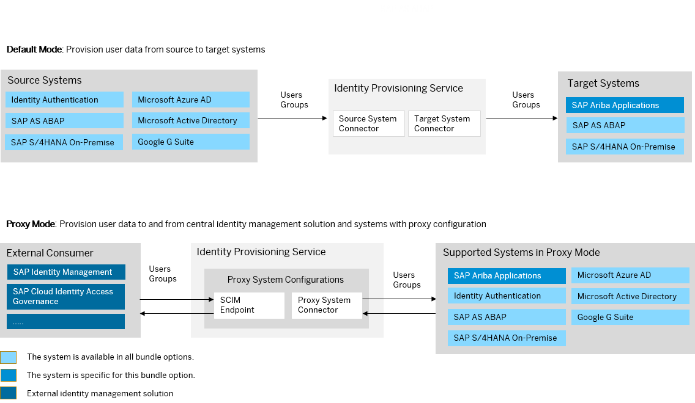

<!-- loio672f97aaaacd421ead344b396b1e8bd8 -->

# SAP Ariba Applications Bundle

SAP Ariba Applications bundle allows you to use the Identity Provisioning service for synchronizing user data between source and target systems. The available source and target systems in this bundle can also be configured as proxy systems for indirect connection to external identity management systems.

> ### Note:  
> As of March 15, 2022, Identity Provisioning bundle tenants are created only on the infrastructure of SAP Cloud Identity Services. These tenants come with most of the provisioning systems \(connectors\) enabled by default. Identity Provisioning bundle tenants running on SAP BTP, Neo environment have a limited number of connectors enabled by default. These are illustrated in the diagram that follows.

<a name="loio672f97aaaacd421ead344b396b1e8bd8__section_pjk_bxz_fqb"/>

## How to Obtain

After purchasing SAP Ariba, the Identity Provisioning bundle tenant is automatically created and provisioned for new customers of the cloud-based procurement and supply chain solution. The technical contact person in your organization receives the welcome e-mail from SAP. He or she is granted the Administrator permissions for the Identity Provisioning bundle tenant and performs the initial logon.

Existing customers of SAP Ariba obtain Identity Provisioning bundle tenant by opening an incident as follows:

1.  Create an incident to component *BNS-ARI-CP-CORE-AI*.

2.  Specify the S-user to be assigned as the first administrator of the Identity Provisioning tenants. Later, this S-user can add other users as administrators.

3.  Specify the URLs to your SAP Ariba Applications **Quality** and **Productive** systems.

In the reply of your incident, you'll receive two URLs related to two Identity Provisioning tenants.

-   The first URL will be bound to your **Quality** instance, and you can use it for testing purposes.

-   The second URL will be bound to your **Productive** instance, and you can use it for productive provisioning configurations and jobs. This bounding principle is applied to your Identity Authentication tenants as well.

