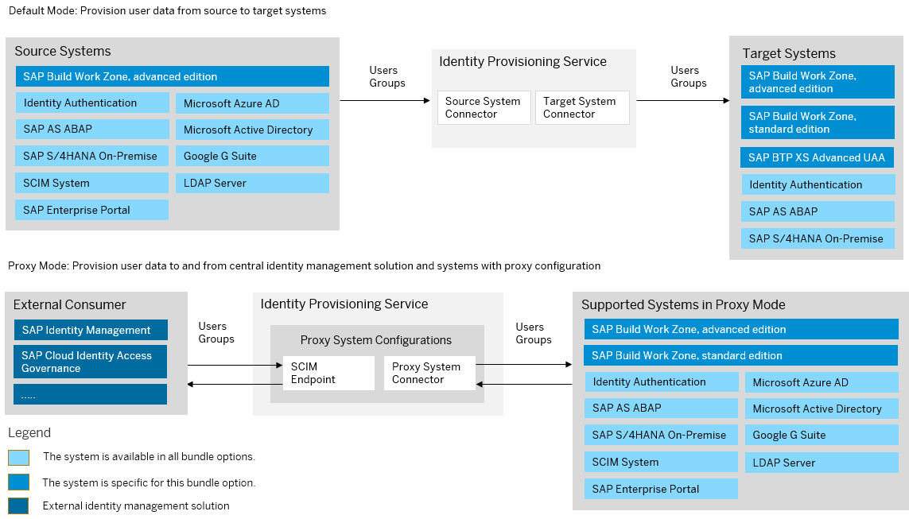

<!-- loio930015d483a74ee8b68a132db7699825 -->

# SAP Build Work Zone, advanced edition Bundle

SAP Build Work Zone, advanced edition bundles with SAP Cloud Identity Services – Identity Authentication and Identity Provisioning

> ### Note:  
> As of March 15, 2022, Identity Provisioning bundle tenants are created only on the infrastructure of SAP Cloud Identity Services. These tenants come with most of the provisioning systems \(connectors\) enabled by default. Identity Provisioning bundle tenants running on SAP BTP, Neo environment have a limited number of connectors enabled by default. These are illustrated in the diagram that follows.

### Bundle Tenant on Neo Environment

<a name="loio930015d483a74ee8b68a132db7699825__section_ajl_vbh_rnb"/>

## How to Obtain

After purchasing SAP Build Work Zone, advanced edition, you can obtain the Identity Provisioning tenant by connecting your subaccount to the service in Work Zone Manager. As the subaccount administrator, proceed as follows:

1.  Connect your subaccount to Identity Provisioning as described in: [Post Booster Configuration](https://help.sap.com/viewer/b03c84105ff74f809631e494bd612e83/Cloud/en-US/e567b51e2e554814836bf2d7b0e2a9fc.html)

2.  Open the URL [https://iamtenants.accounts.cloud.sap/](https://iamtenants.accounts.cloud.sap/) and login with your S-user.

3.  View the Identity Provisioning and Identity Authentication tenants that are assigned to your customer ID.

For the complete onboarding process, see [Getting Started](https://help.sap.com/viewer/b03c84105ff74f809631e494bd612e83/Cloud/en-US/627b9e36a3da430199133c6ca0db45d8.html)

**Related Information**  

[SAP Build Work Zone, advanced edition](https://help.sap.com/docs/WZ?locale=en-US)

