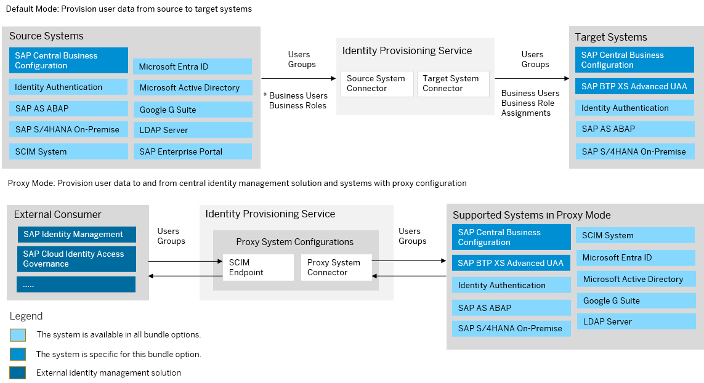

<!-- loio44e86733d23c4368aea9b1c3b7ca0570 -->

# SAP Central Business Configuration Bundle

SAP Central Business Configuration bundles with SAP Cloud Identity Services – Identity Authentication and Identity Provisioning.

<a name="loio44e86733d23c4368aea9b1c3b7ca0570__section_anb_l2b_y1c"/>

## Prerequisites

-   You have credentials to log in to SAP for Me. For more information, see [Access and Authorizations](https://support.sap.com/content/s4m/help/access.html).

> ### Note:  
> As of March 15, 2022, Identity Provisioning bundle tenants are created only on the infrastructure of SAP Cloud Identity Services. These tenants come with most of the provisioning systems \(connectors\) enabled by default. Identity Provisioning bundle tenants running on SAP BTP, Neo environment have a limited number of connectors enabled by default. These are illustrated in the diagram that follows.

### Bundle Tenant on Neo Environment

<a name="loio44e86733d23c4368aea9b1c3b7ca0570__section_fxm_g2y_pbc"/>

## How to Obtain

After purchasing SAP Central Business Configuration, you must initiate its provisioning via SAP for Me by following the procedure described in [SAP for Me Online Help](https://support.sap.com/content/s4m/help/systems/provisioning.html). If you don't have an existing SAP Cloud Identity Services tenant, this will automatically trigger its creation. If you already have a tenant, it will be reused. For more information, see [Activate Your Account](https://help.sap.com/docs/cloud-identity-services/cloud-identity-services/activate-your-account?locale=en-US&version=Cloud).

<a name="loio44e86733d23c4368aea9b1c3b7ca0570__section_i3d_4wx_pbc"/>

## How to Use

This bundle tenant is provisioned to your organization with the following preconfigured source and target systems:

-   For groups provisioning: SAP Central Business Configuration as a source system and Identity Authentication as a target system.

    > ### Note:  
    > Note that the default user groups for SAP Central Business Configuration are already created in Identity Authentication.

-   For users provisioning: Identity Authentication as a source system and SAP Central Business Configuration as a target system.

Тhe communication between SAP Central Business Configuration and Identity Provisioning is set up.

You receive also a preconfigured technical user inIdentity Authentication for system-to-system communication.

You can review the provisioning system configurations, adjust them if needed and schedule provisioning jobs. For more information about SAP Central Business Configuration provisioning systems, see:

-   [SAP Central Business Configuration \(Source\)](sap-central-business-configuration-302b76e.md)

-   [SAP Central Business Configuration \(Target\)](sap-central-business-configuration-baac8cc.md)

The other provisioning systems in the scope of this bundle are enabled. This means that you can start adding and configuring them in the Identity Provisioning UI. See: [Add New Systems](Operation-Guide/add-new-systems-bd214dc.md)

**Related Information**  

[SAP Central Business Configuration](https://help.sap.com/docs/CENTRAL_BUSINESS_CONFIGURATION?locale=en-US)

