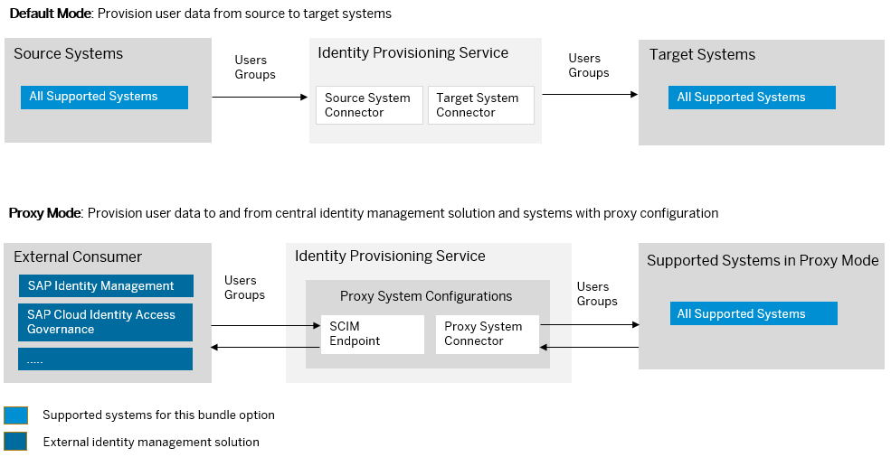

<!-- loio868e7923e4e9402197eb21615a5fff14 -->

# SAP Cloud Identity Access Governance Bundle

SAP Cloud Identity Access Governance bundles with SAP Cloud Identity Services – Identity Authentication and Identity Provisioning.

<a name="loio868e7923e4e9402197eb21615a5fff14__section_ttz_yjl_tlb"/>

## How to Obtain

After purchasing SAP Cloud Identity Access Governance, if your license includes only SAP Cloud Identity Access Governance, you can obtain the Identity Provisioning as well.

> ### Note:  
> You won't be charged any extra fee as Identity Provisioning has been officially integrated in the SAP Cloud Identity Access Governance license.

You already have Identity Authentication \(a mandatory service\), which enables you to sign in and authenticate in the Identity Provisioning UI and within SAP Business Technology Platform.

To obtain Identity Provisioning tenant, you need to create an incident. Follow the steps:

1.  Create an incident to component *GRC-IAG-OPS* \(*SAP Cloud Identity Access Governance*\).

2.  Explain that you've purchased an SAP Cloud Identity Access Governance product and you require access to the Identity Provisioning.

3.  Specify the S-user to be assigned as the first administrator of the Identity Provisioning tenants. Later, this S-user can add other users as administrators.

    For complete information on what you need to specify in the incident, see [Connecting Identity Provisioning Tenant](https://help.sap.com/docs/SAP_CLOUD_IDENTITY_ACCESS_GOVERNANCE/e12d8683adfa4471ac4edd40809b9038/ae06bfacfbba43679b0ca802ca3b58d4.html?version=Latest&q=%22identity%20provisioning%22) in *SAP Cloud Identity Access Governance Admin Guide*

**Related Information**  

[SAP Cloud Identity Access Governance](https://help.sap.com/docs/SAP_CLOUD_IDENTITY_ACCESS_GOVERNANCE?version=CLOUDFOUNDRY)

