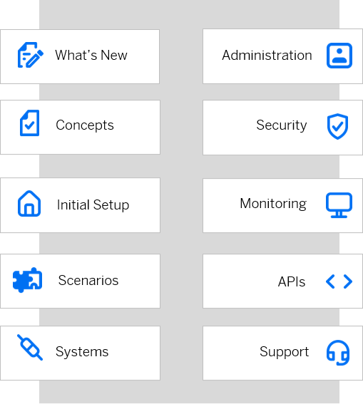

<!-- loiod17a116432d24470930ebea41977a888 -->

# SAP Cloud Identity Services

### What's New

Stay informed about the newest features and updates of SAP Cloud Identity Services.

For more information, see [What's New for Cloud Identity Services](what-s-new-for-cloud-identity-services-de21efe.md).

### Concepts

Understand the concepts relevant for SAP Cloud Identity Services.

For more information, see [Concepts](concepts-5645ae6.md).

### Initial Setup

Explore the required steps to get started with SAP Cloud Identity Services.

For more information, see [Initial Setup](initial-setup-31af7da.md).

### Scenarios

Understand the scenarios supported by SAP Cloud Identity Services.

For more information, see [Scenarios](scenarios-fb9898d.md).

### Systems

Familiarize yourself with the supported provisioning systems \(connectors\) by Identity Provisioning.

For more information, see [Supported Systems](supported-systems-81ca0c1.md).

### Administration

Learn how to configure and administer SAP Cloud Identity Services.

For more information, see [Administration](Operation-Guide/administration-6a8e67c.md).

### Security

Use the security features of SAP Cloud Identity Services to support the security policies of your organization.

For more information, see [Security](Security/security-e7a80f1.md).

### Monitoring

Explore monitoring and reporting to get information about audit logs, job logs, usage statistics, and more.

For more information, see [Monitoring and Troubleshooting](Monitoring-and-Reporting/monitoring-and-troubleshooting-b8382ee.md).

### APIs

Get to know the APIs of SAP Cloud Identity Services delivered on the SAP Business Accelerator Hub.

For more information, see [SAP Cloud Identity Services APIs](https://api.sap.com/package/SCPIdentityServices/rest).

### Support

Get support when you have questions or encounter issues while working with SAP Cloud Identity Services.

For more information, see [Getting Support](getting-support-06818b2.md).

