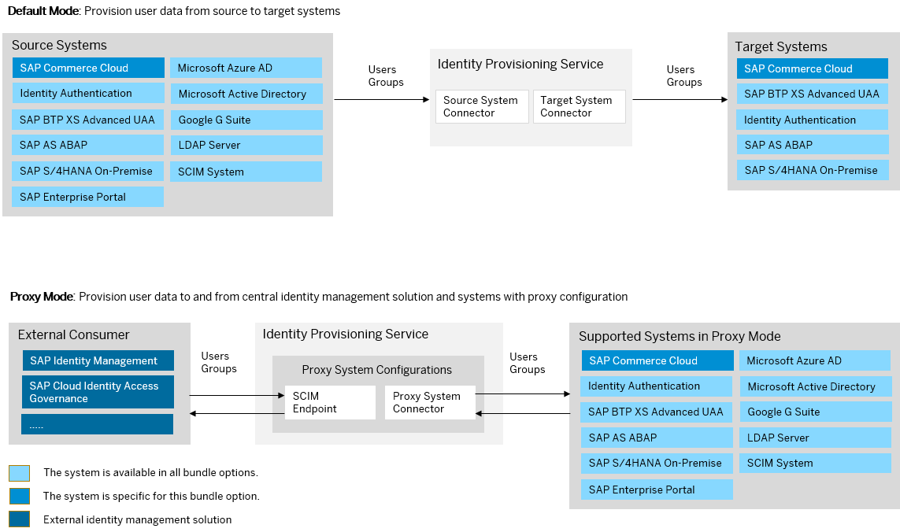

<!-- loioe30224b295334cde9383422fceb84273 -->

# SAP Commerce Cloud Bundle

SAP Commerce Cloud bundles with SAP Cloud Identity Services – Identity Authentication and Identity Provisioning.

> ### Note:  
> As of March 15, 2022, Identity Provisioning bundle tenants are created only on the infrastructure of SAP Cloud Identity Services. These tenants come with most of the provisioning systems \(connectors\) enabled by default. Identity Provisioning bundle tenants running on SAP BTP, Neo environment have a limited number of connectors enabled by default. These are illustrated in the diagram that follows.

<a name="loioe30224b295334cde9383422fceb84273__section_pjk_bxz_fqb"/>

## How to Obtain

After purchasing SAP Commerce Cloud, the technical contact person of your organization receives two onboarding e-mails from SAP. Each of them provides a tenant URL for accessing the SAP Cloud Identity Services administration console. One of the tenant URLs is for testing purposes, the other one is for productive usage. The technical contact person is granted the administrator permissions of the tenants and performs the initial logon to the SAP Cloud Identity Services administration console.

### Bundle Tenant on Neo Environment

<a name="loioe30224b295334cde9383422fceb84273__section_eh1_1c3_ntb"/>

## How to Use

This bundle tenant is provisioned to your organization with preconfigured source and target systems. Identity Authentication system is preconfigured as a source and SAP Commerce Cloud solution is preconfigured as a target. Identity Authentication default user groups are created for SAP Commerce Cloud.

You can review the provisioning system configurations, adjust them if needed and schedule read jobs.

