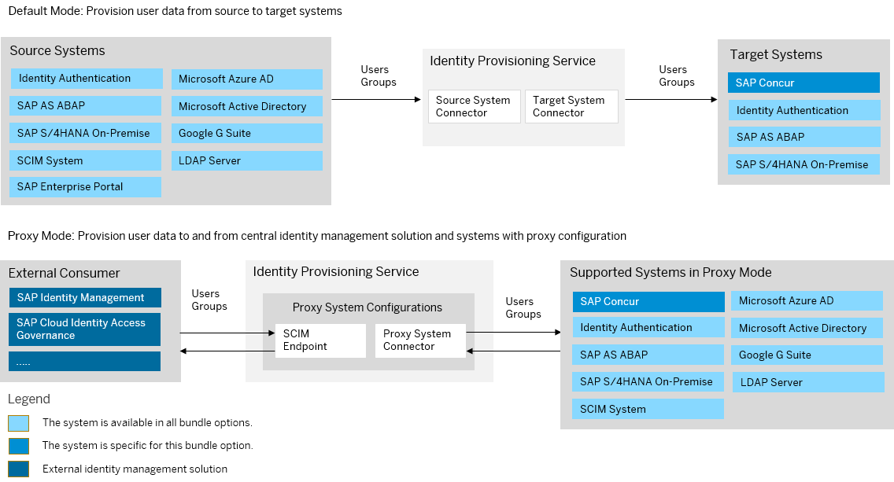

<!-- loiof0980747e54149f5b5affa7db2ac3b65 -->

# SAP Concur Bundle

SAP Concur bundles with SAP Cloud Identity Services – Identity Authentication and Identity Provisioning.

Customers can integrate SAP Cloud Identity Services no matter whether the Concur instance is integrated with their own corporate identity provider or not.

> ### Note:  
> As of March 15, 2022, Identity Provisioning bundle tenants are created only on the infrastructure of SAP Cloud Identity Services. These tenants come with most of the provisioning systems \(connectors\) enabled by default. Identity Provisioning bundle tenants running on SAP BTP, Neo environment have a limited number of connectors enabled by default. These are illustrated in the diagram that follows.

### Bundle Tenant on Neo Environment

<a name="loiof0980747e54149f5b5affa7db2ac3b65__section_llr_syg_vzb"/>

## Prerequisites

-   New or existing Concur Expense, Concur Request, Concur Invoice, and/or Concur Travel & Expense customers that have at least one other SAP cloud solution.

    > ### Note:  
    > Concur Travel-only is not currently supported.

-   Identity Authentication and Identity Provisioning tenants must be created or configured by SAP:

    1.  You need to check with your SAP Concur account team to determine if you are eligible for provisioning of a tenant with Identity Authentication and Identity Provisioning services.

    2.  If eligible, create a support case to initiate the provisioning of an SAP Cloud Identity Services tenant with Identity Authentication and Identity Provisioning services. For customers with an existing Identity Authentication and Identity Provisioning tenants, the tenants will be reused.

        > ### Note:  
        > You must create a case to set up Identity Authentication and Identity Provisioning tenant provisioning for your SAP Concur entity even if you already have existing Identity Authentication and Identity Provisioning tenants from other SAP solutions.

        To create a case, you can create an SAP for Me case \(recommended\) or an SAP Concur support case.

        For more information about creating an SAP for Me case, see this SAP Note: [1296527](https://me.sap.com/notes/1296527) - How to create a support case \(contact SAP Product Support\) - SAP for Me. Use the Component = BNS-CON-SSO.

        For more information about creating an SAP Concur support case, see the *How to Navigate the SAP Concur Support Portal* section on the [SAP Concur Support](https://assets.concur.com/tech-pubs/SAP-Concur-Training-Library/GTM.htm) page for instructions on creating a support case. Use the Case Type = Single Sign On.

<a name="loiof0980747e54149f5b5affa7db2ac3b65__section_mfk_ldd_wvb"/>

## How to Use

Your approach to using SAP Cloud Identity Services for authenticating and managing users in SAP Concur solutions relies on knowing which components are automated and which ones require manual configuration.

As of June 23, 2025, SAP Concur has automated its integration with Identity Authentication, enabling you to access the SAP Cloud Identity Services administration console within SAP Concur. This automation sets up the trust between Identity Authentication and SAP Concur. Once the trust is established, you can proceed with further configuration steps.

For more information, see [Overview](https://help.sap.com/docs/SAP_CONCUR/83c94f03f949423a8f76158375832747/1b9037b66caf1014a93a84cf28690f07.html?version=latest).

