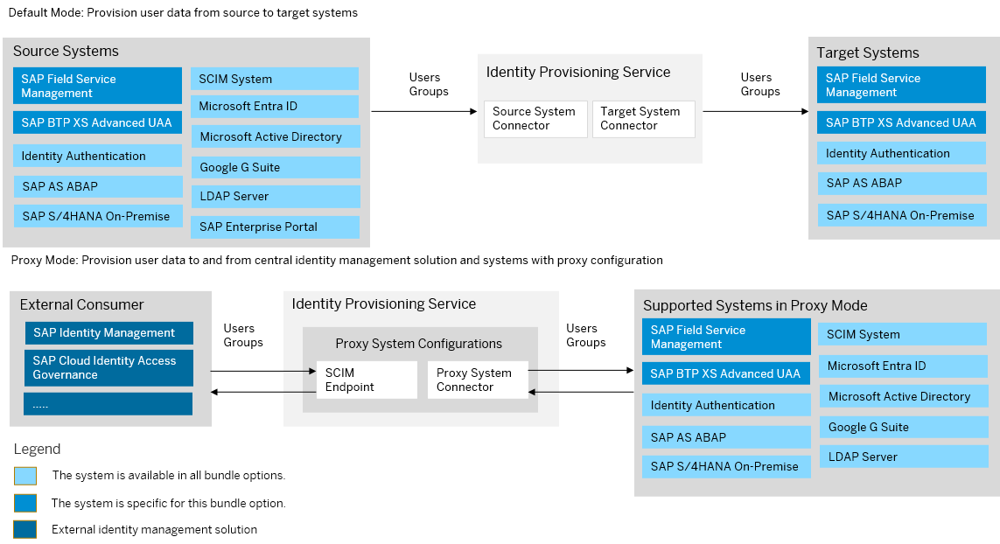

<!-- loio11a5849c1f6444ff90a9654a983b163d -->

# SAP Field Service Management Bundle

SAP Field Service Management bundles with SAP Cloud Identity Services – Identity Authentication and Identity Provisioning.

<a name="loio11a5849c1f6444ff90a9654a983b163d__section_anb_l2b_y1c"/>

## Prerequisites

-   You have credentials to log in to SAP for Me. For more information, see [Access and Authorizations](https://support.sap.com/content/s4m/help/access.html).

> ### Note:  
> As of March 15, 2022, Identity Provisioning bundle tenants are created only on the infrastructure of SAP Cloud Identity Services. These tenants come with most of the provisioning systems \(connectors\) enabled by default. Identity Provisioning bundle tenants running on SAP BTP, Neo environment have a limited number of connectors enabled by default. These are illustrated in the diagram that follows.

### Bundle Tenant on Neo Environment

<a name="loio11a5849c1f6444ff90a9654a983b163d__section_fxm_g2y_pbc"/>

## How to Obtain

After purchasing SAP Field Service Management, you must initiate its provisioning via SAP for Me by following the procedure described in[Provisioning Environments](https://help.sap.com/docs/SAP_FIELD_SERVICE_MANAGEMENT/fsm_getting_started/provisioning-environments.html) and [SAP for Me Online Help](https://support.sap.com/content/s4m/help/systems/provisioning.html). If you don't have an existing SAP Cloud Identity Services tenantIdentity Authentication and Identity Provisioning tenants, this will automatically trigger itstheir creation. If you already have a tenanttenants, itthey will be reused. For more information, see [Get Your Tenant](https://help.sap.com/docs/cloud-identity-services/cloud-identity-services/get-your-tenant?version=Cloud&locale=en-US).

> ### Note:  
> If the SAP Cloud Identity Services - Identity Authentication tenant is newly created the technical contact person of your organization is added as administrator of this tenant. If the tenant is reused, the technical contact person of your organization is added as a regular user. In case a user with matching email address already exists in the SAP Cloud Identity Services - Identity Authentication tenant, no additional user is created. In that case no activation email is sent from SAP Cloud Identity Services.

When the provisioning is complete, the technical contact person of your organization receives an email which contains the URL to the console of Field Service Management and the Account Name. For more information, see [Initial System Access](https://help.sap.com/docs/SAP_FIELD_SERVICE_MANAGEMENT/fsm_getting_started/initial-system-access.html?locale=en-US).

<a name="loio11a5849c1f6444ff90a9654a983b163d__section_i3d_4wx_pbc"/>

## How to Use

This bundle tenant is provisioned to your organization with preconfigured provisioning systems. Also, the communication between SAP Field Service Management and Identity Provisioning is set up. You have preconfigured technical users in Identity Authentication and SAP Field Service Management for system-to-system communication.

The authentication flow from SAP Field Service Management is set up through OpenID Connect with the Identity Authentication.

You have the following provisioning systems preconfigured:

-   For external users provisioning: SAP Field Service Management as a source system and Identity Authentication as a target system.

-   For employee users provisioning: Identity Authentication as a source system and SAP Field Service Management as a target system. The source system has set filter to provision only employee users assigned to groups with `groups.display` starting with `"FSM_"`.

Additionally, you have automatically enabled real-time provisioning for external users from SAP Field Service Management to Identity Authentication and a technical user for accessing the real-time provisioning API.

You can set up manually real-time provisioning for external users from SAP Field Service Management to Identity Authentication. For more information, see [Real-Time Provisioning in Neo Environment](https://help.sap.com/docs/identity-provisioning/identity-provisioning/real-time-provisioning-in-neo-environment?locale=en-US&version=Cloud).

You can review the provisioning system configurations, adjust them if needed and schedule provisioning jobs. For more information about SAP Field Service Management provisioning systems, see:

-   [SAP Field Service Management \(Source\)](sap-field-service-management-19e91d6.md)

-   [SAP Field Service Management \(Target\)](sap-field-service-management-570b984.md)

The other provisioning systems in the scope of this bundle are enabled. This means that you can start adding and configuring them in the Identity Provisioning UI. See: [Add New Systems](Operation-Guide/add-new-systems-bd214dc.md)

**Related Information**  

[SAP Field Service Management](https://help.sap.com/docs/SAP_FIELD_SERVICE_MANAGEMENT?locale=en-US)

[Leverage IPS Scenarios](https://help.sap.com/docs/SAP_FIELD_SERVICE_MANAGEMENT/fsm_federated_authentication/leverage-ips-scenarios.html)

