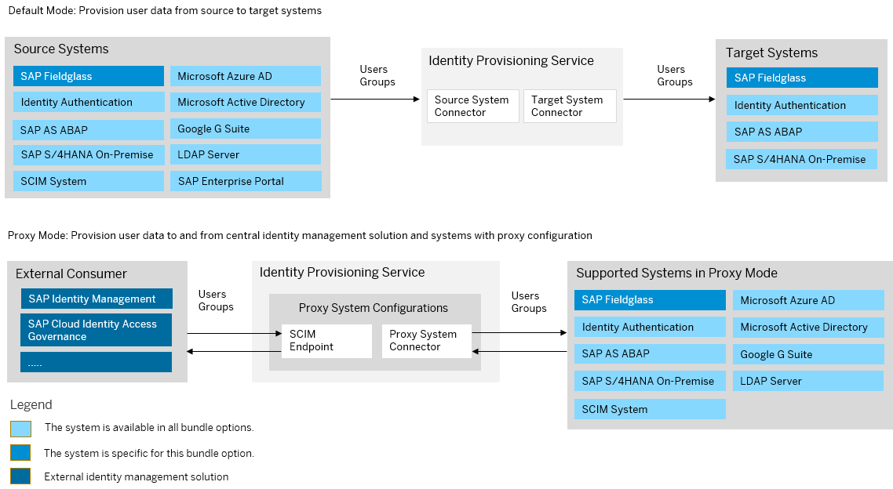

<!-- loio1b299f67d20845a2aee57902fdbc3755 -->

# SAP Fieldglass Bundle

SAP Fieldglass bundles with SAP Cloud Identity Services – Identity Authentication and Identity Provisioning.

> ### Note:  
> As of March 15, 2022, Identity Provisioning bundle tenants are created only on the infrastructure of SAP Cloud Identity Services. These tenants come with most of the provisioning systems \(connectors\) enabled by default. Identity Provisioning bundle tenants running on SAP BTP, Neo environment have a limited number of connectors enabled by default. These are illustrated in the diagram that follows.

### Bundle Tenant on Neo Environment

<a name="loio1b299f67d20845a2aee57902fdbc3755__section_pjk_bxz_fqb"/>

## How to Obtain

After purchasing SAP Fieldglass, the technical contact person of your organization receives two onboarding e-mails from SAP. Each of them provides a tenant URL for accessing the SAP Cloud Identity Services administration console. One of the tenant URLs is for testing purposes, the other one is for productive usage. The technical contact person is granted the administrator permissions of the tenants and performs the initial logon to the SAP Cloud Identity Services administration console.

<a name="loio1b299f67d20845a2aee57902fdbc3755__section_eh1_1c3_ntb"/>

## How to Use

This bundle tenant is provisioned to your organization with preconfigured source and target systems.

-   If you are a new SAP Fieldglass customer \(greenfield scenario\), you get Identity Authentication preconfigured as a source system and SAP Fieldglass preconfigured as a target.

-   If you are an existing SAP Fieldglass customer \(brownfield scenario\), in addition to preconfigured Identity Authentication source system and SAP Fieldglass target system, you get preconfigured SAP Fieldglass source system and Identity Authentication target system. To use brownfield scenario, your SAP Fieldglass administrator must trigger an upgrade process from the SAP Fieldglass UI.

You can review the provisioning system configurations, adjust them if needed and schedule read jobs.

**Related Information**  

[SAP Fieldglass and SAP Cloud Identity Services Business Synopsis](https://help.sap.com/docs/SAP_FIELDGLASS_INTEGRATION/3a206fd25e62405f8659ffc38a00859a/8de88823f3644f31a9b8e4aeaaacaf52.html?locale=en-US)

