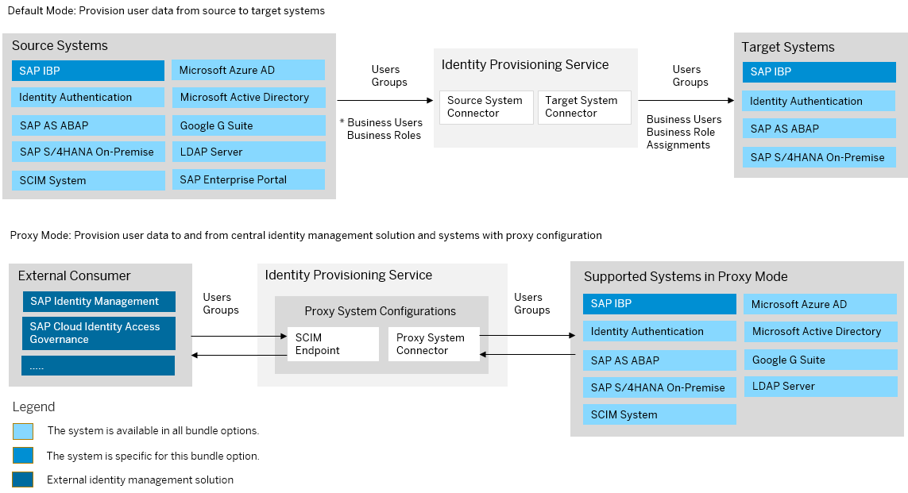
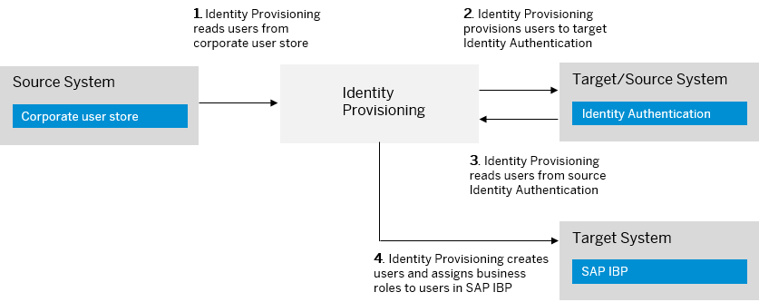

<!-- loio81b7e2e232c14b7baf8d2b7e68f7cda3 -->

# SAP Integrated Business Planning Bundle

SAP Integrated Business Planning \(in short, SAP IBP\) bundles with SAP Cloud Identity Services – Identity Authentication and Identity Provisioning.

> ### Note:  
> As of March 15, 2022, Identity Provisioning bundle tenants are created only on the infrastructure of SAP Cloud Identity Services. These tenants come with most of the provisioning systems \(connectors\) enabled by default. Identity Provisioning bundle tenants running on SAP BTP, Neo environment have a limited number of connectors enabled by default. These are illustrated in the diagram that follows.

### Bundle Tenant on Neo Environment

<a name="loio81b7e2e232c14b7baf8d2b7e68f7cda3__section_pjk_bxz_fqb"/>

## How to Obtain

Since November 2022, the Identity Provisioning service is provided together with SAP IBP by default. For information about accessing your Identity Provisioning tenant as an administrator, see [Initial Administrator User](https://help.sap.com/docs/SAP_INTEGRATED_BUSINESS_PLANNING/685fbd2d5f8f4ca2aacfc35f1938d1c1/22831a6a46024ccda611f7e89b3bfdcf.html?version=2211). If your system has been provisioned before November 2022, you can obtain an Identity Provisioning bundle tenant by creating an incident as follows:

1.  Create an incident to component *SCM-IBP-OPS-SRV* \(*Cloud Operations Service Requests*\).

2.  Specify the S-user to be assigned as the first administrator of the Identity Provisioning tenants.

    Later, this S-user can add other users as administrators.

3.  Specify the URLs to your SAP IBP **Quality** and **Productive** systems.

In the reply of your incident, you'll receive two URLs related to two Identity Provisioning tenants.

-   The first URL will be bound to your **Quality** instance, and you can use it for testing purposes.

-   The second URL will be bound to your **Productive** instance, and you can use it for productive provisioning configurations and jobs. This bounding principle is applied to your Identity Authentication tenants as well.

If you encounter issues with accessing your Identity Provisioning UI, create an incident to component *BC-IAM-IPS*.

<a name="loio81b7e2e232c14b7baf8d2b7e68f7cda3__section_kpf_dr5_3qb"/>

## How to Use

The scope of the SAP IBP bundle tenant includes the provisioning systems \(connectors\) displayed in the diagram above.

By default, the communication between SAP IBP and Identity Provisioning is automatically set up. Also, Identity Authentication is preconfigured as a source system and SAP IBP is preconfigured as a target system. This means that you can start running provisioning jobs manually or set a time interval for scheduled jobs. See: [Start and Stop Provisioning Jobs](Operation-Guide/start-and-stop-provisioning-jobs-531a261.md)

The other provisioning systems in the scope of this bundle are enabled. This means that you can start adding and configuring them in the Identity Provisioning UI. See: [Add New Systems](Operation-Guide/add-new-systems-bd214dc.md)

> ### Note:  
> Users and groups in Identity Authentication correspond to business users and business roles in SAP IBP. The user groups defined in SAP IBP are not considered by the Identity Provisioning.

> ### Example:  
> In this example scenario, users are first provisioned to Identity Authentication \(target system\) from a corporate user store, such as Microsoft Azure AD \(source system\). Afterwards, those users are provisioned from Identity Authentication \(this time set up as a source system\) to SAP IBP \(target system\).

For more information about SAP IBP integration scenarios, see: [Integrating Identity Provisioning Service with SAP IBP](https://help.sap.com/viewer/feae3cea3cc549aaa9d9de7d363a83e6/Latest/en-US/c512e3aefa6f43bbb916eb164361a1c0.html)

For more information about the provisioning systems \(source, target and proxy\) relevant to SAP IBP bundle, see: [Supported Systems](supported-systems-81ca0c1.md)

**Related Information**  

[SAP Integrated Business Planning](https://help.sap.com/viewer/product/SAP_INTEGRATED_BUSINESS_PLANNING/2108/en-US?task=discover_task)

