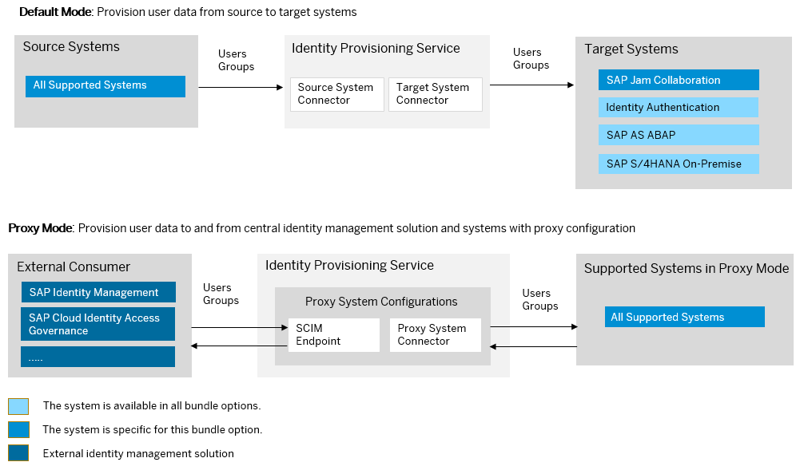

<!-- loio7133fd50d102421c8cf861001af72904 -->

# SAP Jam Collaboration Bundle

SAP Jam Collaboration bundles with SAP Cloud Identity Services – Identity Authentication and Identity Provisioning.

> ### Note:  
> As of March 15, 2022, Identity Provisioning bundle tenants are created only on the infrastructure of SAP Cloud Identity Services. These tenants come with most of the provisioning systems \(connectors\) enabled by default. Identity Provisioning bundle tenants running on SAP BTP, Neo environment have a limited number of connectors enabled by default. These are illustrated in the diagram that follows.

### Bundle Tenant on Neo Environment

<a name="loio7133fd50d102421c8cf861001af72904__section_icc_tmv_ljb"/>

## How to Obtain

-   **Your license contains Identity Provisioning**

    After purchasing SAP Jam Collaboration, you'll receive two e-mails from SAP. According to your contract with SAP, a technical contact person has been chosen as the first user of the Identity Provisioning service, who is granted with *Administrator* permissions. In these e-mails from SAP, you'll find the ID of this administrator \(their P- or S-user\) and their e-mail address. They can access the Identity Provisioning UI with their user credentials.

    Each e-mail from SAP contains also a URL link that you, as an administrator, can use to directly access the Identity Provisioning UI. These two URLs are related to two different Identity Provisioning tenants – the first one you can use for *testing* purposes, and the second one – for *productive* provisioning configurations and jobs.

    If you encounter issues with accessing your Identity Provisioning UI, create an incident to component *BC-IAM-IPS*.

-   **Your license does not contain Identity Provisioning**

    After the successful purchase, if your license includes only SAP Jam Collaboration, you can request a tenant for the Identity Provisioning service.

    > ### Note:  
    > You won't be charged any extra fee as Identity Provisioning service has been officially integrated in the SAP Jam license.
    > 
    > See the following blog post: [SAP Jam now comes with the Identity Provisioning service](https://blogs.sap.com/2017/11/09/sap-jam-now-comes-with-the-sap-cloud-platform-identity-provisioning-service/)

    You already have Identity Authentication \(a mandatory service\), which enables you to sign in and authenticate in the Identity Provisioning UI and within SAP Business Technology Platform.

    To obtain Identity Provisioning, you need to create an incident. Follow the steps:

    1.  Create an incident to component *BC-IAM-IPS*.
    2.  Explain that you've purchased an SAP Jam Collaboration product and you require access to the Identity Provisioning service.
    3.  Specify the S-user to be assigned as the first administrator of the Identity Provisioning tenants. Later, this S-user can add other users as administrators.

<a name="loio7133fd50d102421c8cf861001af72904__section_cd1_scq_kyb"/>

## How To Use

If your SAP Jam Collaboration license includes Identity Provisioning, this bundle tenant is provisioned to your organization with preconfigured source and target systems. Identity Authentication system is preconfigured as a source system and SAP Jam Collaboration is preconfigured as a target. For more information, see [Identity Authentication and Identity Provisioning](https://help.sap.com/docs/SAP_JAM_COLLABORATION/c62f9a30d4444b39b1914b90cbeb63ea/a7d946361a12407ea62a420705a0f3e0.html?version=LATEST) in the *SAP Jam Collaboration Administrator Guide*.

You can review the provisioning system configurations, adjust them if needed and schedule read jobs.

**Related Information**  

[SAP Jam Collaboration](https://help.sap.com/viewer/product/SAP_JAM_COLLABORATION/LATEST/en-US)

