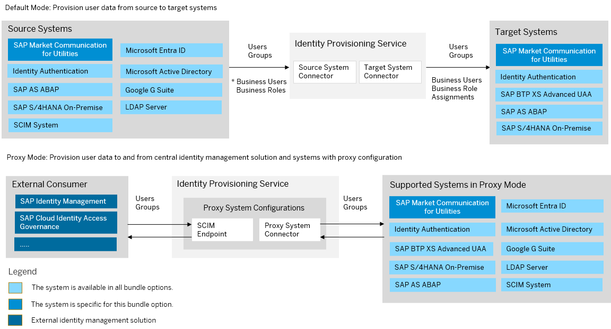

<!-- loio79b84ffca5c7480288ceadfb730d3014 -->

# SAP Market Communication for Utilities Bundle

SAP Market Communication for Utilities bundles with SAP Cloud Identity Services – Identity Authentication and Identity Provisioning.

> ### Note:  
> As of March 15, 2022, Identity Provisioning bundle tenants are created only on the infrastructure of SAP Cloud Identity Services. These tenants come with most of the provisioning systems \(connectors\) enabled by default. Identity Provisioning bundle tenants running on SAP BTP, Neo environment have a limited number of connectors enabled by default. These are illustrated in the diagram that follows.

<a name="loio79b84ffca5c7480288ceadfb730d3014__section_vlv_1fb_jlb"/>

## How to Obtain

After purchasing SAP Market Communication for Utilities, the technical contact person of your organization receives two onboarding e-mails from SAP. Each of them provides a tenant URL for accessing the SAP Cloud Identity Services administration console. One of the tenant URLs is for testing purposes, the other one is for productive usage. The technical contact person is granted the administrator permissions of the tenants and performs the initial logon to the SAP Cloud Identity Services administration console.

### Bundle Tenant on Neo Environment

<a name="loio79b84ffca5c7480288ceadfb730d3014__section_vd1_tlt_21c"/>

## How to Use

This bundle tenant is provisioned to your organization with preconfigured source and target systems. Identity Authentication system is preconfigured as a source and SAP Market Communication for Utilities solution is preconfigured as a target.

> ### Note:  
> A single SAP Cloud Identity Services tenant with configured Identity Authentication source system is used for provisioning to all SAP Market Communication for Utilities tenants that you obtain.

The default user groups for SAP Market Communication for Utilities are created in Identity Authentication. Тhe communication between SAP Market Communication for Utilities and Identity Provisioning is set up. The authentication type used is *ClientCertificateAuthentication*.

You can review the provisioning system configurations, adjust them if needed and schedule read jobs. For more information, see [SAP Market Communication for Utilities target](sap-market-communication-for-utilities-5aa97c7.md).

The other provisioning systems in the scope of this bundle are enabled. This means that you can start adding and configuring them in the Identity Provisioning UI. See: [Add New Systems](Operation-Guide/add-new-systems-bd214dc.md)

**Related Information**  

[SAP Market Communication for Utilities](https://help.sap.com/docs/market-communication-for-utilities?locale=en-US)

