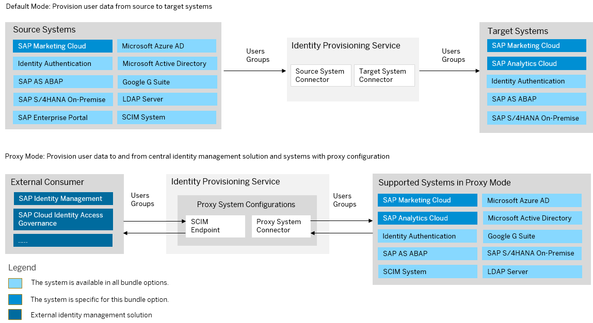

<!-- loiofbd2081a6052402ab3f03fff2c30834a -->

# SAP Marketing Cloud Bundle

SAP Marketing Cloud bundles with SAP Cloud Identity Services – Identity Authentication and Identity Provisioning.

> ### Note:  
> As of March 15, 2022, Identity Provisioning bundle tenants are created only on the infrastructure of SAP Cloud Identity Services. These tenants come with most of the provisioning systems \(connectors\) enabled by default. Identity Provisioning bundle tenants running on SAP BTP, Neo environment have a limited number of connectors enabled by default. These are illustrated in the diagram that follows.

### Bundle Tenant on Neo Environment

<a name="loiofbd2081a6052402ab3f03fff2c30834a__section_cbp_v4d_mjb"/>

## You have purchased the product before release 1911

If you've bought SAP Marketing Cloud before the **1911** release, you have to request access to the Identity Provisioning service. To do this, follow the steps:

1.  Create an incident to component *XX-S4C-OPR-SRV* \(*S/4HANA Cloud service requests*\).
2.  Explain that you've purchased an SAP Marketing Cloud product before **1911** release.
3.  Specify the S-user to be assigned as the first administrator of the Identity Provisioning tenants. Later, this S-user can add other users as administrators.
4.  Specify the URLs to your SAP Marketing Cloud **Quality** and **Productive** systems.

In the reply of your incident, you'll receive two URLs related to two Identity Provisioning tenants. The first URL will be bound to your **Quality** instance, and you can use it for *testing* purposes. The second URL will be bound to your **Productive** instance, and you can use it for *productive* provisioning configurations and jobs. This bounding principle is applied to your Identity Authentication tenants as well.

<a name="loiofbd2081a6052402ab3f03fff2c30834a__section_ebp_v4d_mjb"/>

## You have purchased the product after release 1911

If you've bought SAP Marketing Cloud with release **1911** or higher, you'll receive two onboarding e-mails from SAP. According to your contract with SAP, a technical contact person has been chosen as the first user of the Identity Provisioning service, who is granted with *Administrator* permissions. Each onboarding e-mail contains a URL link that you, as an administrator, can use to directly access the Identity Provisioning UI. The relevant URLs are related to two different Identity Provisioning tenants – the first one you can use for *testing* purposes, and the second one – for *productive* provisioning configurations and jobs.

If you encounter issues with accessing your Identity Provisioning UI, create an incident to component *BC-IAM-IPS*.

**Related Information**  

[SAP Marketing Cloud](https://help.sap.com/viewer/product/SAP_MARKETING_CLOUD/2108.500/en-US?expandAll=true)

