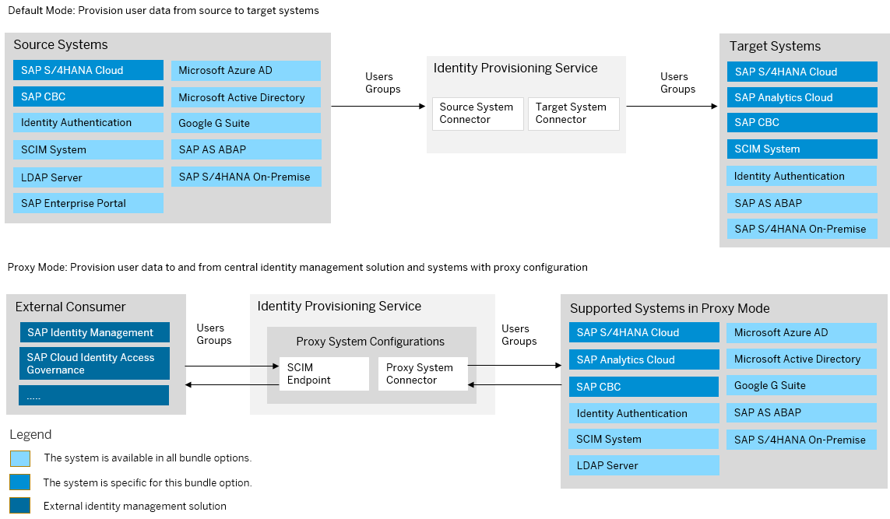

<!-- loio01b30d0f96f94243acf272b2f414b3a7 -->

# SAP S/4HANA Cloud Public Edition Bundle

SAP S/4HANA Cloud Public Edition bundles with SAP Cloud Identity Services – Identity Authentication and Identity Provisioning.

> ### Note:  
> As of March 15, 2022, Identity Provisioning bundle tenants are created only on the infrastructure of SAP Cloud Identity Services. These tenants come with most of the provisioning systems \(connectors\) enabled by default. Identity Provisioning bundle tenants running on SAP BTP, Neo environment have a limited number of connectors enabled by default. These are illustrated in the diagram that follows.

### Bundle Tenant on Neo Environment

> ### Note:  
> This bundle option is only applicable for [SAP S/4HANA Cloud Public Edition Essentials Edition](https://support.sap.com/en/product/s4hana-cloud.html)

> ### Restriction:  
> **SCIM System** can be used as a target system only in provisioning scenarios with *SAP Central Business Configuration*.

<a name="loio01b30d0f96f94243acf272b2f414b3a7__section_obk_yrv_ljb"/>

## How to Obtain

The way you obtain Identity Provisioning bundle tenant depends on the release of your SAP S/4HANA Cloud Public Edition.

### SAP S/4HANA Cloud Public Edition Purchased Before 1911 Release

If you've purchased SAP S/4HANA Cloud Public Edition before the **1911** release, you have to request access to the Identity Provisioning service. To do this, follow the steps:

1.  Create an incident to component *XX-S4C-OPR-SRV* \(*S/4HANA Cloud service requests*\).

2.  Explain that you've purchased an SAP S/4HANA Cloud Public Edition product before **1911** release.

3.  Specify the S-user to be assigned as the first administrator of the Identity Provisioning tenants. Later, this S-user can add other users as administrators.

In the reply of your incident, you'll receive two URLs related to two Identity Provisioning tenants. The first URL will be bound to your **Quality** instance, and you can use it for *testing* purposes. The second URL will be bound to your **Productive** instance, and you can use it for *productive* provisioning configurations and jobs. This bounding principle is applied to your Identity Authentication tenants as well.

### SAP S/4HANA Cloud Public Edition Purchased With 1911 Release or Higher

If you've purchased SAP S/4HANA Cloud Public Edition with release **1911** or higher, you'll receive two onboarding e-mails from SAP. According to your contract with SAP, a technical contact person has been chosen as the first user of the Identity Provisioning service, who is granted with *Administrator* permissions. Each onboarding e-mail contains a URL link that you, as an administrator, can use to directly access the Identity Provisioning UI. The relevant URLs are related to two different Identity Provisioning tenants – the first one you can use for *testing* purposes, and the second one – for *productive* provisioning configurations and jobs.

<a name="loio01b30d0f96f94243acf272b2f414b3a7__section_gyt_gjm_t5b"/>

## How to Use

The Identity Provisioning bundle tenant for SAP S/4HANA Cloud Public Edition release 1911 or higher comes with preconfigured provisioning systems \(connectors\) for specific integration scenarios:

-   For integrating SAP S/4HANA Cloud Public Edition with the embedded SAP Analytics Cloud, SAP provides preconfigured SAP S/4HANA Cloud Public Edition source system and SAP Analytics Cloud target system. To learn more about what's been initially preconfigured and how to apply subsequent changes to the Identity Provisioning configurations, see:

    -   [Ensure SAP S/4HANA Cloud Public Edition users are replicated during their validity period](https://gad5158842f.us2.hana.ondemand.com/dtp/viewer/#/tree/2143/actions/27412:35953:53365/?version=current)

    -   [Ensure deleted SAP S/4HANA Cloud Public Edition users are also deleted in SAP Analytics Cloud](https://gad5158842f.us2.hana.ondemand.com/dtp/viewer/#/tree/2143/actions/27412:35953:53369/?version=current)

-   For integrating SAP S/4HANA Cloud Public Edition with Identity Authentication, SAP provides preconfigured Identity Authentication source system and SAP S/4HANA Cloud Public Edition target system. Also preconfigured Identity Authentication source system and SAP Central Business Configuration target system are delivered with system provisioning.

> ### Note:  
> Your initial provisioning jobs are paused. This means, you need to manually run them. To do this, open your relevant source systems, go to the *Jobs* \> *Read Job* \> *Schedule* and turn the job scheduler *ON*. For more information, see [Read Provisioning Job](Operation-Guide/read-provisioning-job-6256021.md) . If you need to, correct the credentials \(users and passwords\) for your relevant systems first, and then start the initial job\(s\).

If you encounter issues with accessing your Identity Provisioning UI, create an incident to component *BC-IAM-IPS*.

**Related Information**  

[SAP S/4HANA Cloud Public Edition](https://help.sap.com/docs/SAP_S4HANA_CLOUD?version=Latest)

[SAP Identity Provisioning \(IPS\) is now bundled with SAP S/4HANA Cloud Public Edition!](https://blogs.sap.com/2019/11/20/sap-identity-provisioning-ips-is-now-bundled-with-s-4hana-cloud/)

