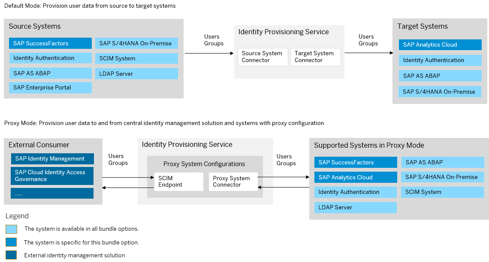

<!-- loioaf371e32f0ab4db69ed0ada241450975 -->

# SAP SuccessFactors Bundle

SAP SuccessFactors bundles with SAP Cloud Identity Services – Identity Authentication and Identity Provisioning.

If your SAP SuccessFactors tenant was created after December 9, 2022, Identity Authentication and Identity Provisioning have already been enabled. You do not need to complete the steps to upgrade to Identity Authentication, as described in [Initiating the Upgrade to SAP Cloud Identity Services - Identity Authentication Service](https://help.sap.com/docs/SAP_SUCCESSFACTORS_PLATFORM/568fdf1f14f14fd089a3cd15194d19cc/0271d9c4176e45ca9307e49230073240.html).

> ### Note:  
> As of March 15, 2022, Identity Provisioning bundle tenants are created only on the infrastructure of SAP Cloud Identity Services. These tenants come with most of the provisioning systems \(connectors\) enabled by default. Identity Provisioning bundle tenants running on SAP BTP, Neo environment have a limited number of connectors enabled by default. These are illustrated in the diagram that follows.

### Bundle Tenant on Neo Environment

<a name="loioaf371e32f0ab4db69ed0ada241450975__section_success_factors_bundle"/>

## How to Obtain

After purchasing SAP SuccessFactors, if your license includes only SAP SuccessFactors, you can obtain Identity Authentication and Identity Provisioning as well. To do this, you have to enable these services via the *Upgrade Center* of SAP SuccessFactors. You need to provide an S-user and password for validation. This S-user will be assigned as the first administrator of the Identity Provisioning tenants.

> ### Note:  
> In case you already have an existing Identity Provisioning tenant, its initial administrator may be different than the S-user you've provided in the *Upgrade Center* procedure. Due to security reasons, this S-user will not be assigned as an administrator. If you want it to be granted IPS\_ADMIN permissions, you need to ask the initial Identity Provisioning administrator to do that for you. To learn how, see: [Manage Authorizations](https://help.sap.com/docs/identity-provisioning/identity-provisioning/manage-authorizations?version=Cloud)
> 
> See also: [\(Guided Answers\) Can't Get Admin Permissions for a Bundle](https://ga.support.sap.com/dtp/viewer/#/tree/2065/actions/26547:29111:29114:27412:30085) 

You also need to create a password for the automatically created SAP SuccessFactors API user \(*IPSADMIN*\), and grant it the following permissions:

-   Go to *Admin Center* \> *Manage Permission Roles* \> *Manage Integration Tools* and choose "*Allow Admin to Access OData API through Basic Authentication*".
-   Go to *Admin Center* \> *Manage Permission Roles* \> *Administrator Permission* \> *Manage User* and choose "*User tenant OData entity*".

Proceed as follows:

1.  [Getting Started with Identity Authentication and SAP SuccessFactors](https://help.sap.com/viewer/568fdf1f14f14fd089a3cd15194d19cc/latest/en-US/35c74e4605564a82a5be6c7fdadf9aef.html)
2.  [Initiate Upgrade to Identity Authentication](https://help.sap.com/viewer/568fdf1f14f14fd089a3cd15194d19cc/latest/en-US/0271d9c4176e45ca9307e49230073240.html)
3.  [Identity Provisioning Administration Console Tasks](https://help.sap.com/viewer/568fdf1f14f14fd089a3cd15194d19cc/latest/en-US/e6eab54ddb5944a58703e7fcfa74cf08.html)
4.  [Setting an API User for Sync Jobs](https://help.sap.com/viewer/568fdf1f14f14fd089a3cd15194d19cc/latest/en-US/0a6e6705d89e42649e3aa8732f2b0724.html)

Your Identity Provisioning system is created once you've initiated your upgrade to Identity Authentication, and the Identity Provisioning administrator receives an email with two links to the Identity Provisioning admin console \(related to two different tenants\) – one for *testing* purposes, and one – for *productive* provisioning configurations and jobs.

If the upgrade procedure fails, create an incident to component *LOD-SF-PLT-IAS*.

If you have troubles with the Identity Provisioning admin console or configurations, create an incident to component *BC-IAM-IPS*.

<a name="loioaf371e32f0ab4db69ed0ada241450975__section_ekd_tkq_kyb"/>

## How to Use

This bundle tenant is provisioned to your organization with preconfigured source and target systems. SAP SuccessFactors is preconfigured as a source system and Identity Authentication is preconfigured as a target.

Integrating SAP SuccessFactors with the embedded SAP Analytics Cloud is triggered from SAP SuccessFactors *Upgrade Center*. As a result, SAP Analytics Cloud is created as a target system. It is disabled and no source system is linked to it.

> ### Note:  
> SAP SuccessFactors target system is enabled only for Identity Provisioning bundle tenants running on SAP Cloud Identity Services infrastructure.

You can review the provisioning system configurations, adjust them if needed and schedule read jobs.

**Related Information**  

[SAP SuccessFactors Platform](https://help.sap.com/docs/SAP_SUCCESSFACTORS_PLATFORM?locale=en-US&version=latest)

