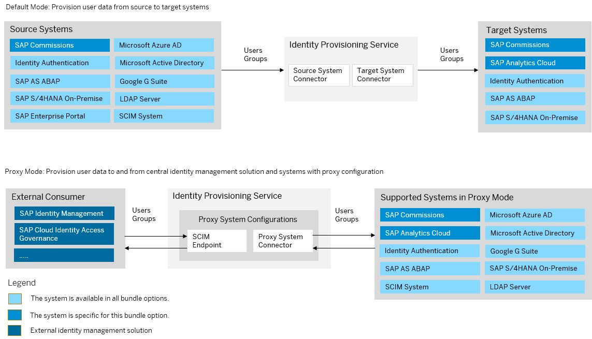

<!-- loio5e348cc330bd49c8a2f3e5195b58b477 -->

# SAP SuccessFactors Incentive Management Bundle

SAP SuccessFactors Incentive Management, formerly known as SAP Commissions, bundles with SAP Cloud Identity Services – Identity Authentication and Identity Provisioning.

> ### Note:  
> As of March 15, 2022, Identity Provisioning bundle tenants are created only on the infrastructure of SAP Cloud Identity Services. These tenants come with most of the provisioning systems \(connectors\) enabled by default. Identity Provisioning bundle tenants running on SAP BTP, Neo environment have a limited number of connectors enabled by default. These are illustrated in the diagram that follows.

### Bundle Tenant on Neo Environment

<a name="loio5e348cc330bd49c8a2f3e5195b58b477__section_vlv_1fb_jlb"/>

## How to Obtain

After purchasing SAP SuccessFactors Incentive Management, you'll receive two e-mails from SAP. According to your contract with SAP, a technical contact person has been chosen as the first user of the Identity Provisioning service, who is granted with *Administrator* permissions. In these e-mails from SAP, you'll find the ID of this administrator \(their P- or S-user\) and their e-mail address. They can access the Identity Provisioning UI with their user credentials.

Each e-mail from SAP contains also a URL link that you, as an administrator, can use to directly access the Identity Provisioning UI. These two URLs are related to two different Identity Provisioning tenants – the first one you can use for *testing* purposes, and the second one – for *productive* provisioning configurations and jobs.

**Related Information**  

[SAP SuccessFactors Incentive Management](https://help.sap.com/docs/SAP_Commissions?version=Latest)

