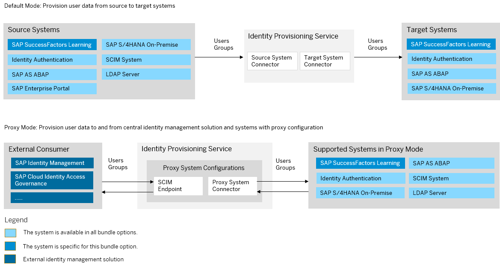

<!-- loio78d9506ea4e040a9b8581d018606bc5a -->

# SAP SuccessFactors Learning Bundle

SAP SuccessFactors Learning bundles with SAP Cloud Identity Services – Identity Authentication and Identity Provisioning.

> ### Note:  
> As of March 15, 2022, Identity Provisioning bundle tenants are created only on the infrastructure of SAP Cloud Identity Services. These tenants come with most of the provisioning systems \(connectors\) enabled by default. Identity Provisioning bundle tenants running on SAP BTP, Neo environment have a limited number of connectors enabled by default. These are illustrated in the diagram that follows.

### Bundle Tenant on Neo Environment

<a name="loio78d9506ea4e040a9b8581d018606bc5a__section_success_factors_bundle"/>

## How to Obtain

After purchasing SAP SuccessFactors with license for SAP SuccessFactors Learning, you can obtain Identity Authentication and Identity Provisioning tenants by initiating the integration in SAP SuccessFactors *Upgrade Center* as outlined here: [How to Integrate SAP SuccessFactors Learning and SAP Cloud Identity Services](https://help.sap.com/docs/SAP_SUCCESSFACTORS_LEARNING/82cf7c83c7db42a8aa1d3bbdbc39e93d/36bfe093c5974c5e88767fa2e7751149.html?q=%22identity%20Provisioning%22)

The process to integrate SAP SuccessFactors Learning and SAP Cloud Identity Services - Identity Authentication and Identity Provisioning consists of the following four steps:

1.  [Initiating Learning Identity Authentication Migration](https://help.sap.com/docs/SAP_SUCCESSFACTORS_LEARNING/82cf7c83c7db42a8aa1d3bbdbc39e93d/e03e7ec93f7e4861b8cf10721c41134a.html?q=%22identity%20Provisioning%22)

2.  [Learning Configuration Procedure](https://help.sap.com/docs/SAP_SUCCESSFACTORS_LEARNING/82cf7c83c7db42a8aa1d3bbdbc39e93d/3f29058a9dfe4ce38a3c774fbdf5339b.html?q=%22identity%20Provisioning%22)

3.  [Migrating Learning Users to Identity Authentication](https://help.sap.com/docs/SAP_SUCCESSFACTORS_LEARNING/82cf7c83c7db42a8aa1d3bbdbc39e93d/3da74f3b7d3e4f37b219f318234058bf.html?q=%22identity%20Provisioning%22)

4.  [Identity Authentication Activation](https://help.sap.com/docs/SAP_SUCCESSFACTORS_LEARNING/82cf7c83c7db42a8aa1d3bbdbc39e93d/c29cd3399f384cf7a2088464c996fb44.html?q=%22identity%20Provisioning%22)

<a name="loio78d9506ea4e040a9b8581d018606bc5a__section_ekd_tkq_kyb"/>

## How to Use

This bundle tenant is provisioned to your organization with preconfigured source and target systems. SAP SuccessFactors Learning is preconfigured as a source system and Identity Authentication is preconfigured as a target.

You can review the provisioning system configurations, adjust them if needed and schedule read jobs.

