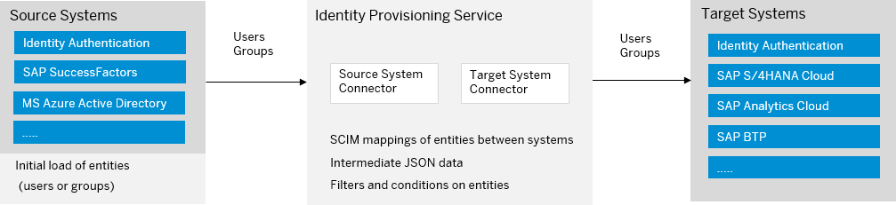

<!-- loio58033bec92124ef2a7905b37d0f50704 -->

# Source Systems

A source system is the connector used for reading entities \(users, groups, roles\).

Source systems can be on-premise or cloud-based, SAP or non-SAP, and usually represent the corporate user store where identities are currently maintained. Identity Provisioning reads the entities from the source system and creates or updates them in the relevant target ones. The provisioning is triggered from the *Jobs* tab of a source system.

You can connect one source system to one or multiple target systems. In the case of multiple \(enabled\) target systems, when you start a *Read* or a *Resync* job, this operation will trigger provisioning of entities from this source system to all relevant target ones.

> ### Restriction:  
> By default, the maximum number of productive source systems you are allowed to add for your tenant is **20**. This restriction is valid for *Customer Managed* systems only.
> 
> If your business requires using more systems, create an incident for component *BC-IAM-IPS* to request them. Describe your scenarios and provide a reason why you need the additional systems.

**Related Information**  

[System Types](system-types-e59ae54.md "Identity Provisioning differentiates systems based on how they are created and what they are used for.")

