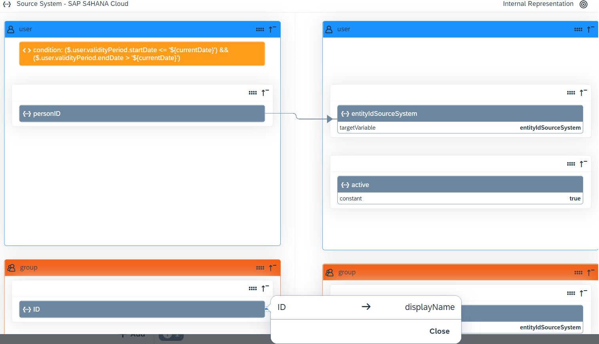
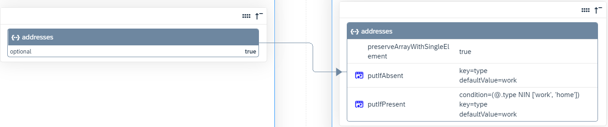
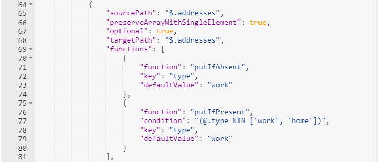

<!-- loio9ea770b21f9f499a97c55a8909d987aa -->

# Transformation Editors

Identity Provisioning provides graphical and JSON text editor for managing provisioning system transformations.

<a name="loio9ea770b21f9f499a97c55a8909d987aa__section_xb2_yn3_3vb"/>

## Graphical Editor

This editor allows you to graphically model the entities \(users, groups, roles\) and their content \(attribute mappings and transformation expressions, like conditions, functions, constants, and others\). It offers the following advantages:

-   Visualization

    Entities are organized in colored boxes. Every entity has a dedicated color. Users are always blue, groups are orange and roles are green. Source and target path attributes are displayed horizontally \(side-by-side\). They are connected with an arrow which indicates the direction of reading and writing the data. Color coding makes it easy to identify specific configurations. Ignored entities are greyed out, skipped operations and conditions are displayed in orange.

-   Simplification

    Typing code and following JSON syntax rules are no longer needed, except in cases when conditions are defined. Expressions and functions along with their possible values are prefilled and available for selection in dropdown lists. The editor takes care of adding the dot notation, that is, separating child elements with a period \(.\), enclosing string values within double quotes, prepending the dollar sign \($\) to the JSONPath expression.

-   Validation

    The JSON validator and the preview ensure that the input is in the expected format.

> ### Note:  
> The graphical editor is available only for Identity Provisioning tenants running on SAP Cloud Identity infrastructure. It is the default editor.

The following interactive screenshot shows the main elements of the graphical editor. Hover over the image and click highlighted areas for more information.

### 

### 

### 

### 

### 

### 

### 

### 

### 

### 

### 

### 

### 

The following example illustrates how the address attribute mapping from the Identity Authentication write transformation is displayed in the graphical editor. Compare the same attribute with its representation in the JSON editor below.

<table>
<tr>
<th valign="top" colspan="2">

Attribute Mapping in Graphical Editor

</th>
</tr>
<tr>
<td valign="top" colspan="2">

The source path attribute `addresses` in the internal representation \(on the left-hand side\) and the target path attribute `addresses` in the target system \(on the right-hand side\) are displayed horizontally. The arrow shows the direction of reading and writing the data. The transformation expressions and functions are listed under the respective `sourcePath` and `targetPath` attribute they are applicable for.

</td>
</tr>
</table>

<a name="loio9ea770b21f9f499a97c55a8909d987aa__section_id2_p4k_swb"/>

## JSON Editor

This editor allows you to work with entities and their transformation mappings in text mode. To add or modify transformations, you need to type. You can also perform operations like select, cut, copy, paste and others. The editor provides line numbering, syntax coloring and syntax validation.

The following example illustrates how the address attribute mapping from the Identity Authentication write transformation is displayed in the JSON editor:

<table>
<tr>
<th valign="top" colspan="2">

Attribute Mapping in JSON Editor

</th>
</tr>
<tr>
<td valign="top">

The source path attribute `addresses` in the internal representation and the target path attribute `addresses` in the target system are displayed vertically - one below the other.

The transformation expressions and functions are listed in individual lines below the respective `sourcePath` and `targetPath` attribute they are applicable for.

Syntax coloring and syntax validation are enabled by default.

</td>
<td valign="top">

</td>
</tr>
</table>

Although the graphical and the JSON editors differ in the user experience they provide, other tasks, such as: export and reset transformations remain the same.

**Related Information**  

[Transformation Types](transformation-types-1a92c56.md "Learn about the types of JSON transformations needed for the provisioning jobs.")

[Transformation Expressions](transformation-expressions-bb8537b.md "")

[Transformation Functions](transformation-functions-0cdac7c.md "")

[Transformation Variables](transformation-variables-8376adb.md "")

[Transformation Conditions](transformation-conditions-f47bd39.md "A condition defines a JSON filter expression that can be applied to entity types (such as users, groups, and roles) or within attribute mappings. It can be combined with strings, constants, variables, and functions, or used within functions.")

[Transformation Examples](transformation-examples-901c759.md "The following examples explain how transformations work.")

[Manage Transformations](Operation-Guide/manage-transformations-2d0fbe5.md "You can manage transformations with graphical and JSON text editor. Regardless of which one you choose, the following initial steps are the same.")

[Working with Graphical Editor](Operation-Guide/working-with-graphical-editor-a985398.md "You can create, update and delete entities and their attribute mappings with a handy and easy to use graphical editor. It provides typical operations for an editor, like adding new data, editing and deleting existing data and saving changes. And what's more, it brings improved user experience, requires less typing and more choosing from a list of prefilled values.")

