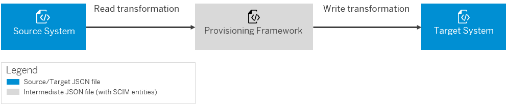

<!-- loio1a92c56f85ef4eccada391a53d34a720 -->

# Transformation Types

Learn about the types of JSON transformations needed for the provisioning jobs.

<a name="loio1a92c56f85ef4eccada391a53d34a720__section_s1p_5kj_d1b"/>

## Context

Two types of transformations occur before the provisioning of entities:

-   **Read Transformation** – from the *source system* to the provisioning framework. It reads the data in the source system and transfers it to an intermediate JSON data in the provisioning framework. The reading of entities from the source system can be complete \(full read\) or partial \(delta read\). For more information, see [Manage Full and Delta Read](Operation-Guide/manage-full-and-delta-read-b7f817c.md).
-   **Write Transformation** – from the provisioning framework to the *target system*. It prepares the data to be written to the target system.

Both transformations result in JSON data.

Every supported system holds and requires specific JSON data. To convert the source JSON data to an intermediate JSON version \(which can be used for transformation to a supported target system\), the Identity Provisioning administrator can use the suggested JSON transformation logic on the *Transformations* tab, and adapt it to the required transformation.

All transformations from the source systems transform their specific JSON data to intermediate data according to the *System for Cross-domain Identity Management* \(SCIM 2.0\) specification.

> ### Note:  
> *Proxy systems* contain both *Read* and *Write* transformations.

## Example

If the source JSON data contains the attribute **name**, the read transformation converts this attribute to *name23* in the intermediate JSON data. Then, the write transformation should use the attribute *name23* \(instead of **name**\) as *sourcePath* attribute.

**Related Information**  

[Transformation Examples](transformation-examples-901c759.md "The following examples explain how transformations work.")

[Transformation Expressions](transformation-expressions-bb8537b.md "")

[Transformation Functions](transformation-functions-0cdac7c.md "")

[Transformation Variables](transformation-variables-8376adb.md "")

[Transformation Editors](transformation-editors-9ea770b.md "Identity Provisioning provides graphical and JSON text editor for managing provisioning system transformations.")

[Manage Transformations](Operation-Guide/manage-transformations-2d0fbe5.md "You can manage transformations with graphical and JSON text editor. Regardless of which one you choose, the following initial steps are the same.")

[Transformation Expressions](transformation-expressions-bb8537b.md "")

[Transformation Functions](transformation-functions-0cdac7c.md "")

