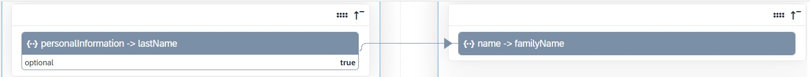

<!-- loio81f5204a5829429781d9ecc8b171f287 -->

# Transformations

Transformations help you transform user and group attributes from the data model of the source system to the data model of the target system.


Identity Provisioning provides a default transformation logic for every supported provisioning system. Source systems apply read transformations, target systems apply write transformations, while proxy systems apply both – read and write proxy transformations.

During a provisioning job, the read transformation of the source system converts the system specific JSON representation of users and groups to one common JSON format \(also called internal JSON\). This common JSON format is then used as a source for passing the data to the target system, which applies the write transformation.

The following examples illustrates how the last name user attribute is read from the SAP S/4HANA Cloud source system, transformed and prepared as the family name user attribute for the Identity Authentication target system using both - graphical and JSON text editor.


### Graphical Editor


<table>
<tr>
<th valign="top">

Source System-Specific JSON

</th>
<th valign="top">

Common JSON

</th>
</tr>
<tr>
<td valign="top" colspan="2">



</td>
</tr>
</table>


<table>
<tr>
<th valign="top">

Common JSON

</th>
<th valign="top">

Target System-Specific JSON

</th>
</tr>
<tr>
<td valign="top" colspan="2">


</td>
</tr>
</table>


### JSON Text Editor


<table>
<tr>
<th valign="top">

Source System-Specific JSON

</th>
<th valign="top">

Common JSON

</th>
<th valign="top">

Target System-Specific JSON

</th>
</tr>
<tr>
<td valign="top">

> ### Code Syntax:  
> ```
> {
>    "sourcePath":"$.personalInformation.lastName",
>    "targetPath":"$.name.familyName"
> },
> 
> ```


</td>
<td valign="top">

> ### Code Syntax:  
> ```
> {
>    "sourcePath":"$.name.familyName",
>    "targetPath":"$.name.familyName"
> },
> 
> ```


</td>
<td valign="top">

> ### Code Syntax:  
> ```
> {
>    "sourcePath":"$.name.familyName",
>    "targetPath":"$.name.familyName"
> },
> 
> ```


</td>
</tr>
</table>

You can adapt the transformation logic, for example, to read only the entities that should be provisioned to the target system. This filter can speed up the processing of the entities and their provisioning to the target system.

Every time you modify the transformation of a provisioning system and save your changes, a new version is created and displayed in the *Transformation History* screen. It lists all versions - from the initial to the current one, and gives you additional information about the last modification date, the person who modified it and a description.

Identity Provisioning provides graphical andJSON text editor for managing provisioning system transformations.

**Related Information**  


[Tenants](tenants-93160eb.md "A tenant refers to your (customer-specific) instance of SAP Cloud Identity Services. It's delivered to you as part of a bundle with an SAP cloud solution or as part of a self-service request in SAP BTP cockpit.")

[Bundles](bundles-25b65a4.md "A bundle is a group of preconfigured products and services which are sold together.")

[Applications](applications-404a11c.md "An application is associated with a consumer of Identity Authentication as an identity provider. This consumer could be for example an SAP cloud solution, a third-party application, SAP BTP subaccount, or the SAP Cloud Identity Services administration console.")

[Provisioning Systems](provisioning-systems-15da6af.md "Identity Provisioning provides connectors to various business applications for provisioning and deprovisioning of users and groups. These business applications are set up as provisioning systems in the administration console of SAP Cloud Identity Services.")

[Properties](properties-e92c1aa.md "Properties hold the configuration of a provisioning system.")

[Users](users-70e95d1.md "Users in SAP Cloud Identity Services fall into two categories: administrators and end users.")

[Cookies](cookies-e60fd04.md "")

