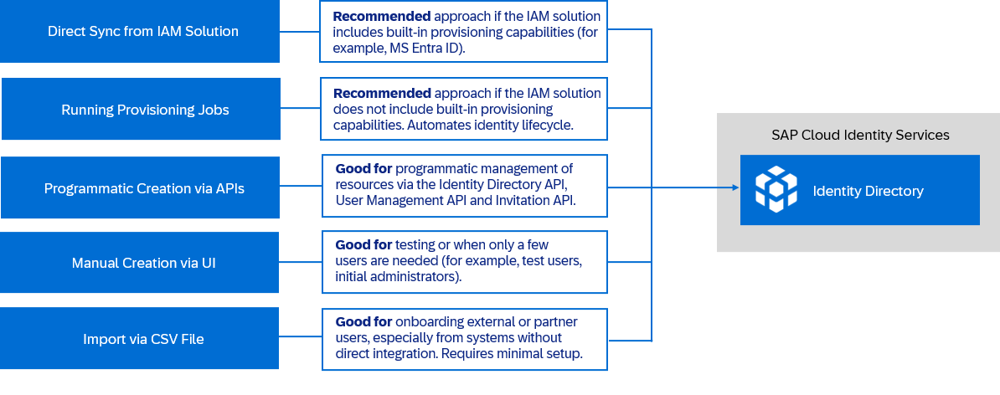

<!-- loioefcb8394753640a2ab28c909d050e956 -->

# User and Group Creation in Identity Directory

Learn how to create users and groups in the Identity Directory — the persistency layer of SAP Cloud Identity Services.

We strongly recommend creating users in SAP Cloud Identity Services. In certain scenarios, such as when using Joule, SAP Task Center, or SAP SuccessFactors People Analytics, having users in SAP Cloud Identity Services is mandatory. Integrations with Joule and SAP Task Center require user persistence in the directory to enable cross-application correlation.

The diagram below outlines the available methods for onboarding users and groups, depending on your use case and goals.

<a name="loioefcb8394753640a2ab28c909d050e956__section_sjr_4t1_4gc"/>

## Direct Sync from IAM Solution

Users and groups are provisioned through synchronization with the identity and access management \(IAM\) solution \(direct sync\), provided that both systems support the integration.

The IAM solution \(for example, Microsoft Entra ID\) includes built-in capabilities to provision users directly to the Identity Directory of SAP Cloud Identity Services. This allows users to authenticate via SAP Cloud Identity Services and access other SAP applications. For more information, see [Configure SAP Cloud Identity Services for automatic user provisioning with Microsoft Entra ID](https://learn.microsoft.com/en-us/entra/identity/saas-apps/sap-cloud-platform-identity-authentication-provisioning-tutorial).

<a name="loioefcb8394753640a2ab28c909d050e956__section_zjv_xw1_4gc"/>

## Running Provisioning Jobs

Users and groups are created by executing scheduled or manual provisioning jobs from source systems in Identity Provisioning.

The Identity Provisioning service provides connectors to configure the synchronization of users and groups to the Identity Directory, and from there, transfer them to other SAP applications. For more information, see [Centralized Provisioning with Identity Directory](https://help.sap.com/docs/cloud-identity-services/cloud-identity-services/provisioning-scenario-with-identity-directory?version=Cloud)→ [Source-Target System Provisioning](https://help.sap.com/docs/cloud-identity-services/cloud-identity-services/provisioning-scenario-with-identity-directory?version=Cloud#source-target-system-provisioning).

<a name="loioefcb8394753640a2ab28c909d050e956__section_n24_mbb_4gc"/>

## Programmatic Creation via APIs

Users and groups can be provisioned programmatically using the Identity Directory SCIM API. Additionally, SAP Cloud Identity Services provide the Invitation REST API and the User Management REST API, which allow you to manage specific tasks programmatically, such as sending user invitations, registering users for specific applications.

For more information, see:

-   Using the Identity Directory SCIM: [Identity Directory API](https://api.sap.com/api/IdDS_SCIM/overview)

-   Using the Invitation REST API: [Invitation REST API](https://help.sap.com/docs/cloud-identity-services/cloud-identity-services/invitation-rest-api?version=Cloud)

-   Using User Management REST API: [User Registration](https://help.sap.com/docs/cloud-identity-services/cloud-identity-services/user-registration?version=Cloud)

<a name="loioefcb8394753640a2ab28c909d050e956__section_fmz_sbb_4gc"/>

## Manual Creation via UI

Users and groups are created manually through the directory’s user interface in the SAP Cloud Identity Services administration console.

For more information, see [Create a New User](https://help.sap.com/docs/cloud-identity-services/cloud-identity-services/create-new-user?version=Cloud) and [Create a Group](Operation-Guide/create-a-group-b1b638d.md).

<a name="loioefcb8394753640a2ab28c909d050e956__section_wzf_hwc_pgc"/>

## Import via CSV File

Users and groups are imported using CSV file uploads in the SAP Cloud Identity Services administration console.

User import is supported at both the tenant level and the application level.

-   **Tenant-level import** is typically used for users who will be managed centrally across multiple applications.

    For more information, see [Import CSV File with Full User Profile](https://help.sap.com/docs/cloud-identity-services/cloud-identity-services/import-csv-file-with-full-user-profile?version=Cloud)

-   **Application-level import** is used when only a subset of users needs access to a specific application.

    For more information, see [Import or Update Users for a Specific Application](https://help.sap.com/docs/cloud-identity-services/cloud-identity-services/import-or-update-users-for-specific-application?version=Cloud)

Group import is only supported at the tenant level.

For more information, see [Import Groups via CSV File](Operation-Guide/import-groups-via-csv-file-daf96bd.md)

