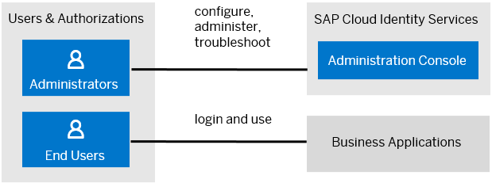

<!-- loio70e95d1d4f514710a0de56067081fd7f -->

# Users

Users in SAP Cloud Identity Services fall into two categories: administrators and end users.

<a name="loio70e95d1d4f514710a0de56067081fd7f__section_h44_jsf_2zb"/>

## Administrators

SAP Cloud Identity Services distinguish between two types of administrators: **user administrator** and **system administrator**.

-   User administrators are real persons. They manage tenant configurations, applications, corporate identity providers, identity provisioning, users and groups. The initial administrator of SAP Cloud Identity Services tenants is created as a user administrator.

-   System administrators are technical users. They are used for establishing system-to-system communication in provisioning scenarios, accessing real-time provisioning and proxy system APIs, as well as accessing tenant API for running Identity Provisioning jobs. System administrators can also act as user administrators because they have the same authorizations.

<a name="loio70e95d1d4f514710a0de56067081fd7f__section_npf_ksf_2zb"/>

## End Users

End users use business applications that consume Identity Authentication as identity provider. The service authenticates the users with credentials maintained in Identity Authentication or delegates the authentication request to a 3rd party identity provider. End users are initially created, imported or provisioned to the user store of SAP Cloud Identity Services.

There are six user types of end users:

<table>
<tr>
<th valign="top">

User Type

</th>
<th valign="top">

Description

</th>
</tr>
<tr>
<td valign="top">

*Customer* 

</td>
<td valign="top">

External users that are customers for the company. They may need access to some applications.

</td>
</tr>
<tr>
<td valign="top">

*Employee* 

</td>
<td valign="top">

Internal company users, mainly users with long-term contracts.

</td>
</tr>
<tr>
<td valign="top">

*Partner* 

</td>
<td valign="top">

External users from a partner company that will need some kind of access.

</td>
</tr>
<tr>
<td valign="top">

*Public* 

</td>
<td valign="top">

External users that are not controlled by the company. For example, self-registered.

</td>
</tr>
<tr>
<td valign="top">

*External* 

</td>
<td valign="top">

External users that can be a temporary hired employees that need access to some applications, or external users that need access to learning materials and training managed by the company.

</td>
</tr>
<tr>
<td valign="top">

*Onboardee* 

</td>
<td valign="top">

An employee user that needs a different authentication, because, for example the user may not exist in the corporate identity provider.

</td>
</tr>
<tr>
<td valign="top">

*Alumni* 

</td>
<td valign="top">

External users that were once employed by the company but now they are no more part of it. They may need some kind of access.

</td>
</tr>
</table>

**Related Information**  

[Tenants](tenants-93160eb.md "A tenant refers to your (customer-specific) instance of SAP Cloud Identity Services. It's delivered to you as part of a bundle with an SAP cloud solution or as part of a self-service request in SAP BTP cockpit.")

[Bundles](bundles-25b65a4.md "A bundle is a group of preconfigured products and services which are sold together.")

[Applications](applications-404a11c.md "An application is associated with a consumer of Identity Authentication as an identity provider. This consumer could be for example an SAP cloud solution, a third-party application, SAP BTP subaccount, or the SAP Cloud Identity Services administration console.")

[Provisioning Systems](provisioning-systems-15da6af.md "Identity Provisioning provides connectors to various business applications for provisioning and deprovisioning of users and groups. These business applications are set up as provisioning systems in the administration console of SAP Cloud Identity Services.")

[Properties](properties-e92c1aa.md "Properties hold the configuration of a provisioning system.")

[Transformations](transformations-81f5204.md "Transformations help you transform user and group attributes from the data model of the source system to the data model of the target system.")

[Groups](groups-d93be69.md "SAP Cloud Identity Services offers groups to organize users based on common characteristics, authorization, or application. Use them to efficiently manage user access and permissions within your organization's SAP Cloud Identity Services environment.")

[Authorization Policies](authorization-policies-01ddefa.md "Authorization Management enables you to refine authorization policies that give access to resources in enabled SAP BTP-based business applications. Restrict policies based on the values of user or business object attributes. Assign policies to users with the group management capabilities of the identity directory.")

[Cookies](cookies-e60fd04.md "")

[Create a New User](Operation-Guide/create-a-new-user-348deef.md "As a tenant administrator, you can create a new user in the administration console for SAP Cloud Identity Services.")

[List and Edit User Details](Operation-Guide/list-and-edit-user-details-045cb01.md "As a tenant administrator, you can view detailed information about the users in the administration console for SAP Cloud Identity Services. Optionally you can edit this information.")

[Add Administrators](Operation-Guide/add-administrators-bbbdbdd.md#loiobbbdbdd3899942ce874f3aae9ba9e21d "As a tenant administrator, you can add new administrators in the administration console for SAP Cloud Identity Services.")

