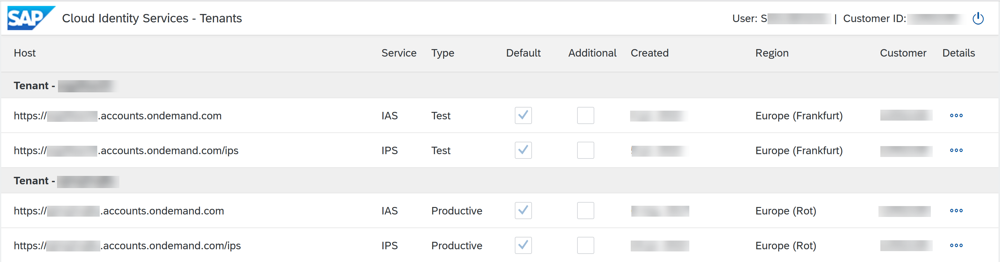
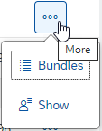
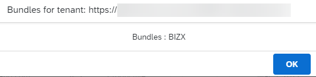
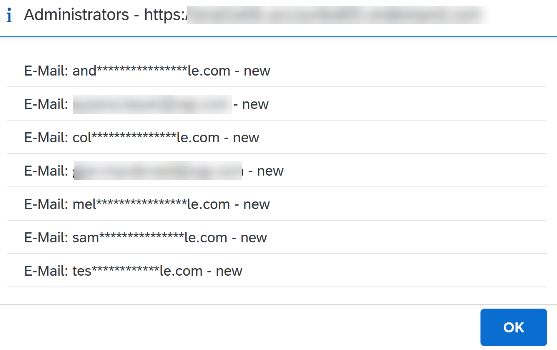

<!-- loiof56e6f24e373404087d6a1a9a13515a2 -->

# View Assigned Tenants and Administrators

View all SAP Cloud Identity Services tenants that are assigned to your customer ID.

## Prerequisites

You have an *S-user*. For more information, see [About the User, Authorization, and Administrator Concept](https://support.sap.com/content/s4m/help/access/user-admin-concept.html).

<a name="loiof56e6f24e373404087d6a1a9a13515a2__context_lqb_bn5_mqb"/>

## Context

The SAP Cloud Identity Services - Tenants application shows which are the Identity Authentication and Identity Provisioning tenants that are assigned to a customer ID and who are the tenant administrators of these tenants. The information also includes the status of the administrator. Only administrators that have the *Manage Tenant Configuration* role are displayed.

The default tenants, one test and productive tenant per customer, are provided regardless of the number of contracts signed in which SAP Cloud Identity Services is included or bundled. Additional productive or test tenants beyond the initial ones must be purchased separately. For more information, see [Tenants](tenants-93160eb.md).

> ### Tip:  
> As an alternative, you can view the tenant administrators of the tenants that are assigned to you and add new administrators in SAP Cloud Identity Services via the [SAP for Me](https://me.sap.com/home) portal. For more information see [Cloud Identity Services Administrators Card](https://support.sap.com/content/s4m/help/systems/systems/details/ias.html).

<a name="loiof56e6f24e373404087d6a1a9a13515a2__steps_ztk_cn5_mqb"/>

## Procedure

1.  Access the SAP Cloud Identity Services - Tenants application via the following URL:[https://iamtenants.accounts.cloud.sap/](https://iamtenants.accounts.cloud.sap/)

2.  Sign in with your *S-user*.

    > ### Remember:  
    > Not signing in with an *S-user* will return *HTTP Status 500 - Internal Server Error*.

    You can view the Identity Authentication and Identity Provisioning tenants that are assigned to your customer ID.

    

3.  Choose details next to the tenant to view the bundles or tenant administrators for that tenant.

    

    -   Bundles - shows the bundles for the tenant.

        

    -   Show - shows the administrators for the tenant.

        

        > ### Note:  
        > The users and emails are masked if the domain of the authenticated user is different from the domain of the tenant administrators.

**Related Information**  

[Tenants](tenants-93160eb.md "A tenant refers to your (customer-specific) instance of SAP Cloud Identity Services. It's delivered to you as part of a bundle with an SAP cloud solution or as part of a self-service request in SAP BTP cockpit.")

