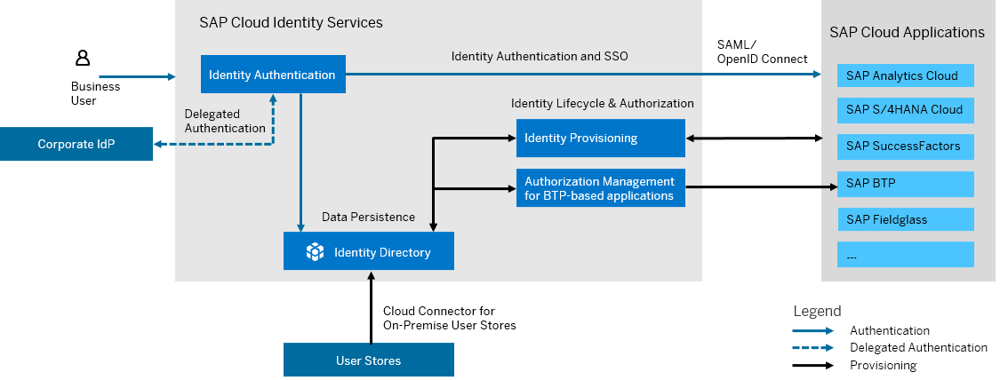

<!-- loio27882717f44b445fa287936c6f43dc1f -->

# What Are Cloud Identity Services?

Мanage identities, authorizations and SSO across cloud and on-premise solutions. 

SAP Cloud Identity Services are a group of services of SAP Business Technology Platform \(SAP BTP\), which enable you to integrate identity and access management between systems. The goal is to provide a seamless single sign-on experience across systems while ensuring that system and data access are secure. SAP Cloud Identity Services include Identity Authentication, Identity Provisioning, Identity Directory and Authorization Management.

## Environment

SAP Cloud Identity Services run on several underlying Infrastructure-as-a-Service technologies and regions. Regions are provided either by SAP or by SAP's Infrastructure-as-a-Service \(IaaS\) partners Amazon Web Services \(AWS\), Microsoft Azure, Google Cloud, and Alibaba Cloud. The third-party region providers operate the infrastructure layer of the regions, whereas SAP operates the platform layer. For more information, see [Regional Availability](regional-availability-be600ca.md).

SAP Cloud Identity Services are available for consumption with the following SAP BTP environments:

-   Cloud Foundry
-   Kyma
-   Neo

## Features

<dl>
<dt><b>

Authentication and SSO

</b></dt>
<dd>

Choose one of the supported authentication methods to control access to your application, like Form, SPNEGO, Social, or 2FA. Use OpenID Connect or SAML 2.0 to provide single sign-on. Integrate your application programmatically using authentication via API.

</dd><dt><b>

Risk-Based Authentication

</b></dt>
<dd>

Help enforce two-factor authentication based on IP ranges, user groups, user type, or authentication method to manage access to a business application.

</dd><dt><b>

Delegate Authentication

</b></dt>
<dd>

Delegate authentication to a 3rd party or on-premise IdP, as default or based on a condition like IdP, email domain, user type or user group, and thus enable SSO across on-premise and the cloud.

</dd><dt><b>

Policy-Based Authorizations

</b></dt>
<dd>

Develop SAP BTP applications with instance-based authorizations. Configure those instance-based authorizations centrally as policies within SAP Cloud Identity Services.

</dd><dt><b>

Data Persistence 

</b></dt>
<dd>

Store and manage users and groups in identity directory - the user store of SAP Cloud Identity Services.

</dd><dt><b>

User and Group Provisioning 

</b></dt>
<dd>

Synchronize users and groups between multiple supported cloud and on-premise systems, both SAP and non-SAP. Filter data. Run jobs in full and delta read mode.

</dd><dt><b>

Job Logging and Notifications 

</b></dt>
<dd>

View and manage job logs and real-time provisioning logs. Subscribe to source systems and receive notifications for the status of provisioning jobs.

</dd><dt><b>

User and Group Management via API 

</b></dt>
<dd>

Use SCIM REST API to manage users and groups, invite users, customize end-user UI texts in any language.

</dd>
</dl>

<a name="loio27882717f44b445fa287936c6f43dc1f__section_c1h_3z1_t1c"/>

## Overview Graphic

### Identity Authentication

Identity Authentication provides you with controlled cloud-based access to business processes, applications, and data. It simplifies your user experience through authentication mechanisms, single sign-on, on-premise integration, and convenient self-service options. Identity Authentication provides the following benefits:

-   Authentication: All SAP cloud applications can offer their users the same authentication mechanisms​, as well as strong authentication with configurable multi-factor \(MFA\) enforcement; easy separation mechanism for multiple user stores and flexible configuration where to validate user's credentials.

-   Single Sign-On: Identity Authentication offers central SSO endpoint for all SAP cloud applications and pre-configured or semi-automated trust configuration​.

-   Integrating SAP applications: Identity Authentication offers common identity for users, as well as a unified way for user management and security token service for protection of ​system-to-system communication. Data across applications can be correlated ​\(precondition for central foundation services\)​.

### Identity Provisioning

Identity Provisioning offers easier and more secure identity lifecycle management as a service with identity and authorization provisioning and deprovisioning. It enables customers to set up faster and more efficient administration of user onboarding and offboarding. Identity Provisioning supports a centralized lifecycle of corporate identities in the cloud. In addition, it can handle automated provisioning of existing on-premise identities to cloud applications.

### Identity Directory

Identity Directory is the persistency layer of SAP Cloud Identity Services. It offers a central place for storing and managing users and groups. Its SCIM 2.0 REST API allows customers to define their own custom schemas with own attributes. The directory generates the Global User ID attribute - the unique user identifier across landscape. This attribute is distributed by Identity Provisioning to SAP cloud applications, like SAP Task Center, which need the common user identifier in their integration scenarios.

### Authorization Management

Authorization Management enables you to refine authorization policies that give access to resources in enabled SAP BTP-based business applications. Restrict policies based on the values of user or business object attributes. Assign policies to users with the group management capabilities of the identity directory. Use the corresponding user interfaces of SAP Cloud Identity Services or the SCIM API of the identity directory.

<a name="loio27882717f44b445fa287936c6f43dc1f__section_pf2_51b_t1c"/>

## Use Cases

SAP Cloud Identity Services offers the following scenarios:

-   [Identity Authentication Scenarios](scenarios-fb9898d.md) for consumers \(business-to-consumer scenarios\), partners \(business-to-business scenarios\), and employees \(business-to-employee scenarios\).

-   [Authorization Management Scenario](https://help.sap.com/docs/identity-authentication/identity-authentication/configuring-authorization-policies?version=Cloud) for configuring and assigning authorization policies to users.

-   [Identity Directory Scenario](https://help.sap.com/docs/identity-provisioning/identity-provisioning/local-identity-directory?version=Cloud) for storing and provisioning users and groups.

-   [Identity Provisioning Scenario](https://help.sap.com/docs/identity-provisioning/identity-provisioning/bundle-tenants-and-connectors?version=Cloud#how-to-use-bundle-tenants) for using bundled tenants in provisioning and deprovisioning.

<a name="loio27882717f44b445fa287936c6f43dc1f__section_yzb_m1b_t1c"/>

## Prerequisites

To use SAP Cloud Identity Services, you must obtain a tenant. It's delivered to you as part of a bundle with an SAP cloud solution or as part of a self-service request in SAP BTP cockpit.

For more information, see [Tenants](tenants-93160eb.md) and [Bundles](bundles-25b65a4.md).

<a name="loio27882717f44b445fa287936c6f43dc1f__section_n5f_v1b_t1c"/>

## Tools

The central point of entry to SAP Cloud Identity Services is the administration console, where you can manage tenant configurations, user authentication and provisioning. It is a Fiori-based user interface adaptive to most browsers.

For more information, see [Operation Guide](https://help.sap.com/docs/identity-authentication/identity-authentication/operation-guide?version=Cloud).

> ### Tip:  
> The English version of this guide is open for contributions and feedback using GitHub. This allows you to get in contact with responsible authors of SAP Help Portal pages and the development team to discuss documentation-related issues. To contribute to this guide, or to provide feedback, choose the corresponding option on SAP Help Portal:
> 
> -   *Feedback* \> *Create issue*: Provide feedback about a documentation page. This option opens an issue on GitHub.
> 
> -   *Feedback* \> *Edit page*: Contribute to a documentation page. This option opens a pull request on GitHub.
> 
> 
> You need a GitHub account to use these options.
> 
> More information:
> 
> -   [Contribution Guidelines](https://help.sap.com/docs/open-documentation-initiative/contribution-guidelines/readme.html)
> 
> -   [Introduction Video](https://www.youtube.com/watch?v=WJ0oarMlVW4)
> 
> -   [Introduction Blog Post](https://blogs.sap.com/2021/11/29/sap-btp-documentation-goes-github-new-collaboration-process/)

